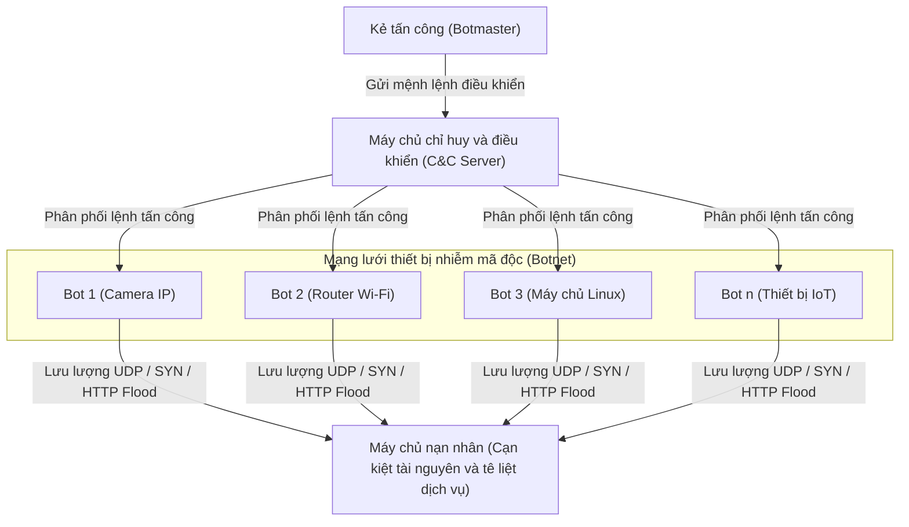
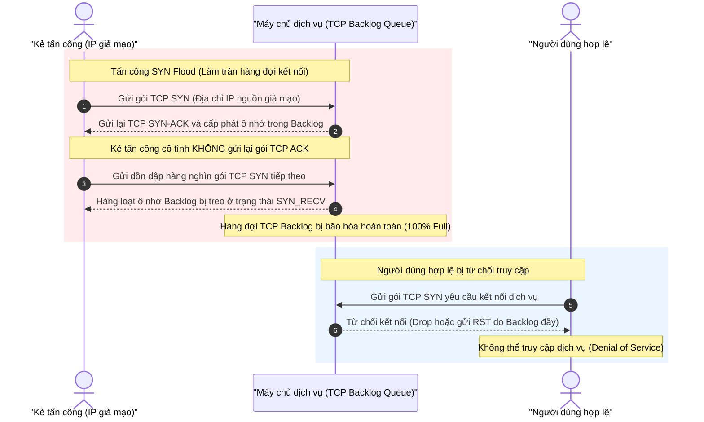
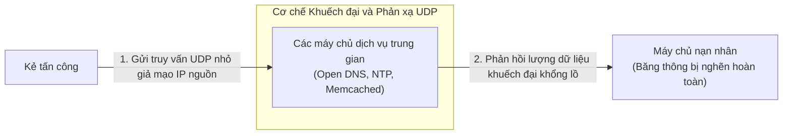
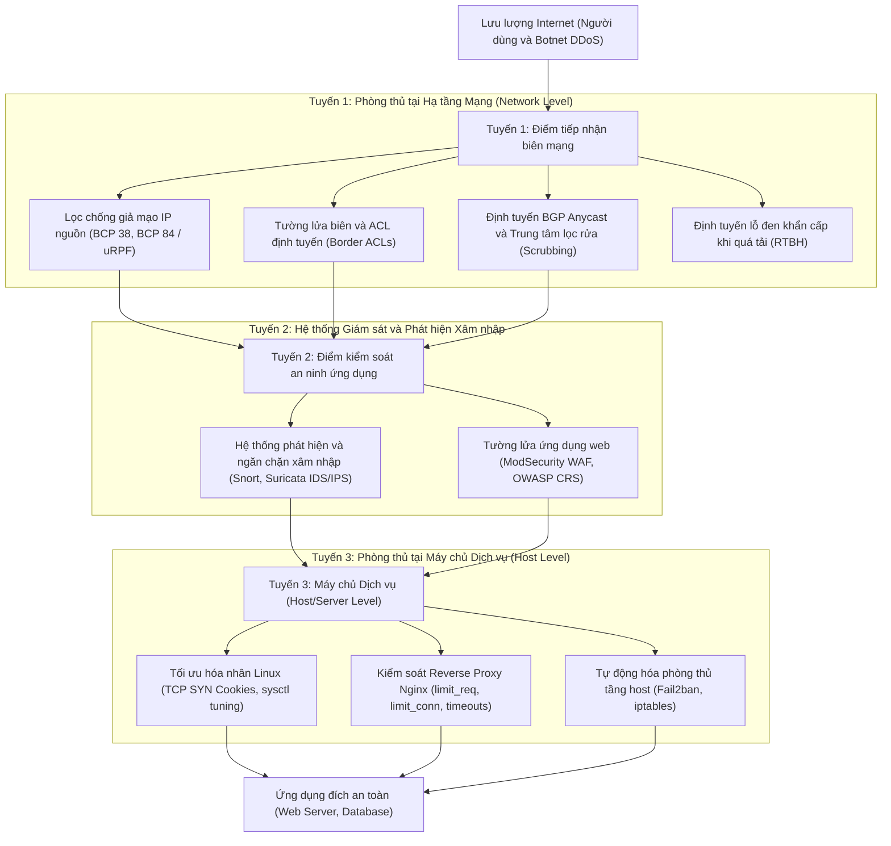

# CHƯƠNG 1. TỔNG QUAN VỀ TẤN CÔNG VÀ PHÒNG CHỐNG DoS/DDoS

Chương 1 cung cấp cơ sở lý thuyết nền tảng về tấn công từ chối dịch vụ (DoS/DDoS) và giải pháp phòng chống. Nội dung chương gồm ba phần trọng tâm:
- Khái niệm, đặc điểm và tác động của DoS/DDoS, cùng cơ chế vận hành của mạng botnet và mô hình thương mại hóa dịch vụ tấn công.
- Phân loại kỹ thuật tấn công theo mô hình OSI, đi sâu vào tấn công làm cạn kiệt băng thông (Volumetric), khai thác giao thức (Protocol), tấn công tầng ứng dụng (Application Layer) và kỹ thuật khuếch đại/phản xạ (Amplification/Reflection).
- Tổng quan nguyên lý và kỹ thuật phòng thủ theo chiều sâu (Defense-in-Depth) tại hạ tầng mạng, máy chủ dịch vụ và hệ thống giám sát an ninh.

---

## 1.1 Khái niệm cơ bản về DoS và DDoS

### 1.1.1 Định nghĩa tấn công từ chối dịch vụ (DoS)

Tấn công từ chối dịch vụ (Denial of Service - DoS) làm tê liệt khả năng cung cấp tài nguyên hoặc dịch vụ của hệ thống đối với người dùng hợp lệ, nhắm trực tiếp vào tính sẵn sàng (Availability) trong tam giác bảo mật CIA. Mục tiêu của kẻ tấn công là làm cạn kiệt hoặc gián đoạn tài nguyên vận hành: băng thông mạng, tài nguyên quản lý trạng thái của giao thức (hàng đợi kết nối socket), hoặc năng lực xử lý tính toán của ứng dụng (CPU, RAM, luồng thực thi).

Kỹ thuật DoS triển khai theo hai hướng chính:

- **Khai thác lỗ hổng phần mềm (Vulnerability-based Attacks):** Kẻ tấn công gửi các gói tin có cấu trúc dị thường (malformed packets) vi phạm đặc tả giao thức để kích hoạt lỗi xử lý của hệ điều hành hoặc phần mềm máy chủ. Điển hình là Ping of Death (gửi gói tin ICMP vượt quá kích thước tối đa 65.535 byte gây tràn bộ đệm khi tái lắp ghép) [1], Teardrop (khai thác lỗi xử lý trường độ lệch phân mảnh Offset khiến hệ điều hành sập), và Land Attack (gửi gói TCP SYN có địa chỉ IP và cổng nguồn trùng với IP và cổng đích, khiến máy chủ tự phản hồi chính mình dẫn đến treo hệ thống).
- **Làm tràn ngập tài nguyên (Flooding / Resource Exhaustion Attacks):** Kẻ tấn công phát lượng lớn yêu cầu vượt quá công suất tính toán, năng lực xử lý I/O hoặc dung lượng đường truyền mạng của hệ thống đích. Kỹ thuật này không phụ thuộc vào lỗ hổng phần mềm cụ thể, do đó đe dọa hầu hết các dịch vụ kết nối mạng công cộng.

### 1.1.2 Tấn công từ chối dịch vụ phân tán (DDoS) và mạng Botnet

Tấn công từ chối dịch vụ phân tán (Distributed Denial of Service - DDoS) phát động lưu lượng từ nhiều nguồn cùng lúc, thường là hàng trăm đến hàng triệu thiết bị trong mạng botnet, nhằm áp đảo hạ tầng của mục tiêu.

*Bảng 1.1 - So sánh đặc điểm kỹ thuật giữa tấn công DoS và DDoS*

| Tiêu chí so sánh | Tấn công DoS (Đơn nguồn) | Tấn công DDoS (Phân tán) |
|---|---|---|
| **Số lượng nguồn tấn công** | Một hoặc vài máy trạm cục bộ | Hàng nghìn đến hàng triệu máy trạm phân tán toàn cầu (mạng botnet) |
| **Quy mô lưu lượng** | Bị giới hạn bởi băng thông phần cứng của máy tấn công (thường dưới 1 Gbps) | Lưu lượng khổng lồ; Cloudflare ghi nhận 935 đợt tấn công tầng mạng vượt ngưỡng 1 Tbps trong nửa đầu năm 2026 [2] |
| **Khả năng ngăn chặn** | Tương đối đơn giản; thiết lập quy tắc tường lửa chặn IP nguồn phát | Phức tạp; nguồn tấn công phân tán rộng và thường xuyên giả mạo địa chỉ IP nguồn (IP Spoofing) |
| **Khả năng truy vết nguồn gốc** | Dễ dàng xác định địa chỉ IP nguồn thật của kẻ tấn công | Khó khăn; lưu lượng đi qua nhiều lớp máy chủ trung gian và mạng botnet che giấu danh tính kẻ chủ mưu |

Mạng botnet là nền tảng chính của các cuộc tấn công DDoS quy mô lớn, bao gồm các thiết bị (máy tính cá nhân, camera IP, router) bị cài cắm mã độc và chịu sự điều khiển từ xa của kẻ tấn công.

Một mạng Botnet hoàn chỉnh gồm ba thành phần kỹ thuật:
- **Kẻ điều hành (Botmaster):** Cá nhân hoặc nhóm tội phạm mạng nắm giữ mã điều khiển toàn hệ thống.
- **Máy chủ chỉ huy và điều khiển (Command and Control - C&C Server):** Máy chủ trung gian làm nhiệm vụ chuyển tiếp mệnh lệnh tác chiến từ botmaster xuống các máy bị nhiễm.
- **Thiết bị nhiễm mã độc (Bots):** Các máy trạm, máy chủ hoặc thiết bị Internet vạn vật (IoT) như router, camera IP bị khai thác lỗ hổng và cài cắm phần mềm điều khiển ngầm.

Vòng đời của Botnet diễn ra qua ba giai đoạn liên tiếp: Lây nhiễm (Infection) qua quét cổng dịch vụ hoặc lừa đảo; Kết nối báo danh và duy trì kênh điều khiển với máy chủ C&C (C&C Rendezvous); Tiếp nhận lệnh và phát động tấn công hàng loạt vào mục tiêu (Execution).

*Hình 1.1 - Sơ đồ kiến trúc mạng Botnet và cơ chế phát động tấn công DDoS phân tán*

Kênh chỉ huy C&C của botnet được tổ chức theo hai mô hình kiến trúc chính:
- **Mô hình tập trung (Client-Server):** Các bot nhận lệnh từ máy chủ trung tâm qua giao thức IRC hoặc HTTP/HTTPS. Mô hình này dễ quản lý nhưng có điểm yếu lỗi đơn (Single Point of Failure); botnet sẽ tê liệt khi máy chủ C&C bị cô lập hoặc tịch thu tên miền.
- **Mô hình phân tán ngang hàng (Peer-to-Peer - P2P):** Các bot trao đổi lệnh và cập nhật danh sách nút mạng trực tiếp với nhau. Mô hình P2P loại bỏ máy chủ trung tâm, khiến việc triệt phá toàn bộ mạng botnet phức tạp hơn.

Botnet Mirai (tháng 8/2016) là trường hợp điển hình khai thác thiết bị IoT. Mã độc tự quét các cổng Telnet 23 và 2323, sử dụng 62 cặp tài khoản mặc định của nhà sản xuất để chiếm quyền điều khiển camera an ninh và router, đạt đỉnh khoảng 600.000 thiết bị [3]. Ngày 21/10/2016, Mirai huy động khoảng 100.000 thiết bị gửi lưu lượng TCP/UDP tới cổng 53 của công ty phân giải DNS Dyn, làm tê liệt các dịch vụ như Twitter, GitHub, Spotify và Netflix trong nhiều giờ [4].

Bên cạnh botnet tự xây dựng, mô hình dịch vụ hóa (DDoS-as-a-Service, gồm các dịch vụ booter và stresser) cho phép người thuê phát động tấn công theo giờ với chi phí thấp mà không cần kiến thức kỹ thuật chuyên sâu, làm gia tăng tần suất đe dọa an toàn thông tin toàn cầu.

### 1.1.3 Hậu quả và thiệt hại

Tấn công DoS/DDoS gây ra tổn thất nghiêm trọng trên bốn phương diện:

- **Gián đoạn vận hành và tổn thất tài chính:** Website, cổng thanh toán hoặc hệ thống nội bộ ngừng hoạt động làm sụt giảm doanh thu tức thì, phát sinh chi phí ứng cứu sự cố và nguy cơ bồi thường vi phạm cam kết mức chất lượng dịch vụ (SLA).
- **Suy giảm uy tín thương hiệu:** Gián đoạn dịch vụ kéo dài làm xói mòn lòng tin của đối tác và khách hàng, ảnh hưởng tiêu cực tới vị thế của tổ chức trên thị trường.
- **Nghi binh che giấu xâm nhập (Smokescreen Attack):** Kẻ tấn công sử dụng DDoS lưu lượng lớn để thu hút nhân lực của Trung tâm Giám sát Điều hành An ninh mạng (SOC), tạo điều kiện đánh cắp dữ liệu nhạy cảm hoặc cài cắm mã độc vào hệ thống nội bộ. Khảo sát năm 2016 của Kaspersky Lab và B2B International cho thấy 56% doanh nghiệp từng ghi nhận DDoS bị lợi dụng cho mục đích này [5].
- **Tác động lan truyền diện rộng (Collateral Damage):** Sự cố tấn công vào các đơn vị cung cấp hạ tầng chia sẻ (nhà cung cấp DNS, điện toán đám mây hoặc ISP) khiến toàn bộ khách hàng và dịch vụ phụ thuộc trên cùng hạ tầng bị cô lập hoàn toàn, tương tự sự cố Dyn năm 2016.

---

## 1.2 Phân loại các hình thức tấn công DoS/DDoS theo mô hình OSI

Mô hình OSI phân tách mạng thành bảy tầng độc lập. Phân loại DoS/DDoS theo tầng OSI giúp xác định chính xác loại tài nguyên mục tiêu bị khai thác và giải pháp phòng thủ tương ứng. Cơ quan An ninh mạng và Cơ sở hạ tầng Hoa Kỳ (CISA) chia tấn công DoS/DDoS thành ba nhóm: làm cạn kiệt băng thông (Volumetric), khai thác giao thức tầng mạng/vận chuyển (Protocol), và tấn công tầng ứng dụng (Application Layer). Nhóm tấn công khuếch đại/phản xạ (Amplification/Reflection) sử dụng kỹ thuật chuyên biệt để nhân lưu lượng nên được phân tích thành một phân nhóm độc lập.

*Bảng 1.2 - Phân loại các hình thức tấn công DoS/DDoS theo mô hình OSI*

| Nhóm tấn công | Tầng tác động (OSI) | Tài nguyên mục tiêu bị khai thác | Kỹ thuật tấn công tiêu biểu |
|---|---|---|---|
| **Làm cạn băng thông (Volumetric)** | Tầng mạng & vận chuyển (Layer 3 & 4) | Băng thông đường truyền vật lý, năng lực chuyển mạch router | UDP Flood, ICMP Flood |
| **Khai thác giao thức (Protocol)** | Tầng mạng & vận chuyển (Layer 3 & 4) | Bảng trạng thái kết nối tường lửa, hàng đợi kết nối (backlog) của socket | TCP SYN Flood, Ping of Death, Smurf Attack |
| **Tầng ứng dụng (Application Layer)** | Tầng ứng dụng (Layer 7) | Luồng xử lý máy chủ web, CPU, RAM, giới hạn kết nối cơ sở dữ liệu | HTTP GET/POST Flood, Slowloris, Slow POST (R.U.D.Y.) |
| **Khuếch đại / Phản xạ (Amplification / Reflection)** | Tầng vận chuyển & ứng dụng (Layer 4 & 7) | Băng thông đường truyền nạn nhân (nhờ hệ số khuếch đại UDP) | DNS Amplification, NTP Amplification, Memcached Amplification |

### 1.2.1 Tấn công tầng mạng và tầng vận chuyển (Volumetric và Protocol)

**Nhóm tấn công làm cạn băng thông (Volumetric Attacks):** Làm nghẽn toàn bộ dung lượng kết nối mạng đi vào máy chủ đích bằng khối lượng dữ liệu khổng lồ.

- **UDP Flood:** Giao thức UDP hoạt động phi kết nối và không yêu cầu bắt tay khởi tạo. Kẻ tấn công phát dồn dập các gói UDP tốc độ cao tới các cổng ngẫu nhiên trên máy chủ đích. Khi tiếp nhận, hệ điều hành đích kiểm tra tiến trình đang lắng nghe (listening) trên cổng tương ứng; nếu không tìm thấy dịch vụ nào, hệ thống phải tạo và gửi lại gói tin ICMP "Destination Unreachable" (Type 3, Code 3). Việc xử lý và trả lời hàng loạt gói tin này làm cạn kiệt CPU của máy chủ và lấp đầy băng thông đường truyền.
- **ICMP Flood (Ping Flood):** Kẻ tấn công gửi liên tục các gói ICMP Echo Request (Type 8) tới IP nạn nhân, buộc hệ điều hành đích phải phản hồi bằng các gói ICMP Echo Reply (Type 0) có kích thước tương đương. Vì lưu lượng mang tính đối xứng, tổng băng thông gửi đi của botnet trực tiếp làm nghẽn băng thông của máy chủ nạn nhân ở cả hai chiều.

**Nhóm tấn công khai thác giao thức (Protocol Attacks):** Khai thác cách thức quản lý trạng thái của các giao thức mạng ở tầng 3 và 4 để làm cạn kiệt tài nguyên xử lý của hệ điều hành hoặc thiết bị mạng trung gian.

- **SYN Flood:** Giao thức TCP thiết lập phiên truyền thông qua quá trình bắt tay ba bước (3-way handshake). Trong điều kiện bình thường, máy khách gửi gói SYN, máy chủ phản hồi bằng gói SYN-ACK và dành ra một vùng nhớ trong hàng đợi kết nối bán mở (backlog queue) để chờ gói ACK cuối cùng từ máy khách trước khi chuyển sang trạng thái hoàn tất (`ESTABLISHED`). Trong tấn công SYN Flood, kẻ tấn công phát hàng loạt gói SYN với IP nguồn giả mạo hoặc cố tình không phản hồi gói ACK. Các kết nối bán mở (half-open connections) giữ chỗ trong hàng đợi backlog cho đến khi hết thời gian chờ (timeout). Khi hàng đợi đầy, máy chủ từ chối tiếp nhận mọi yêu cầu kết nối hợp lệ mới. Tấn công này làm tê liệt dịch vụ bằng cách chiếm dụng hàng đợi socket của nhân hệ điều hành mà không cần làm nghẽn đường truyền mạng.

*Hình 1.2 - Sơ đồ quy trình bắt tay ba bước TCP và hiện tượng nghẽn hàng đợi trong tấn công SYN Flood*

### 1.2.2 Tấn công tầng ứng dụng (Application Layer - Layer 7)

Tấn công tầng ứng dụng nhắm trực tiếp vào các phần mềm dịch vụ máy chủ web, hệ quản trị cơ sở dữ liệu hoặc giao diện lập trình ứng dụng (API). Lưu lượng tấn công tuân thủ đúng định dạng giao thức (như HTTP/HTTPS), mang đặc điểm cú pháp hợp lệ nên các thiết bị tường lửa tầng mạng truyền thống khó phân biệt với người dùng thông thường. Kẻ tấn công chỉ cần lượng băng thông nhỏ nhưng có thể gây cạn kiệt tài nguyên tính toán (CPU, RAM) hoặc làm bão hòa giới hạn luồng xử lý đồng thời (worker threads / connection pool) của máy chủ web.

- **HTTP Flood:** Kẻ tấn công gửi dồn dập các yêu cầu HTTP GET hoặc HTTP POST hợp lệ tới máy chủ web. Yêu cầu GET thường nhắm vào trang nội dung nặng hoặc tài nguyên động đòi hỏi máy chủ tính toán; yêu cầu POST nhắm vào biểu mẫu xác thực, tìm kiếm dữ liệu hoặc tải tệp lên để buộc cơ sở dữ liệu phải xử lý liên tục.
- **Slowloris:** Công cụ do Robert Hansen công bố năm 2009, khai thác quy chuẩn kết thúc tiêu đề HTTP theo RFC 7230 [6]. Kẻ tấn công mở nhiều kết nối TCP tới máy chủ web và gửi các trường tiêu đề HTTP không hoàn chỉnh (thiếu chuỗi kết thúc `\r\n\r\n`). Định kỳ trước khi bộ đếm thời gian chờ (timeout) của máy chủ hết hạn, công cụ gửi thêm một dòng tiêu đề phụ (ví dụ `X-a: b\r\n`) để gia hạn kết nối. Bằng cách giữ hàng ngàn socket ở trạng thái mở liên tục với băng thông tối thiểu, Slowloris chiếm dụng toàn bộ bảng kết nối đồng thời của máy chủ web, ngăn chặn người dùng hợp lệ truy cập. (Cơ chế này được phân tích chuyên sâu tại Chương 2 và thực nghiệm tại Chương 3).
- **Slow POST (R.U.D.Y. - R-U-Dead-Yet):** Hoạt động tương tự Slowloris nhưng khai thác phần thân thông điệp (HTTP Message Body). Kẻ tấn công gửi yêu cầu HTTP POST với trường tiêu đề `Content-Length` lớn, sau đó truyền từng byte dữ liệu của phần thân với độ trễ kéo dài từ 10 đến 120 giây giữa các byte. Máy chủ phải duy trì socket và cấp phát tài nguyên bộ nhớ chờ nhận đủ lượng dữ liệu đã khai báo, dẫn đến cạn kiệt tài nguyên kết nối.

### 1.2.3 Tấn công khuếch đại và phản xạ (Amplification/Reflection Attacks)

Tấn công khuếch đại kết hợp hai kỹ thuật mạng:
- **Kỹ thuật Phản xạ (Reflection):** Kẻ tấn công gửi gói tin yêu cầu tới các máy chủ trung gian công khai (Reflectors) trên Internet nhưng giả mạo địa chỉ IP nguồn thành địa chỉ IP của nạn nhân (IP Spoofing). Khi máy chủ trung gian phản hồi, toàn bộ dữ liệu sẽ đổ dồn về máy chủ nạn nhân thay vì máy của kẻ tấn công.
- **Kỹ thuật Khuếch đại (Amplification):** Kẻ tấn công lựa chọn các giao thức phi kết nối (chủ yếu là UDP) có đặc tính phản hồi chứa lượng dữ liệu lớn gấp nhiều lần gói tin yêu cầu ban đầu.

Hệ số khuếch đại băng thông (Bandwidth Amplification Factor - BAF) là tỷ số giữa kích thước tải dữ liệu UDP (payload) của gói tin phản hồi và kích thước tải dữ liệu của gói tin yêu cầu ban đầu [7]:

$$\text{BAF} = \frac{\text{Kích thước Payload phản hồi (Bytes)}}{\text{Kích thước Payload yêu cầu (Bytes)}}$$

*Hình 1.3 - Sơ đồ luồng lưu lượng trong tấn công DoS/DDoS phản xạ và khuếch đại*

*Bảng 1.3 - Các kỹ thuật tấn công khuếch đại UDP phổ biến và hệ số BAF*

| Kỹ thuật tấn công | Giao thức / Cổng | Cơ chế tạo phản hồi khuếch đại | Hệ số khuếch đại băng thông (BAF) |
|---|---|---|---|
| **DNS Amplification** | UDP / Cổng 53 | Gửi truy vấn bản ghi dung lượng lớn (loại ANY hoặc TXT) tới các máy chủ Open DNS Resolver hỗ trợ tiện ích EDNS0 (RFC 2671) | Từ 28 đến 54 lần |
| **NTP Amplification** | UDP / Cổng 123 | Lạm dụng lệnh giám sát hệ thống `monlist` trên các máy chủ NTP phiên bản cũ để lấy danh sách 600 địa chỉ IP kết nối gần nhất | Khoảng 556,9 lần |
| **Memcached Amplification** | UDP / Cổng 11211 | Gửi các yêu cầu đọc dữ liệu dung lượng nhỏ để truy xuất các tệp dữ liệu lưu trong bộ nhớ đệm mở công khai không xác thực | Lên tới 51.200 lần |

Ngày 28 tháng 2 năm 2018, nền tảng GitHub hứng chịu đợt tấn công Memcached Amplification đạt đỉnh 1,35 Tbps với tốc độ truyền 126,9 triệu gói tin mỗi giây [8]. Cuộc tấn công bắt nguồn từ việc hàng loạt máy chủ Memcached mở cổng UDP 11211 trực tiếp ra Internet mà không bật xác thực, kết hợp kỹ thuật giả mạo IP nguồn trên tầng mạng.

Ba biện pháp giảm thiểu nguy cơ tấn công phản xạ và khuếch đại:
1. Triển khai cơ chế lọc gói tin giả mạo IP nguồn ở phía nhà cung cấp dịch vụ mạng (Ingress Filtering theo chuẩn BCP 38 / RFC 2827) [9].
2. Vô hiệu hóa giao thức UDP trên các phần mềm máy chủ không bắt buộc (như Memcached) hoặc chỉ ràng buộc dịch vụ với giao diện nội bộ `127.0.0.1`.
3. Cập nhật và điều chỉnh cấu hình hệ thống: Tắt tính năng phân giải đệ quy công khai (Open Resolver) trên các máy chủ DNS nội bộ và vô hiệu hóa lệnh `monlist` trên máy chủ NTP.

---

## 1.3 Tổng quan các nguyên lý và kỹ thuật phòng chống DoS/DDoS

Tấn công DoS/DDoS hiện nay thường phối hợp nhiều vectơ (Multi-vector Attacks: vừa làm nghẽn băng thông vừa làm tê liệt ứng dụng). Vì vậy, một biện pháp đơn lẻ không đủ bảo vệ toàn diện hệ thống. Cơ quan An ninh mạng và Cơ sở hạ tầng Hoa Kỳ (CISA) khuyến nghị áp dụng mô hình phòng thủ theo chiều sâu (Defense-in-Depth), chia các giải pháp kỹ thuật thành ba tuyến phòng thủ chính: hạ tầng mạng, máy chủ dịch vụ, và hệ thống giám sát an ninh chuyên dụng [10].

*Hình 1.4 - Mô hình kiến trúc phòng thủ nhiều lớp (Defense-in-Depth) chống DoS/DDoS*

### 1.3.1 Phòng thủ tại hạ tầng mạng (Network Infrastructure Level)

- **Tường lửa và danh sách kiểm soát truy cập (Firewall & ACL):** Thiết lập quy tắc lọc gói tin tại bộ định tuyến biên dựa trên địa chỉ IP, cổng dịch vụ, giao thức và các cờ điều khiển TCP. Quản trị viên áp dụng chính sách giới hạn tốc độ (Rate Limiting) đối với các giao thức dễ bị lạm dụng như ICMP và UDP. Khi nguồn tấn công phân tán qua hàng trăm nghìn IP botnet, cơ chế chặn danh sách IP tĩnh không còn phát huy hiệu quả.
- **Lọc chống giả mạo IP (Ingress Filtering & uRPF):**
  - Khuyến nghị BCP 38 (RFC 2827) yêu cầu các nhà cung cấp dịch vụ mạng (ISP) kiểm tra và loại bỏ các gói tin có địa chỉ IP nguồn không thuộc dải địa chỉ được phân bổ cho khách hàng đó [9].
  - Khuyến nghị BCP 84 (RFC 3704) mở rộng cơ chế kiểm tra đường dẫn ngược Unicast (Unicast Reverse Path Forwarding - uRPF) cho các mạng đa kết nối (multihomed) [11]. Bộ định tuyến đối chiếu bảng định tuyến để xác định giao diện tiếp nhận gói tin có phải là đường đi tối ưu để phản hồi về IP nguồn đó hay không; nếu không khớp, gói tin bị hủy ngay lập tức. Lọc chống giả mạo IP là giải pháp then chốt để triệt tiêu các cuộc tấn công phản xạ và khuếch đại.
- **Kỹ thuật định tuyến lỗ đen (Remotely Triggered Black Hole - RTBH):** Khi lưu lượng tấn công vượt quá ngưỡng chịu tải của đường truyền, nhà vận hành mạng quảng bá một tuyến đường BGP cho địa chỉ IP đang bị tấn công với địa chỉ next-hop trỏ vào giao diện hủy gói (Null0 hoặc discard interface). Toàn bộ lưu lượng hướng tới địa chỉ đó bị loại bỏ ngay tại biên mạng của nhà cung cấp dịch vụ. Hạ tầng mạng còn lại được bảo vệ, dù dịch vụ bị tấn công tạm thời không thể truy cập từ bên ngoài.
- **BGP Anycast và Trung tâm lọc rửa lưu lượng (Scrubbing Centers):** Cùng một địa chỉ IP công cộng được quảng bá từ nhiều nút mạng phân tán tại các vị trí địa lý khác nhau. Thuật toán định tuyến BGP tự động điều hướng lưu lượng từ các máy tấn công về nút mạng gần nhất, chia nhỏ lưu lượng tấn công tổng thể để hấp thụ cục bộ. Các trung tâm lọc rửa của nhà cung cấp dịch vụ chuyên nghiệp (như Cloudflare, Akamai) bóc tách gói tin độc hại trước khi chuyển tiếp lưu lượng người dùng hợp lệ về máy chủ gốc của tổ chức qua đường hầm an toàn.

### 1.3.2 Phòng thủ tại máy chủ dịch vụ (Host/Server Level)

- **Tối ưu hóa tham số mạng nhân hệ điều hành Linux:** Nhân Linux cung cấp ba tham số then chốt để bảo vệ hàng đợi kết nối trước tấn công SYN Flood:
  - `net.ipv4.tcp_syncookies = 1`: Kích hoạt cơ chế SYN Cookies theo RFC 4987 [12]. Khi hàng đợi backlog của socket bị đầy, máy chủ không lưu trạng thái vào bảng kết nối bán mở mà mã hóa thông tin kết nối (địa chỉ IP, cổng, chỉ số MSS) thành giá trị số thứ tự ban đầu (ISN) trong gói SYN-ACK. Khi nhận được gói ACK hợp lệ tiếp theo từ client, máy chủ giải mã thông tin để khôi phục kết nối. Cơ chế này giúp máy chủ tiếp tục phục vụ người dùng hợp lệ mà không bị cạn kiệt bộ nhớ.
  - `net.ipv4.tcp_max_syn_backlog`: Mở rộng kích thước hàng đợi tiếp nhận các yêu cầu kết nối đang ở trạng thái `SYN_RECV` (thường thiết lập từ 2048 đến 4096).
  - `net.ipv4.tcp_synack_retries`: Giảm số lần gửi lại gói tin SYN-ACK (mặc định là 5 lần, tương đương khoảng 63 giây chờ) xuống 2 hoặc 3 lần để giải phóng nhanh chóng các ô nhớ bị chiếm giữ bởi các kết nối không hoàn tất bắt tay.
- **Giới hạn tốc độ và thời gian chờ trên Web Server (Nginx / Apache):** Máy chủ web Nginx cung cấp module `ngx_http_limit_req_module` ứng dụng thuật toán thùng rò rỉ (leaky bucket) để giới hạn tần suất yêu cầu trên mỗi địa chỉ IP, và module `ngx_http_limit_conn_module` để giới hạn trần số kết nối đồng thời từ một IP duy nhất. Hai chỉ thị `client_header_timeout` và `client_body_timeout` (thiết lập từ 5 đến 10 giây) buộc máy chủ chủ động đóng kết nối và trả mã lỗi `HTTP 408 Request Timeout` nếu máy khách không truyền đủ dữ liệu trong thời hạn quy định. Cấu hình này thu hẹp trực tiếp cửa sổ tấn công của Slowloris và Slow POST.
- **Kiến trúc Reverse Proxy:** Đặt máy chủ Nginx làm reverse proxy phía trước các máy chủ ứng dụng nội bộ. Nginx tiếp nhận, đệm toàn bộ phần đầu và phần thân của yêu cầu HTTP từ client trước khi chuyển tiếp vào máy chủ ứng dụng phía sau, bảo vệ các tiến trình xử lý nặng khỏi nguy cơ bị chiếm giữ socket bởi các cuộc tấn công tốc độ chậm.
- **Cơ chế phòng vệ tự động với Fail2ban:** Fail2ban giám sát liên tục tệp nhật ký (access log, error log) của hệ thống. Khi phát hiện một địa chỉ IP có hành vi bất thường lặp lại vượt ngưỡng (như phát sinh nhiều mã lỗi 408 hoặc đăng nhập thất bại liên tục), Fail2ban tự động cập nhật quy tắc tường lửa (`iptables` hoặc `nftables`) để cô lập tạm thời địa chỉ IP đó ở tầng mạng.

### 1.3.3 Hệ thống phát hiện, ngăn chặn xâm nhập và tường lửa ứng dụng (IDS/IPS, WAF)

- **Hệ thống phát hiện và ngăn chặn xâm nhập (IDS/IPS):** IDS (Intrusion Detection System) phân tích lưu lượng thụ động để phát hiện và đưa ra cảnh báo an ninh, trong khi IPS (Intrusion Prevention System) được đặt trực tiếp trên luồng truyền dữ liệu (inline) để chủ động ngăn chặn các luồng lưu lượng bất thường. Hai công cụ mã nguồn mở tiêu biểu là Snort và Suricata; Suricata hỗ trợ xử lý đa luồng hiệu năng cao và có thể vận hành ở cả chế độ nghe thụ động (IDS) lẫn chế độ chặn luồng trực tiếp (IPS). Các hệ thống này kết hợp hai phương pháp phân tích: phát hiện theo dấu hiệu đã biết (Signature-based) và phát hiện theo hành vi bất thường (Anomaly-based).
- **Tường lửa ứng dụng web (WAF - Web Application Firewall):** Chuyên trách kiểm soát lưu lượng HTTP/HTTPS ở tầng 7. WAF phân tích sâu nội dung tiêu đề, cookie và dữ liệu truyền tải của các phiên làm việc web để bóc tách các cuộc tấn công khai thác lỗ hổng và tấn công tầng ứng dụng. ModSecurity là engine WAF mã nguồn mở phổ biến, thường được tích hợp với bộ quy tắc OWASP Core Rule Set (OWASP CRS) [13]. WAF bổ trợ cho tường lửa tầng mạng nhưng không thể thay thế năng lực hấp thụ băng thông lớn của hệ thống mạng biên khi xảy ra các cuộc tấn công volumetric quy mô cao.

*Bảng 1.4 - So sánh tổng hợp các giải pháp phòng chống DoS/DDoS*

| Giải pháp kỹ thuật | Tầng tác động | Mục tiêu bảo vệ phù hợp nhất | Hạn chế kỹ thuật chính |
|---|---|---|---|
| **Tường lửa biên & ACL** | Layer 3 & 4 | Lọc gói tin tĩnh theo IP, cổng và giao thức; giới hạn tốc độ lưu lượng ICMP/UDP | Kém hiệu quả trước lưu lượng phân tán rộng từ mạng botnet lớn |
| **Lọc chống giả mạo IP (BCP 38, uRPF)** | Layer 3 | Triệt tiêu tấn công phản xạ và khuếch đại UDP bằng cách ngăn chặn IP Spoofing | Đòi hỏi sự hợp tác triển khai đồng bộ từ phía nhà cung cấp dịch vụ mạng (ISP) |
| **Định tuyến lỗ đen (RTBH)** | Layer 3 | Giảm tải khẩn cấp khi lưu lượng tấn công vượt ngưỡng chịu đựng của hạ tầng | Địa chỉ IP mục tiêu bị cô lập hoàn toàn, dịch vụ không thể truy cập từ bên ngoài |
| **BGP Anycast & Trung tâm lọc rửa** | Layer 3 & 4 | Hấp thụ và bóc tách lưu lượng tấn công phân tán quy mô lớn (hàng trăm Gbps đến Tbps) | Chi phí triển khai và duy trì dịch vụ cao; phụ thuộc năng lực nhà cung cấp |
| **TCP SYN Cookies** | Layer 4 | Bảo vệ hàng đợi kết nối socket của hệ điều hành trước tấn công TCP SYN Flood | Không lưu tùy chọn TCP mở rộng trong gói SYN; làm tăng nhẹ tải tính toán mã băm của CPU |
| **Giới hạn tốc độ & thời gian chờ (Nginx)** | Layer 7 | Ngăn chặn tấn công cạn kiệt socket kết nối HTTP chậm (Slowloris, Slow POST) | Yêu cầu vượt ngưỡng quy định bị từ chối; cần tinh chỉnh tham số phù hợp với người dùng mạng yếu |
| **Hệ thống IDS/IPS (Suricata, Snort)** | Layer 3, 4, 7 | Nhận diện dấu hiệu tấn công đã biết và phát hiện lưu lượng biến động bất thường | Phương pháp chữ ký khó phát hiện các cuộc tấn công phân tán lưu lượng nhỏ lẻ |
| **Tường lửa ứng dụng web (WAF)** | Layer 7 | Phân tích sâu nội dung thông điệp HTTP/HTTPS, ngăn chặn tấn công logic ứng dụng | Không có khả năng hấp thụ các đợt tấn công làm tràn băng thông ở tầng mạng |

---

## 1.4 Kết chương

Chương 1 đã hệ thống hóa cơ sở lý thuyết về tấn công và phòng chống từ chối dịch vụ (DoS/DDoS). Nội dung chương làm rõ bản chất của DoS/DDoS nhắm vào tính sẵn sàng của hệ thống, phân tích kiến trúc mạng botnet và mô hình dịch vụ hóa tấn công.

Dựa trên mô hình tham chiếu OSI, các kỹ thuật tấn công được phân loại thành ba nhóm trọng tâm: tấn công làm cạn kiệt băng thông và khai thác giao thức ở tầng mạng/vận chuyển, tấn công làm cạn kiệt tài nguyên xử lý ở tầng ứng dụng, và kỹ thuật khuếch đại/phản xạ dựa trên UDP. Mỗi hình thức khai thác một loại tài nguyên riêng biệt và đòi hỏi cơ chế đối phó tương ứng.

Về phòng thủ, hệ thống cần áp dụng chiến lược phòng thủ nhiều lớp (Defense-in-Depth), kết hợp giữa kiểm soát lưu lượng tại hạ tầng mạng, tối ưu hóa cấu hình máy chủ dịch vụ, và triển khai các hệ thống giám sát an ninh chuyên dụng (IDS/IPS, WAF). Trên cơ sở lý thuyết này, Chương 2 sẽ lựa chọn công cụ tấn công Slowloris—đại diện tiêu biểu cho kỹ thuật tấn công tầng ứng dụng làm cạn kiệt tài nguyên socket máy chủ—để phân tích cơ chế kỹ thuật và xây dựng giải pháp phòng thủ thực nghiệm.

---

## Tài liệu tham khảo Chương 1

- **[1]** CERT Coordination Center, *"CA-1996-26: Denial-of-Service Attack via ping,"* Carnegie Mellon University, Software Engineering Institute, 1996.
- **[2]** Cloudflare Inc., *"DDoS Threat Report for 2026 H1,"* Cloudflare Research & Intelligence, 2026. [Trực tuyến]. Địa chỉ: https://www.cloudflare.com/resources/reports/ddos-threat-report/.
- **[3]** M. Antonakakis et al., *"Understanding the Mirai Botnet,"* in *26th USENIX Security Symposium (USENIX Security 17)*, Vancouver, BC, 2017, pp. 1093–1110.
- **[4]** S. Hilton, *"Dyn Analysis Summary of Thursday October 21-2016 Attack,"* Dyn Dyn Status Blog, Oct. 2016.
- **[5]** Kaspersky Lab and B2B International, *"Corporate IT Security Risks: Special Report on DDoS Attacks,"* Kaspersky Lab, Tech. Rep., 2016.
- **[6]** R. Hansen, *"Slowloris HTTP DoS,"* ha.ckers.org, 2009.
- **[7]** C. Rossow, *"Amplification Hell: Revisiting Network Protocols for DDoS Abuse,"* in *2014 IEEE Symposium on Security and Privacy*, San Jose, CA, USA, 2014, pp. 46–60.
- **[8]** S. Kottler, *"February 28th DDoS Incident Report,"* The GitHub Blog, Mar. 2018. [Trực tuyến]. Địa chỉ: https://github.blog/2018-03-01-ddos-incident-report/.
- **[9]** P. Ferguson and D. Senie, *"Network Ingress Filtering: Defeating Denial of Service Attacks which employ IP Source Address Spoofing,"* BCP 38, RFC 2827, Internet Engineering Task Force (IETF), May 2000.
- **[10]** Cybersecurity and Infrastructure Security Agency (CISA), *"Understanding and Mitigating Russian State-Sponsored Cyber Threats to U.S. Critical Infrastructure - DDoS Defense Quick Guide,"* CISA Technical Alert, 2022.
- **[11]** F. Baker and P. Savola, *"Ingress Filtering for Multihomed Networks,"* BCP 84, RFC 3704, Internet Engineering Task Force (IETF), Mar. 2004.
- **[12]** W. Eddy, *"TCP SYN Flooding Attacks and Common Mitigations,"* RFC 4987, Internet Engineering Task Force (IETF), Aug. 2007.
- **[13]** OWASP Foundation, *"OWASP ModSecurity Core Rule Set (CRS) Project,"* OWASP, 2023. [Trực tuyến]. Địa chỉ: https://coreruleset.org.