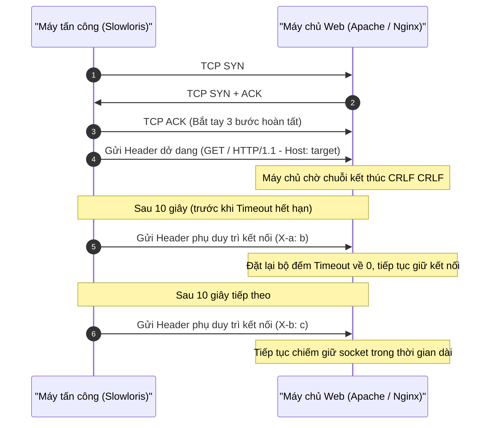
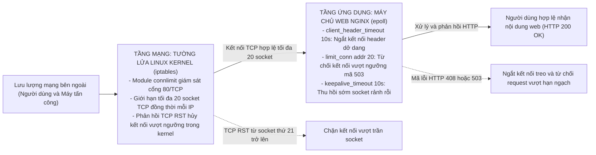

# CHƯƠNG 2. PHÂN TÍCH CÔNG CỤ TẤN CÔNG SLOWLORIS VÀ GIẢI PHÁP PHÒNG THỦ

## 2.1 Khái quát

Chương 2 tập trung vào hai nội dung kỹ thuật trọng tâm: phân tích cơ chế tấn công Slowloris và thiết kế giải pháp phòng thủ trên máy chủ web. Nội dung cụ thể gồm hai phần:
- Phân tích công cụ tấn công Slowloris: làm rõ cơ chế khai thác quy chuẩn đóng gói HTTP/1.1 theo RFC 7230, sự khác biệt giữa kiến trúc đa tiến trình và hướng sự kiện, cùng các dấu hiệu nhận diện trên hệ thống.
- Xây dựng giải pháp phòng chống: thiết lập kiến trúc phòng thủ hai tầng phối hợp giữa máy chủ web Nginx tại tầng ứng dụng (thời gian chờ 10 giây, giới hạn 20 socket/IP) và tường lửa iptables tại tầng mạng (chặn trần 20 kết nối TCP bằng connlimit). Chương cũng đề xuất các giải pháp mở rộng gồm tự động hóa với Fail2ban, kiểm soát tần suất với module limit_req và tối ưu hóa nhân Linux.

---

## 2.2 Phân tích công cụ tấn công Slowloris

Slowloris do chuyên gia bảo mật Robert Hansen công bố năm 2009 [1], nhắm vào tầng ứng dụng (Layer 7). Công cụ này thuộc nhóm tấn công tốc độ chậm (low and slow). Kẻ tấn công chỉ cần một máy trạm gửi lưu lượng nhỏ nhưng kéo dài liên tục. Lưu lượng này chiếm dụng toàn bộ bảng kết nối đồng thời của máy chủ web, khai thác cách triển khai giao thức HTTP trên các kiến trúc hướng tiến trình và cơ chế quản lý socket của máy chủ.

*Bảng 2.1 - So sánh đặc điểm kỹ thuật giữa tấn công DoS truyền thống và Slowloris*

| Tiêu chí so sánh | Tấn công DoS băng thông lớn (Volumetric DoS) | Tấn công Slowloris (Low and Slow DoS) |
| :--- | :--- | :--- |
| **Tầng tác động (Mô hình OSI)** | Tầng mạng / Tầng vận chuyển (Layer 3 & 4) | Tầng ứng dụng (Layer 7 - HTTP/HTTPS) |
| **Mục tiêu làm cạn kiệt** | Băng thông đường truyền, bảng trạng thái router/firewall | Giới hạn kết nối đồng thời của máy chủ web (`MaxRequestWorkers` trên Apache hoặc `worker_connections` trên Nginx) |
| **Lưu lượng yêu cầu** | Rất lớn (hàng trăm Mbps đến Gbps) | Rất nhỏ (khoảng vài chục Kbps) |
| **Yêu cầu hạ tầng tấn công** | Cần botnet hoặc máy chủ khuếch đại (NTP, DNS) | Chỉ cần một máy trạm cấu hình thông thường |
| **Dấu hiệu trên Access Log** | Ghi nhận đột biến hàng triệu bản ghi request | Hầu như không có bản ghi trong lúc treo kết nối; chỉ ghi nhận mã HTTP 408 trên Nginx khi chạm trần thời gian chờ |
| **Mức độ tiêu thụ CPU/RAM** | CPU máy chủ và router xử lý gói tin tăng vọt | Bộ nhớ RAM ổn định; CPU tăng vọt trong pha bắt tay TCP hàng loạt, sau đó duy trì ở mức trung bình để quản lý socket |

### 2.2.1 Cơ chế hoạt động và cách thức làm cạn kiệt tài nguyên

**Quy chuẩn kết thúc yêu cầu theo RFC 7230:**  
Theo đặc tả HTTP/1.1 trong RFC 7230 (được cập nhật tại RFC 9112) [2], một thông điệp yêu cầu kết thúc phần tiêu đề (headers) bằng một dòng trống chứa hai cặp ký tự xuống dòng liên tiếp CRLF (`\r\n\r\n`).

```http
GET / HTTP/1.1\r\n
Host: example.com\r\n
User-Agent: Mozilla/5.0...\r\n
Accept: text/html\r\n
\r\n                            <-- Chuỗi CRLF đánh dấu kết thúc phần Header
```

Khi chưa nhận đủ chuỗi `\r\n\r\n`, máy chủ coi yêu cầu chưa hoàn tất. Socket mạng được giữ ở trạng thái mở để chờ các dòng tiêu đề tiếp theo.

**Kỹ thuật duy trì kết nối nửa mở:**  
Sau khi hoàn tất bắt tay ba bước TCP, Slowloris gửi dòng yêu cầu cùng một vài trường tiêu đề ban đầu, nhưng không gửi chuỗi `\r\n\r\n` kết thúc:

```http
GET / HTTP/1.1\r\n
Host: example.com\r\n
User-Agent: Mozilla/5.0 (Windows NT 10.0; Win64; x64)...\r\n
```

Định kỳ từ 10 đến 15 giây, trước khi bộ đếm thời gian của máy chủ (như giá trị `Timeout 60` mặc định của Apache) hết hạn, công cụ gửi tiếp một dòng tiêu đề phụ không có ý nghĩa nghiệp vụ:

```http
X-a: b\r\n
```

Mỗi khi nhận thêm dữ liệu, máy chủ đặt lại bộ đếm timeout về 0. Bằng cách lặp lại thao tác này, kẻ tấn công duy trì hàng loạt socket mở liên tục mà không bao giờ gửi xong yêu cầu [3].


*Hình 2.1 - Trình tự bắt tay TCP và duy trì kết nối dở dang của Slowloris*

**Cơ chế làm cạn kiệt tài nguyên xử lý trên các kiến trúc máy chủ:**  
Slowloris khai thác trực tiếp mô hình xử lý đa tiến trình và đa luồng trên các máy chủ web truyền thống như Apache HTTP Server thông qua module đa xử lý MPM (Multi-Processing Module) [4]:
* Mô hình MPM Prefork gán mỗi tiến trình con cho một kết nối client duy nhất.
* Mô hình MPM Worker gán mỗi luồng xử lý cho một kết nối.

Cả hai mô hình đều giới hạn tổng số kết nối đồng thời qua tham số `MaxRequestWorkers` (thường từ 150 đến 400 kết nối để tránh tràn bộ nhớ RAM). Khi kẻ tấn công mở đồng thời vài trăm socket ở trạng thái treo, số socket này lấp đầy toàn bộ worker pool của máy chủ. Lúc này, mọi yêu cầu kết nối từ người dùng hợp lệ đều bị đẩy vào hàng đợi chờ (`ListenBacklog`). Khi hàng đợi đầy, máy chủ từ chối kết nối mới hoặc làm yêu cầu của người dùng bị quá hạn (timed out).

Đối với các máy chủ web sử dụng kiến trúc hướng sự kiện bất đồng bộ như Nginx, dù cơ chế `epoll` giúp một tiến trình worker xử lý hàng nghìn kết nối mà không tốn nhiều bộ nhớ RAM, Slowloris vẫn có thể gây cạn kiệt tài nguyên nếu máy chủ không có chính sách giới hạn kết nối theo IP và giữ thời gian chờ header quá dài. Khi kẻ tấn công mở đồng loạt hàng trăm socket dở dang, các kết nối này chiếm trọn giới hạn `worker_connections` của Nginx, đẩy các yêu cầu kết nối từ người dùng hợp lệ vào hàng đợi chờ hoặc bị từ chối dịch vụ.

### 2.2.2 Dấu hiệu nhận diện trên hệ thống nạn nhân

Hệ thống bị tấn công Slowloris xuất hiện các biểu hiện đặc trưng sau:

1. **Tài nguyên phần cứng và mạng:** Băng thông mạng gần như không tăng so với bình thường, chỉ tiêu tốn vài chục kilobit/giây cho các gói tin giữ kết nối. Tải CPU tăng mạnh trong pha bắt tay TCP dồn dập ban đầu, sau đó duy trì ở mức trung bình để quản lý bảng trạng thái socket. Bộ nhớ RAM duy trì ổn định, không bị tràn bộ nhớ.
2. **Bảng kết nối mạng:** Lệnh kiểm tra socket (`ss` hoặc `netstat`) ghi nhận số lượng lớn kết nối ở trạng thái `ESTABLISHED` trỏ về cổng 80 hoặc 443 từ cùng một địa chỉ IP nguồn, với kích thước hàng đợi truyền nhận (`Recv-Q` / `Send-Q`) gần như bằng 0.

```bash
# Kiểm tra số lượng kết nối tới cổng dịch vụ web
ss -tan '( sport = :80 or sport = :443 )' | awk '{print $1}' | sort | uniq -c
```

3. **Phía người dùng:** Các yêu cầu tải trang bị treo lâu, độ trễ phản hồi mạng tăng vọt và xuất hiện lỗi quá thời gian chờ (`504 Gateway Timeout` khi đi qua proxy, hoặc `ERR_CONNECTION_TIMED_OUT`).
4. **Nhật ký máy chủ:** Trên các máy chủ đa tiến trình như Apache, file `access.log` không có bản ghi mới trong suốt thời gian tấn công do tiến trình chỉ ghi log sau khi hoàn tất phiên phản hồi HTTP [4]. Thông tin lỗi chỉ xuất hiện trong `error.log` khi hệ thống cạn kiệt worker pool (`server reached MaxRequestWorkers setting`). Ngược lại, trên máy chủ web Nginx, khi các socket dở dang bị ngắt do chạm trần thời gian chờ (`client_header_timeout`), máy chủ sẽ ghi nhận bản ghi với mã trạng thái `HTTP 408 Request Timeout` vào `access.log`. Dấu hiệu này giúp người quản trị phát hiện và theo dõi hành vi tấn công ngay trên nhật ký truy cập.

---

## 2.3 Giải pháp phòng chống trên máy chủ web

Cuộc tấn công Slowloris thành công nhờ hai điều kiện: máy chủ cho phép duy trì kết nối chậm kéo dài, và không khống chế số lượng socket đồng thời từ mỗi IP nguồn. Do đó, giải pháp phòng thủ cần đối ứng trực tiếp vào hai yếu tố này.

Nhóm thiết kế mô hình phòng thủ hai tầng theo nguyên lý phòng thủ chiều sâu (Defense-in-Depth). Tầng mạng (iptables) đóng vai trò lá chắn phía trước tại nhân Linux, khống chế số lượng socket vật lý. Tầng ứng dụng (Nginx) đóng vai trò phòng ngự nghiệp vụ trực tiếp, kiểm soát thời gian truyền nhận giao thức HTTP. Các giải pháp mở rộng gồm Fail2ban, module limit_req và tham số sysctl bổ trợ khả năng tự động hóa và nâng cao năng lực chịu tải cho môi trường thực tế.


*Hình 2.2 - Sơ đồ kiến trúc phòng thủ hai tầng bảo vệ máy chủ web*

### 2.3.1 Cơ chế kiểm soát lưu lượng và giới hạn kết nối bằng Nginx

Nginx sử dụng kiến trúc hướng sự kiện bất đồng bộ với cơ chế `epoll`, cho phép một tiến trình worker xử lý hàng nghìn kết nối đồng thời mà không tốn nhiều bộ nhớ [5]. Khi cấu hình các chỉ thị kiểm soát thời gian chờ và số kết nối đồng thời, Nginx chủ động bảo vệ tài nguyên socket và loại bỏ các luồng truyền dữ liệu bất thường.

*Bảng 2.2 - Các tham số cấu hình phòng thủ Slowloris trên Nginx*

| Tên tham số cấu hình | Giá trị thiết lập | Mục đích kỹ thuật |
| :--- | :--- | :--- |
| `client_header_timeout` | `10s` | Giới hạn thời gian tối đa để client truyền xong toàn bộ phần HTTP Header |
| `client_body_timeout` | `10s` | Giới hạn thời gian tối đa giữa hai thao tác đọc liên tiếp của request body |
| `keepalive_timeout` | `10s` | Giảm thời gian duy trì socket rảnh rỗi giữa các request của client |
| `limit_conn_zone` | `$binary_remote_addr zone=addr:10m` | Khởi tạo vùng nhớ chia sẻ 10MB lưu bảng theo dõi kết nối theo IP |
| `limit_conn` | `addr 20` | Giới hạn tối đa 20 kết nối đồng thời từ mỗi địa chỉ IP nguồn |

Cấu hình hoàn chỉnh trong file `/etc/nginx/nginx.conf`:

```nginx
http {
    # Cấp phát 10MB bộ nhớ chia sẻ lưu trữ bảng trạng thái kết nối theo IP (zone=addr)
    limit_conn_zone $binary_remote_addr zone=addr:10m;

    server {
        listen 80 default_server;
        server_name _;

        # Giới hạn tối đa 20 kết nối đồng thời từ một địa chỉ IP nguồn
        limit_conn addr 20;

        # Rút ngắn thời gian chờ client gửi hoàn tất phần Header xuống 10 giây
        client_header_timeout 10s;

        # Rút ngắn thời gian chờ client gửi body yêu cầu xuống 10 giây
        client_body_timeout 10s;

        # Giảm thời gian duy trì socket rảnh rỗi giữa các request xuống 10 giây
        keepalive_timeout 10s;

        location / {
            root /var/www/html;
            index index.html index.htm;
        }
    }
}
```

Các chỉ thị cấu hình trên chia thành hai nhóm cơ chế chính:

1. **Nhóm tham số kiểm soát thời gian truyền nhận dữ liệu (Timeouts):**  
Mặc định, máy chủ thường duy trì thời gian chờ header lên tới 60 giây. Việc rút ngắn `client_header_timeout` xuống 10 giây buộc client phải hoàn tất toàn bộ phần header trong khung thời gian này. Khi Slowloris gửi header rác định kỳ để duy trì socket dở dang, nếu quá 10 giây không có chuỗi kết thúc `\r\n\r\n`, Nginx chủ động ngắt socket và phản hồi mã lỗi `HTTP 408 Request Timeout`. Chỉ thị `client_body_timeout 10s` và `keepalive_timeout 10s` hỗ trợ thu hồi sớm socket rảnh rỗi và ngăn chặn biến thể truyền nội dung chậm (Slow POST).

2. **Nhóm tham số khống chế định mức kết nối theo địa chỉ IP (limit_conn):**  
Module `ngx_http_limit_conn_module` sử dụng vùng nhớ chia sẻ `addr:10m` để theo dõi số lượng socket từ từng địa chỉ IP [5]. Khai báo `limit_conn addr 20` giới hạn mỗi client chỉ duy trì tối đa 20 kết nối đồng thời. Khi Slowloris cố tình mở hàng loạt kết nối, từ kết nối thứ 21 trở đi, Nginx từ chối tiếp nhận và trả về mã lỗi `HTTP 503 Service Temporarily Unavailable`. Cơ chế này ngăn chặn việc chiếm dụng cạn kiệt tài nguyên `worker_connections`, bảo toàn năng lực xử lý cho người dùng hợp lệ.

### 2.3.2 Cấu hình tường lửa tầng mạng với iptables

Dù Nginx xử lý tốt kết nối đồng thời, việc để lượng lớn socket đi vào tầng ứng dụng vẫn làm tốn tài nguyên quản lý file descriptor của hệ điều hành. Chặn bớt lưu lượng ngay tại tầng nhân Linux qua iptables giúp giảm tải trực tiếp cho dịch vụ web.

**Cấu hình module connlimit của iptables:**  
Module `connlimit` cho phép kiểm tra số lượng kết nối TCP đồng thời ở trạng thái mở từ một địa chỉ IP trước khi gói tin chuyển tiếp lên tầng ứng dụng [6]:

```bash
# Từ chối kết nối mới nếu một IP mở quá 20 socket TCP đồng thời tới cổng 80
sudo iptables -A INPUT -p tcp --dport 80 -m connlimit --connlimit-above 20 -j REJECT --reject-with tcp-reset
```

Khi áp dụng quy tắc trên, từ socket thứ 21 trở đi, hạt nhân Linux phản hồi gói tin `TCP RST` (Reset) để đóng kết nối ngay lập tức. Cơ chế này phân chia ranh giới xử lý giữa hai tầng:
- Tầng mạng (iptables): Kiểm soát lưu lượng ngay tại nhân Linux. Nếu một IP gửi gói tin SYN vượt quá 20 socket đồng thời, iptables phản hồi `TCP RST` lập tức, ngăn gói tin đi vào hàng đợi của Nginx và tiết kiệm chu kỳ xử lý của CPU.
- Tầng ứng dụng (Nginx): Tiếp nhận các kết nối hợp lệ nằm trong ngưỡng 20 socket đi qua tường lửa. Nếu client giữ kết nối chậm quá 10 giây, Nginx chủ động ngắt phiên và trả về mã lỗi `HTTP 408`.

Sự kết hợp giữa iptables tại Layer 4 và Nginx tại Layer 7 tạo thành mô hình phòng thủ hai tầng cốt lõi. Đây là cấu hình phòng ngự chính được triển khai, kiểm thử và đo lường định lượng trong bài thực nghiệm ở Chương 3.

### 2.3.3 Các giải pháp tự động hóa và tối ưu hóa mở rộng

Phần này đề xuất ba giải pháp mở rộng gồm tự động hóa cô lập IP bằng Fail2ban, kiểm soát tần suất yêu cầu bằng module limit_req và tinh chỉnh tham số hạt nhân Linux (`sysctl.conf`). Đây là các khuyến nghị kỹ thuật bổ trợ cho môi trường vận hành thực tế.

Trong bài thực nghiệm ở Chương 3, nhóm chủ đích không kích hoạt Fail2ban khi thu thập số liệu 120 giây. Nếu kích hoạt Fail2ban, tường lửa sẽ chặn toàn bộ địa chỉ IP của máy tấn công sau 5 yêu cầu phát sinh mã lỗi 408 hoặc 503 (khoảng giây thứ 11). Việc ngắt nguồn phát quá sớm sẽ triệt tiêu áp lực tải lên hệ thống. Nhóm cần duy trì tải tấn công liên tục trong 120 giây để quan sát toàn diện động thái của máy chủ. Trạng thái chịu tải kéo dài giúp kiểm chứng mức CPU 36.8%, RAM 555 MB, nhịp đóng 120 socket và độ trễ probe 1.90 ms.

1. **Cơ chế tự động cô lập IP tấn công với Fail2ban:**  
Fail2ban theo dõi file nhật ký truy cập của Nginx theo thời gian thực. Khi một địa chỉ IP nhận nhiều mã lỗi 408 hoặc 503 trong thời gian ngắn, Fail2ban tự động tạo quy tắc iptables để chặn gói tin từ IP đó trong một khoảng thời gian xác định [7].

Cấu hình bộ lọc Fail2ban cho Nginx (`/etc/fail2ban/filter.d/nginx-slowloris.conf`):

```ini
[Definition]
failregex = ^<HOST> -.* "(GET|POST).*" (408|503)
ignoreregex =
```

Khai báo Jail trong `/etc/fail2ban/jail.local`:

```ini
[nginx-slowloris]
enabled  = true
port     = http,https
filter   = nginx-slowloris
logpath  = /var/log/nginx/access.log
maxretry = 5
findtime = 60
bantime  = 600
```

Khi một IP phát sinh 5 lần mã lỗi 408 hoặc 503 trong vòng 60 giây, Fail2ban đưa địa chỉ đó vào danh sách chặn của iptables trong 10 phút (600 giây).

2. **Kiểm soát tần suất gửi yêu cầu với module limit_req:**  
Kẻ tấn công có thể thay đổi chiến thuật từ duy trì kết nối chậm sang mở và đóng phiên dồn dập nhằm lách qua các bộ đếm timeout. Module `ngx_http_limit_req_module` của Nginx áp dụng thuật toán thùng rò rỉ (Leaky Bucket) để khống chế tốc độ tiếp nhận request:

```nginx
http {
    # Giới hạn tốc độ tiếp nhận: tối đa 5 yêu cầu/giây trên mỗi IP
    limit_req_zone $binary_remote_addr zone=req_limit:10m rate=5r/s;

    server {
        location / {
            # Cho phép xử lý đột biến tối đa 10 yêu cầu
            limit_req zone=req_limit burst=10 nodelay;
        }
    }
}
```

Cấu hình trên cho phép client gửi tối đa 5 yêu cầu/giây, đồng thời chấp nhận mức tăng đột biến không quá 10 yêu cầu với tùy chọn `nodelay`. Các yêu cầu vượt quá hạn ngạch này lập tức bị Nginx từ chối bằng mã `HTTP 503`.

3. **Tinh chỉnh tham số hạt nhân Linux trên máy chủ sản xuất:**  
Các tham số mạng trong file `/etc/sysctl.conf` giúp hệ điều hành dọn dẹp socket rác nhanh hơn và mở rộng hàng đợi tiếp nhận:

```ini
# Bật TCP SYN Cookies bảo vệ hàng đợi kết nối
net.ipv4.tcp_syncookies = 1

# Giảm thời gian giữ trạng thái FIN-WAIT-2 khi đóng socket
net.ipv4.tcp_fin_timeout = 15

# Tăng kích thước hàng đợi tiếp nhận kết nối
net.core.somaxconn = 4096
net.ipv4.tcp_max_syn_backlog = 4096

# Giảm chu kỳ kiểm tra TCP Keepalive để giải phóng socket rảnh rỗi sớm hơn
net.ipv4.tcp_keepalive_time = 300
net.ipv4.tcp_keepalive_intvl = 15
net.ipv4.tcp_keepalive_probes = 5
```

Quản trị viên áp dụng cấu hình mới bằng lệnh `sudo sysctl -p`.

### 2.3.4 Đánh giá phạm vi hiệu quả và giới hạn của giải pháp

Mô hình phòng thủ phối hợp giữa Nginx và iptables giải quyết tốt bài toán tấn công Slowloris từ một nguồn phát hoặc một dải địa chỉ IP tập trung (tấn công DoS đơn lẻ). Tuy nhiên, đối với biến thể tấn công phân tán quy mô lớn (Distributed Slowloris / DDoS), giải pháp này bộc lộ những giới hạn kỹ thuật cần lưu ý:
1. **Trường hợp mạng Botnet phân tán rộng:** Nếu kẻ tấn công sử dụng hàng nghìn địa chỉ IP khác nhau và mỗi IP chỉ mở từ 1 đến 2 kết nối, lưu lượng từ mỗi IP hoàn toàn nằm dưới ngưỡng kích hoạt của `limit_conn` (20 kết nối) và `connlimit` (20 kết nối). Khi đó, các quy tắc dựa trên ngưỡng IP đơn lẻ không thể phát hiện cuộc tấn công.
2. **Hướng xử lý bổ trợ nâng cao:** Để khắc phục kịch bản tấn công phân tán nói trên, hệ thống cần bổ sung các cơ chế phòng thủ chuyên sâu hơn:
   - Triển khai tường lửa ứng dụng web (WAF như ModSecurity hoặc Coraza) có khả năng phân tích hành vi và áp dụng điểm danh tiếng (reputation score) cho phiên kết nối.
   - Sử dụng các mạng phân phối nội dung (CDN) hoặc dịch vụ trung gian bảo vệ (như Cloudflare, AWS Shield) để hấp thụ và lọc các kết nối chậm phân tán trước khi lưu lượng chạm tới máy chủ gốc.

---

## 2.4 Kết chương

Chương 2 đã phân tích cơ chế tấn công Slowloris, cách thức làm cạn kiệt tài nguyên kết nối và các dấu hiệu nhận diện trên hệ thống. Chương cũng xây dựng mô hình phòng thủ hai tầng phối hợp giữa cấu hình Nginx (10s timeout, 20 socket) và quy tắc connlimit của iptables. Các giải pháp mở rộng gồm Fail2ban, module limit_req và tinh chỉnh sysctl cũng được đề xuất cho môi trường vận hành thực tế. Đây là cơ sở kỹ thuật trực tiếp để nhóm triển khai và đánh giá thực nghiệm trong bài Lab ở Chương 3.

---

## Tài liệu tham khảo Chương 2

- **[1]** R. Hansen, *"Slowloris HTTP DoS,"* ha.ckers.org, 2009.
- **[2]** R. Fielding and J. Reschke, *"Hypertext Transfer Protocol (HTTP/1.1): Message Syntax and Routing,"* RFC 7230, Internet Engineering Task Force (IETF), 2014.
- **[3]** OWASP Foundation, *"Slow HTTP Attack,"* OWASP Automated Threat Handbook, 2021.
- **[4]** The Apache Software Foundation, *"Apache MPM worker & mod_reqtimeout Documentation,"* Apache HTTP Server Version 2.4 Documentation, 2024.
- **[5]** Nginx Inc., *"Module ngx_http_core_module & ngx_http_limit_conn_module,"* Nginx Documentation, 2024.
- **[6]** Netfilter Core Team, *"iptables extensions man page (connlimit, recent),"* Netfilter.org, 2023.
- **[7]** C. Hombrouck et al., *"Fail2ban Architecture and Configuration Guide,"* Fail2ban Project, 2023.
