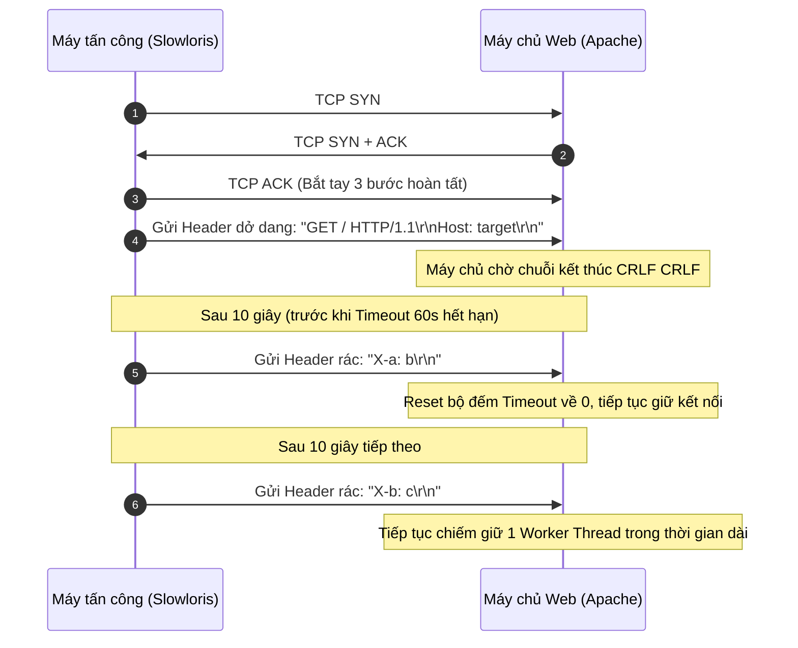
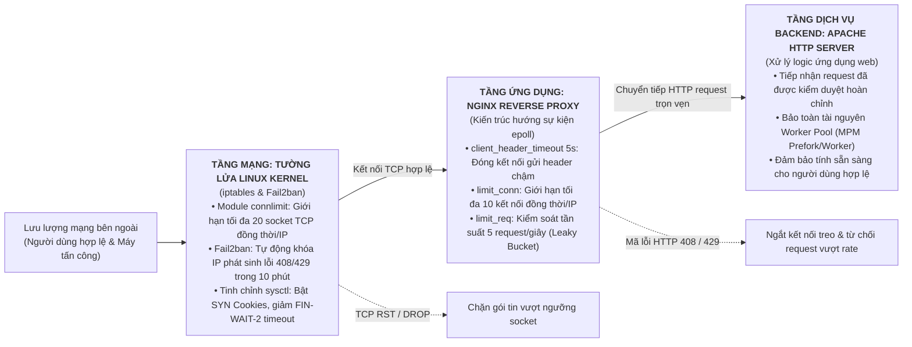

# CHƯƠNG 2. PHÂN TÍCH CÔNG CỤ TẤN CÔNG SLOWLORIS VÀ GIẢI PHÁP PHÒNG THỦ

> **Học phần:** Cơ sở An toàn thông tin  
> **Nhóm thực hiện:** Nhóm 1  
> **Đề tài:** Tìm hiểu về các dạng tấn công và cách phòng chống DoS/DDoS. Tìm và demo một công cụ tấn công DoS/DDoS, sau đó đưa ra giải pháp phòng chống phù hợp.

---

## 2.1 Khái quát

Như đã đề cập trong phần Mở đầu, chương này tập trung vào hai nội dung kỹ thuật trọng tâm: phân tích cơ chế hoạt động của công cụ tấn công Slowloris và xây dựng giải pháp phòng thủ trên máy chủ web. Cụ thể, nội dung của chương gồm hai phần chính:
- Phân tích công cụ tấn công Slowloris: làm rõ cơ chế khai thác quy chuẩn đóng gói HTTP/1.1 theo RFC 7230, cách thức chiếm dụng bảng kết nối trên các máy chủ đa tiến trình và các dấu hiệu nhận diện trên hệ thống.
- Xây dựng giải pháp phòng chống: thiết lập kiến trúc phòng thủ đa lớp kết hợp giữa máy chủ đệm Nginx (rút ngắn thời gian chờ header, giới hạn kết nối đồng thời và kiểm soát tần suất request) cùng tường lửa iptables và công cụ Fail2ban tại tầng mạng.

---

## 2.2 Phân tích công cụ tấn công Slowloris

Slowloris do chuyên gia bảo mật Robert Hansen công bố năm 2009 [1], nhắm vào tầng ứng dụng (Layer 7). Công cụ này thuộc nhóm tấn công tốc độ chậm (low and slow). Kẻ tấn công chỉ cần một máy trạm gửi lưu lượng nhỏ nhưng kéo dài liên tục. Lưu lượng này chiếm dụng toàn bộ bảng kết nối đồng thời của máy chủ web, khai thác cách triển khai giao thức HTTP trên các kiến trúc hướng tiến trình.

*Bảng 2.1 - So sánh đặc điểm kỹ thuật giữa tấn công DoS truyền thống và Slowloris*

| Tiêu chí so sánh | Tấn công DoS băng thông lớn (Volumetric DoS) | Tấn công Slowloris (Low and Slow DoS) |
| :--- | :--- | :--- |
| **Tầng tác động (Mô hình OSI)** | Tầng mạng / Tầng vận chuyển (Layer 3 & 4) | Tầng ứng dụng (Layer 7 - HTTP/HTTPS) |
| **Mục tiêu làm cạn kiệt** | Băng thông đường truyền, bảng trạng thái router/firewall | Giới hạn xử lý kết nối đồng thời (`MaxRequestWorkers`) |
| **Lưu lượng yêu cầu** | Rất lớn (hàng trăm Mbps đến Gbps) | Rất nhỏ (khoảng vài chục Kbps) |
| **Yêu cầu hạ tầng tấn công** | Cần botnet hoặc máy chủ khuếch đại (NTP, DNS) | Chỉ cần một máy trạm cấu hình thông thường |
| **Dấu hiệu trên Access Log** | Ghi nhận đột biến hàng triệu bản ghi request | Không có bản ghi (do request chưa hoàn thành) |
| **Mức độ tiêu thụ CPU/RAM** | CPU máy chủ và router xử lý gói tin tăng vọt | CPU duy trì ở mức bình thường |

### 2.2.1 Cơ chế hoạt động và cách thức làm cạn kiệt tài nguyên

**Quy chuẩn kết thúc yêu cầu theo RFC 7230:**  
Theo đặc tả HTTP/1.1 trong RFC 7230 (được cập nhật tại RFC 9112) [2], một thông điệp yêu cầu kết thúc phần tiêu đề (headers) bằng một dòng trống chứa hai cặp ký tự xuống dòng liên tiếp CRLF (`\r\n\r\n`, mã hex `0D 0A 0D 0A`).

```http
GET / HTTP/1.1\r\n
Host: example.com\r\n
User-Agent: Mozilla/5.0...\r\n
Accept: text/html\r\n
\r\n                            <-- Chuỗi CRLF đánh dấu kết thúc phần Header
```

Khi chưa nhận đủ chuỗi `\r\n\r\n`, máy chủ coi yêu cầu chưa hoàn tất. Socket mạng được giữ ở trạng thái mở để chờ các dòng tiêu đề tiếp theo.

**Kỹ thuật duy trì kết nối nửa mở:**  
Sau khi hoàn tất bắt tay ba bước TCP, Slowloris gửi dòng yêu cầu cùng một vài trường tiêu đề ban đầu, nhưng không gửi chuỗi `\r\n\r\n` kết thúc:

```http
GET / HTTP/1.1\r\n
Host: example.com\r\n
User-Agent: Mozilla/5.0 (Windows NT 10.0; Win64; x64)...\r\n
```

Định kỳ từ 10 đến 15 giây, trước khi bộ đếm thời gian của máy chủ (như giá trị `Timeout 60` mặc định của Apache) hết hạn, công cụ gửi tiếp một dòng tiêu đề phụ không có ý nghĩa nghiệp vụ:

```http
X-a: b\r\n
```

Mỗi khi nhận thêm dữ liệu, máy chủ đặt lại bộ đếm timeout về 0. Bằng cách lặp lại thao tác này, kẻ tấn công duy trì hàng loạt socket mở liên tục mà không bao giờ gửi xong yêu cầu [3].


*Hình 2.1 - Trình tự bắt tay TCP và duy trì kết nối dở dang của Slowloris*

**Cơ chế làm cạn kiệt tài nguyên xử lý:**  
Slowloris khai thác trực tiếp mô hình xử lý đa tiến trình và đa luồng trên các máy chủ web truyền thống như Apache HTTP Server thông qua module đa xử lý MPM (Multi-Processing Module) [4]:
* Mô hình MPM Prefork gán mỗi tiến trình con cho một kết nối client duy nhất.
* Mô hình MPM Worker gán mỗi luồng xử lý cho một kết nối.

Cả hai mô hình đều giới hạn tổng số kết nối đồng thời qua tham số `MaxRequestWorkers` (thường từ 150 đến 400 kết nối để tránh tràn bộ nhớ RAM). Khi kẻ tấn công mở đồng thời vài trăm socket ở trạng thái treo, số socket này lấp đầy toàn bộ worker pool của máy chủ. Lúc này, mọi yêu cầu kết nối từ người dùng hợp lệ đều bị đẩy vào hàng đợi chờ (`ListenBacklog`). Khi hàng đợi đầy, máy chủ từ chối kết nối mới hoặc làm yêu cầu của người dùng bị quá hạn (timed out).

### 2.2.2 Dấu hiệu nhận diện trên hệ thống nạn nhân

Hệ thống bị tấn công Slowloris xuất hiện các biểu hiện đặc trưng sau:

1. **Tài nguyên phần cứng và mạng:** Băng thông mạng gần như không tăng so với bình thường, chỉ tiêu tốn vài chục kilobit/giây cho các gói tin giữ kết nối. Tải CPU ở mức thấp do máy chủ không phải thực thi mã phía backend (PHP, Python, Java). Bộ nhớ RAM giữ nguyên ở mức cấp phát cho các tiến trình đang hoạt động.
2. **Bảng kết nối mạng:** Lệnh kiểm tra socket (`ss` hoặc `netstat`) ghi nhận số lượng lớn kết nối ở trạng thái `ESTABLISHED` trỏ về cổng 80 hoặc 443 từ cùng một địa chỉ IP nguồn, với kích thước hàng đợi truyền nhận (`Recv-Q` / `Send-Q`) gần như bằng 0.

```bash
# Kiểm tra số lượng kết nối tới cổng dịch vụ web
ss -tan '( sport = :80 or sport = :443 )' | awk '{print $1}' | sort | uniq -c
```

3. **Phía người dùng:** Các yêu cầu tải trang bị treo lâu và trả về lỗi quá thời gian chờ (`504 Gateway Timeout` khi đi qua proxy, hoặc `ERR_CONNECTION_TIMED_OUT`).
4. **Nhật ký máy chủ:** File `access.log` không có bản ghi mới trong suốt thời gian tấn công, do Apache chỉ ghi log sau khi hoàn tất phiên phản hồi HTTP [4]. Thông tin chỉ xuất hiện trong `error.log` khi tiến trình hết worker trống (`server reached MaxRequestWorkers setting`) hoặc khi các kết nối bị ngắt do chạm trần timeout.

---

## 2.3 Giải pháp phòng chống trên máy chủ web

Phòng thủ Slowloris cần kết hợp hai mục tiêu: đóng sớm các kết nối truyền dữ liệu chậm và giới hạn số socket mở đồng thời từ mỗi IP. Nhóm xây dựng mô hình phòng vệ hai lớp gồm tầng ứng dụng (Nginx đóng vai trò Reverse Proxy) và tầng mạng (iptables kết hợp Fail2ban).


*Hình 2.2 - Sơ đồ kiến trúc phòng thủ đa lớp bảo vệ máy chủ web*

### 2.3.1 Cơ chế kiểm soát lưu lượng và giới hạn kết nối bằng Nginx

Nginx sử dụng kiến trúc hướng sự kiện bất đồng bộ với cơ chế `epoll`, cho phép một tiến trình worker xử lý hàng nghìn kết nối đồng thời mà không tốn nhiều bộ nhớ [5]. Khi đặt làm Reverse Proxy trước Apache, Nginx tiếp nhận toàn bộ kết nối từ client, chỉ chuyển tiếp yêu cầu về backend sau khi đã đọc hoàn chỉnh header và body. Nhờ vậy, backend tránh được tình trạng bị chiếm dụng worker.

*Bảng 2.2 - Các tham số cấu hình phòng thủ Slowloris trên Nginx*

| Tên tham số cấu hình | Giá trị thiết lập | Mục đích kỹ thuật |
| :--- | :--- | :--- |
| `client_header_timeout` | `5s` | Giới hạn thời gian tối đa để client truyền xong toàn bộ header |
| `client_body_timeout` | `5s` | Giới hạn thời gian tối đa giữa hai thao tác đọc request body |
| `keepalive_timeout` | `15s` | Giảm thời gian duy trì kết nối rảnh rỗi của client |
| `limit_conn_zone` | `$binary_remote_addr 10m` | Khởi tạo vùng nhớ 10MB lưu bảng theo dõi kết nối theo IP |
| `limit_conn` | `10` | Giới hạn tối đa 10 kết nối đồng thời trên mỗi địa chỉ IP |
| `limit_req_zone` | `rate=5r/s` | Giới hạn tốc độ tiếp nhận yêu cầu tối đa 5 request/giây/IP |

**Rút ngắn thời gian chờ nhận Header:**  
Mặc định, máy chủ thường cho phép client gửi header trong khoảng 60 giây. Cấu hình giảm thời gian này giúp Nginx đóng kết nối sớm và trả về mã lỗi `408 Request Timeout` nếu client truyền dữ liệu quá chậm.

Cấu hình trong file `/etc/nginx/nginx.conf`:

```nginx
http {
    # Thời gian tối đa để đọc xong toàn bộ request header từ client
    client_header_timeout 5s;

    # Thời gian tối đa giữa hai thao tác đọc liên tiếp của request body
    client_body_timeout 5s;

    # Thời gian duy trì kết nối rảnh rỗi (idle keep-alive)
    keepalive_timeout 15s;

    # Thời gian tối đa để client tiếp nhận phản hồi từ server
    send_timeout 5s;
}
```

Với cấu hình `client_header_timeout 5s`, nếu client không gửi xong toàn bộ header trong 5 giây hoặc ngừng gửi quá thời gian này, Nginx sẽ chủ động ngắt socket.

**Giới hạn số lượng kết nối đồng thời trên mỗi địa chỉ IP:**  
Module `ngx_http_limit_conn_module` của Nginx cho phép giới hạn số socket kết nối đồng thời từ một địa chỉ IP client [5].

Cấu hình khai báo vùng nhớ và áp dụng chính sách:

```nginx
http {
    # Vùng nhớ lưu trạng thái kết nối theo IP (10MB lưu được khoảng 160.000 địa chỉ IP)
    limit_conn_zone $binary_remote_addr zone=addr_limit:10m;

    # Mã lỗi trả về khi vượt ngưỡng
    limit_conn_status 429;

    server {
        listen 80;
        server_name example.com;

        location / {
            # Giới hạn tối đa 10 kết nối đồng thời từ mỗi IP
            limit_conn addr_limit 10;

            # Chuyển tiếp request hợp lệ về máy chủ backend Apache
            proxy_pass http://127.0.0.1:8080;
            proxy_set_header Host $host;
            proxy_set_header X-Real-IP $remote_addr;
            proxy_set_header X-Forwarded-For $proxy_add_x_forwarded_for;
        }
    }
}
```

Khi Slowloris mở hàng loạt kết nối, Nginx chỉ nhận 10 kết nối đầu. Từ kết nối thứ 11, Nginx trả về mã phản hồi `429 Too Many Requests` và không chuyển tiếp về backend.

**Giới hạn tần suất gửi yêu cầu (Rate Limiting):**  
Module `ngx_http_limit_req_module` sử dụng thuật toán thùng rò rỉ (Leaky Bucket) để khống chế tốc độ gửi request, tránh trường hợp client liên tục mở và đóng kết nối:

```nginx
http {
    # Giới hạn tốc độ tiếp nhận: tối đa 5 yêu cầu/giây trên mỗi IP
    limit_req_zone $binary_remote_addr zone=req_limit:10m rate=5r/s;

    server {
        location / {
            # Cho phép xử lý đột biến tối đa 10 yêu cầu
            limit_req zone=req_limit burst=10 nodelay;
        }
    }
}
```

### 2.3.2 Cấu hình tường lửa ngăn chặn nguồn tấn công

Dù Nginx xử lý tốt kết nối đồng thời, việc để lượng lớn socket đi vào tầng ứng dụng vẫn làm tốn tài nguyên quản lý file descriptor của hệ điều hành. Chặn bớt lưu lượng ngay tại tầng nhân Linux qua iptables và Fail2ban giúp giảm tải trực tiếp cho dịch vụ web.

**Sử dụng module connlimit của iptables:**  
Module `connlimit` cho phép kiểm tra số lượng kết nối TCP đồng thời ở trạng thái mở từ một địa chỉ IP trước khi gói tin đến tầng ứng dụng [6]:

```bash
# Từ chối kết nối mới nếu một IP mở quá 20 socket TCP đồng thời tới cổng 80
sudo iptables -A INPUT -p tcp --dport 80 -m connlimit --connlimit-above 20 -j REJECT --reject-with tcp-reset

# Áp dụng quy tắc tương tự cho cổng HTTPS 443
sudo iptables -A INPUT -p tcp --dport 443 -m connlimit --connlimit-above 20 -j REJECT --reject-with tcp-reset
```

Khi áp dụng quy tắc trên, từ socket thứ 21 trở đi, hạt nhân Linux phản hồi gói tin `TCP RST` (Reset) để đóng kết nối ngay lập tức.

**Tự động phát hiện và cô lập IP tấn công với Fail2ban:**  
Fail2ban theo dõi file nhật ký của Nginx hoặc Apache. Khi một địa chỉ IP nhận nhiều mã lỗi 408 (Timeout) hoặc 429 (Too Many Requests) trong thời gian ngắn, Fail2ban tự động tạo quy tắc iptables để hủy gói tin từ IP đó trong một khoảng thời gian nhất định [7].

Cấu hình bộ lọc Fail2ban cho Nginx (`/etc/fail2ban/filter.d/nginx-slowloris.conf`):

```ini
[Definition]
failregex = ^<HOST> -.* "(GET|POST).*" (408|429)
ignoreregex =
```

Khai báo Jail trong `/etc/fail2ban/jail.local`:

```ini
[nginx-slowloris]
enabled  = true
port     = http,https
filter   = nginx-slowloris
logpath  = /var/log/nginx/access.log
maxretry = 5
findtime = 60
bantime  = 600
```

Nếu một IP có 5 lần phát sinh mã lỗi 408 hoặc 429 trong vòng 60 giây, địa chỉ đó bị chặn hoàn toàn trong 10 phút (600 giây).

**Tinh chỉnh tham số mạng trong hạt nhân Linux:**  
Cấu hình các tham số mạng trong file `/etc/sysctl.conf` giúp giải phóng tài nguyên socket nhanh hơn:

```ini
# Bật TCP SYN Cookies bảo vệ hàng đợi kết nối
net.ipv4.tcp_syncookies = 1

# Giảm thời gian giữ trạng thái FIN-WAIT-2 khi đóng socket
net.ipv4.tcp_fin_timeout = 15

# Tăng kích thước hàng đợi tiếp nhận kết nối
net.core.somaxconn = 4096
net.ipv4.tcp_max_syn_backlog = 4096

# Giảm chu kỳ kiểm tra TCP Keepalive để giải phóng socket rảnh rỗi sớm hơn
net.ipv4.tcp_keepalive_time = 300
net.ipv4.tcp_keepalive_intvl = 15
net.ipv4.tcp_keepalive_probes = 5
```

Áp dụng cấu hình mới bằng lệnh: `sudo sysctl -p`.

### 2.3.3 Đánh giá phạm vi hiệu quả và giới hạn của giải pháp

Mô hình phòng thủ phối hợp giữa Nginx và iptables/Fail2ban giải quyết tốt bài toán tấn công Slowloris từ một nguồn phát hoặc một dải địa chỉ IP tập trung (tấn công DoS đơn lẻ). Tuy nhiên, đối với biến thể tấn công phân tán quy mô lớn (Distributed Slowloris / DDoS), giải pháp này bộc lộ những giới hạn kỹ thuật cần lưu ý:
1. **Trường hợp mạng Botnet phân tán rộng:** Nếu kẻ tấn công sử dụng hàng nghìn địa chỉ IP khác nhau và mỗi IP chỉ mở từ 1 đến 2 kết nối, lưu lượng từ mỗi IP hoàn toàn nằm dưới ngưỡng kích hoạt của `limit_conn` (10 kết nối) và `connlimit` (20 kết nối). Khi đó, các quy tắc dựa trên ngưỡng IP đơn lẻ không thể phát hiện cuộc tấn công.
2. **Hướng xử lý bổ trợ nâng cao:** Để khắc phục kịch bản tấn công phân tán nói trên, hệ thống cần bổ sung các cơ chế phòng thủ chuyên sâu hơn:
   - Triển khai tường lửa ứng dụng web (WAF như ModSecurity hoặc Coraza) có khả năng phân tích hành vi và áp dụng điểm danh tiếng (reputation score) cho phiên kết nối.
   - Sử dụng các mạng phân phối nội dung (CDN) hoặc dịch vụ trung gian bảo vệ (như Cloudflare, AWS Shield) để hấp thụ và lọc các kết nối chậm phân tán trước khi lưu lượng chạm tới máy chủ gốc.

---

## 2.4 Kết chương

Chương này đã phân tích cơ chế hoạt động của công cụ tấn công Slowloris, chỉ ra cách thức làm cạn kiệt tài nguyên xử lý kết nối thông qua việc duy trì socket kéo dài ở mức băng thông tối thiểu, cùng các dấu hiệu nhận diện trên hệ thống. Chương cũng đã xây dựng hoàn chỉnh mô hình giải pháp phòng thủ đa lớp, bao gồm cấu hình tối ưu thời gian chờ và giới hạn kết nối trên Nginx, kết hợp tường lửa iptables và Fail2ban tại tầng mạng, đồng thời đánh giá cụ thể phạm vi bảo vệ cũng như giới hạn của giải pháp trước biến thể tấn công phân tán. Đây là cơ sở kỹ thuật trực tiếp để nhóm tiến hành triển khai và đánh giá thực nghiệm trong môi trường Lab ở Chương 3.

---

## Tài liệu tham khảo Chương 2

- **[1]** R. Hansen, *"Slowloris HTTP DoS,"* ha.ckers.org, 2009.
- **[2]** R. Fielding and J. Reschke, *"Hypertext Transfer Protocol (HTTP/1.1): Message Syntax and Routing,"* RFC 7230, Internet Engineering Task Force (IETF), 2014.
- **[3]** OWASP Foundation, *"Slow HTTP Attack,"* OWASP Automated Threat Handbook, 2021.
- **[4]** The Apache Software Foundation, *"Apache MPM worker & mod_reqtimeout Documentation,"* Apache HTTP Server Version 2.4 Documentation, 2024.
- **[5]** Nginx Inc., *"Module ngx_http_core_module & ngx_http_limit_conn_module,"* Nginx Documentation, 2024.
- **[6]** Netfilter Core Team, *"iptables extensions man page (connlimit, recent),"* Netfilter.org, 2023.
- **[7]** C. Hombrouck et al., *"Fail2ban Architecture and Configuration Guide,"* Fail2ban Project, 2023.
