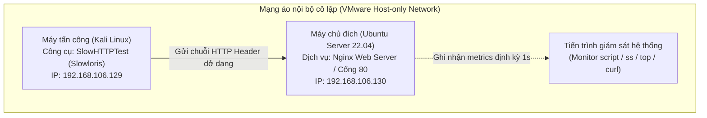

# CHƯƠNG 3. THỰC NGHIỆM VÀ ĐÁNH GIÁ KẾT QUẢ


## 3.1 Xây dựng môi trường thử nghiệm

### 3.1.1 Mô hình mạng thử nghiệm

Nhóm thiết lập mô hình thử nghiệm trên nền tảng ảo VMware Workstation trong phân vùng mạng cô lập (Host-only Network). Việc cô lập mạng giúp kiểm soát toàn bộ lưu lượng phát sinh, tránh gây ảnh hưởng tới hạ tầng mạng thực tế.

Mô hình gồm hai nút máy ảo chính:
- **Máy tấn công (Attacker):** Kali Linux (IP: `192.168.106.129`), chạy công cụ SlowHTTPTest [8] để gửi lưu lượng HTTP Header chậm.
- **Máy mục tiêu (Target):** Ubuntu Server 22.04 LTS (IP: `192.168.106.130`), chạy dịch vụ web Nginx phiên bản 1.18.0 trên cổng 80/TCP.


*Hình 3.1 - Sơ đồ kiến trúc môi trường thử nghiệm mô phỏng tấn công và phòng thủ*

### 3.1.2 Trạng thái hệ thống trước thực nghiệm

Trước khi phát lưu lượng tấn công, nhóm kiểm tra trạng thái hoạt động của dịch vụ Nginx và tính thông suốt của đường truyền mạng.

Trên máy mục tiêu (Ubuntu Server), các lệnh sau xác nhận tiến trình Nginx và cổng dịch vụ:

```bash
# Kiểm tra dịch vụ Nginx đang chạy
systemctl is-active nginx

# Xác nhận Nginx đang lắng nghe trên cổng 80/TCP
sudo ss -lntp | grep :80

# Xác định địa chỉ IP của giao tiếp mạng
hostname -I
```

Từ máy tấn công (Kali Linux), lệnh ping và curl kiểm tra kết nối mạng cùng phản hồi HTTP:

```bash
# Kiểm tra kết nối tầng mạng (ICMP Ping)
ping -c 4 <IP_UBUNTU>

# Gửi yêu cầu HTTP HEAD kiểm tra phản hồi từ Nginx
curl -I http://<IP_UBUNTU>/
```

Máy chủ trả về mã phản hồi `HTTP/1.1 200 OK`, xác nhận dịch vụ web sẵn sàng tiếp nhận kết nối.

### 3.1.3 Trạng thái nền (Baseline)

Nhóm thu thập thông số hoạt động của máy chủ trong 120 giây ở điều kiện bình thường (chưa có tải tấn công). Số liệu trạng thái nền (Baseline) cung cấp mốc đối chứng để đo lường mức độ ảnh hưởng của cuộc tấn công và hiệu quả phòng thủ.

Tiến trình giám sát tự động (`slowloris_monitor.py`) ghi nhận định kỳ mỗi giây một lần các chỉ số kỹ thuật:
- **Tổng số kết nối TCP cổng 80 (`total_80`):** Số socket TCP mở trên cổng dịch vụ web.
- **Số kết nối `ESTABLISHED`:** Số socket TCP đã hoàn tất bắt tay ba bước và đang trao đổi dữ liệu.
- **Tỷ lệ sử dụng CPU (`cpu_percent`):** Phần trăm năng lực vi xử lý hệ thống tiêu thụ.
- **Bộ nhớ RAM (`mem_used_mb`, `mem_percent`):** Dung lượng (MB) và tỷ lệ (%) bộ nhớ vật lý sử dụng.
- **Thời gian phản hồi HTTP (`reponse_sec`):** Độ trễ xử lý yêu cầu HTTP tiêu chuẩn gửi qua giao tiếp loopback (ms).


---

## 3.2 Mô phỏng tấn công không phòng thủ

### 3.2.1 Kịch bản tấn công Slowloris

Từ máy Kali Linux, nhóm thực thi kịch bản Slowloris (`-H`) bằng công cụ SlowHTTPTest. Kịch bản mở 500 kết nối HTTP đồng thời, gửi tiêu đề dở dang với chu kỳ giãn cách 10 giây giữa các đoạn header để giữ socket mở liên tục mà không hoàn tất yêu cầu.

Lệnh thực thi trên máy tấn công Kali Linux:

```bash
slowhttptest -c 500 -H -g -o slowloris_monitor -i 10 -r 20 -t GET -u http://<IP_UBUNTU>/ -x 24 -p 3 -l 120
```

Ý nghĩa các tham số cấu hình:
- `-c 500`: Đặt số kết nối đồng thời mục tiêu là 500.
- `-H`: Chọn chế độ gửi tiêu đề chậm (Slowloris).
- `-g`: Xuất biểu đồ thống kê dạng đồ họa (HTML/Canvas).
- `-o slowloris_monitor`: Đặt tiền tố tên tệp kết quả xuất ra.
- `-i 10`: Đặt khoảng cách giữa các đoạn header tiếp theo là 10 giây.
- `-r 20`: Đặt tốc độ mở kết nối mới là 20 kết nối mỗi giây.
- `-t GET`: Chọn phương thức HTTP GET cho yêu cầu.
- `-u http://<IP_UBUNTU>/`: Chỉ định URL của máy chủ mục tiêu.
- `-x 24`: Giới hạn độ dài header ngẫu nhiên gửi thêm tối đa 24 byte.
- `-p 3`: Đặt thời gian chờ tối đa cho gói tin thăm dò là 3 giây.
- `-l 120`: Giới hạn thời gian chạy thử nghiệm trong 120 giây.

### 3.2.2 Giám sát hệ thống máy chủ 

Trong 120 giây thử nghiệm, tiến trình giám sát trên Ubuntu Server liên tục ghi nhận dữ liệu mạng và tài nguyên vào tệp `slowloris_monitor.csv`:

Kiểm tra số lượng socket TCP theo từng trạng thái bằng lệnh `ss`:

```bash
watch -n 1 'ss -tan "( dport = :80 or sport = :80 )" | awk "NR>1 {print $1}" | sort | uniq -c'
```

Theo dõi tải CPU và bộ nhớ bằng lệnh `top`.

Theo dõi nhật ký truy cập và lỗi của Nginx theo thời gian thực:

```bash
sudo tail -f /var/log/nginx/access.log /var/log/nginx/error.log
```

### 3.2.3 Phân tích kết quả 

Số liệu thống kê trích xuất từ hai tệp nhật ký `baseline_500.csv` và `slowloris_monitor.csv` được tổng hợp tại Bảng 3.1:

*Bảng 3.1 - So sánh thông số hệ thống trước và trong khi chịu tấn công Slowloris (chưa phòng thủ)*

| Chỉ số giám sát | Trạng thái nền (Baseline) | Khi bị tấn công (Bản 1) | Đánh giá kỹ thuật |
| :--- | :---: | :---: | :--- |
| **Tổng số TCP Connections** | 2 | ~481 | Tăng từ 2 lên trung bình 481 kết nối do công cụ liên tục mở socket TCP mới tới cổng 80. |
| **Số kết nối ESTABLISHED** | 0 | ~442 | Chiếm dụng trung bình 442 kết nối dở dang (đỉnh điểm 500 kết nối), làm cạn kiệt bảng kết nối của máy chủ. |
| **Mức tiêu thụ CPU (%)** | 8.7% | 38.3% | Tăng 4.4 lần. Đỉnh điểm chạm 100% trong pha bắt tay TCP hàng loạt, sau đó duy trì ở mức 38.3% để quản lý socket. |
| **Mức tiêu thụ RAM** | 589.0 MB (17.59%) | 590.2 MB (17.63%) | Biến động 1.2 MB (tăng 0.04%). Slowloris không làm tràn bộ nhớ mà tập trung chiếm giữ slot kết nối. |
| **Thời gian phản hồi HTTP cục bộ** | 0.90 ms | 0.48 ms | Phản hồi nội bộ qua loopback giữ ở mức dưới 1 ms do cơ chế epoll xử lý riêng, trong khi kết nối từ mạng ngoài bị nghẽn hoàn toàn. |

Từ số liệu thực nghiệm, nhóm ghi nhận các hiện tượng kỹ thuật:

1. **Hiện tượng cạn kiệt bảng kết nối (Connection Pool Exhaustion):** Với tốc độ mở 20 kết nối mỗi giây, số kết nối `ESTABLISHED` chạm ngưỡng 500 ở giây thứ 26. Tệp `baseline_500.csv` ghi nhận số kết nối bị ngắt (`Closed`) luôn bằng 0 trong suốt 120 giây. Cấu hình mặc định của Nginx không giới hạn số kết nối từ một IP và giữ thời gian chờ header dài, khiến các socket dở dang bị chiếm dụng liên tục.

2. **Mức tiêu hao tài nguyên phần cứng:** Mức tiêu thụ RAM duy trì ở mức ~590 MB, khẳng định Slowloris không gây tràn bộ nhớ. Tải CPU tăng lên 100% tại giây thứ 2 khi máy chủ xử lý dồn dập các gói tin bắt tay TCP SYN/ACK, sau đó ổn định ở mức trung bình 38.3% để duy trì ngữ cảnh và bộ đếm thời gian của 500 socket.

3. **Tác động từ chối dịch vụ (DoS) đối với người dùng hợp lệ:** Lệnh curl nội bộ qua loopback (127.0.0.1) vẫn phản hồi trong 0.48 ms do kiến trúc hướng sự kiện (epoll) của Nginx xử lý riêng biệt các socket nội bộ. Tuy nhiên, các máy trạm ngoài mạng không thể thiết lập phiên mới vì 500 kết nối độc hại đã chiếm trọn giới hạn `worker_connections` của máy chủ.

---

## 3.3 Triển khai phòng thủ 

### 3.3.1 Cấu hình Nginx Web Server

Nhóm thiết lập giải pháp phòng thủ tại tầng ứng dụng (Layer 7) bằng cách bổ sung chỉ thị kiểm soát kết nối và thời gian chờ vào tệp cấu hình `/etc/nginx/nginx.conf`.

Khai báo vùng nhớ theo dõi kết nối tại khối `http`:

```nginx
# Cấp phát 10MB bộ nhớ chia sẻ để lưu trữ bảng trạng thái IP kết nối (zone=addr)
limit_conn_zone $binary_remote_addr zone=addr:10m;
```

Cấu hình giới hạn kết nối và thời gian chờ tại khối `server`:

```nginx
server {
    listen 80 default_server;
    server_name _;

    # Giới hạn tối đa 20 kết nối đồng thời từ một địa chỉ IP nguồn
    limit_conn addr 20;

    # Rút ngắn thời gian chờ client gửi hoàn tất phần Header xuống 10 giây
    client_header_timeout 10s;

    # Rút ngắn thời gian chờ client gửi body yêu cầu xuống 10 giây
    client_body_timeout 10s;

    # Giảm thời gian duy trì socket rảnh rỗi giữa các request xuống 10 giây
    keepalive_timeout 10s;
}
```

Kiểm tra cú pháp và nạp lại cấu hình:

```bash
sudo nginx -t
sudo systemctl reload nginx
```

Chức năng của từng chỉ thị:
- `limit_conn addr 20`: Giới hạn mỗi địa chỉ IP nguồn mở tối đa 20 kết nối đồng thời. Nginx từ chối các kết nối vượt ngưỡng bằng mã `HTTP 503 Service Temporarily Unavailable`.
- `client_header_timeout 10s`: Giới hạn thời gian truyền toàn bộ phần HTTP Header trong 10 giây. Nginx tự động đóng kết nối và trả về mã lỗi `HTTP 408 Request Timeout` nếu client không gửi đủ chuỗi kết thúc `\r\n\r\n`.
- `client_body_timeout 10s` và `keepalive_timeout 10s`: Ngăn chặn các biến thể truyền body chậm (Slow POST) và giải phóng các socket rảnh rỗi sau 10 giây.

### 3.3.2 Đánh giá hiệu quả thực nghiệm sau khi áp dụng cấu hình Nginx

Sau khi nạp cấu hình mới, nhóm chạy lại bài thử nghiệm SlowHTTPTest với cùng bộ tham số (`-c 500`, `-i 10`, `-r 20`, `-l 120`). Hai tệp `slowloris_monitor2.csv` và `baseline2_500.csv` ghi nhận diễn biến thực nghiệm:
- **Từ giây 0 đến giây 10:** SlowHTTPTest mở kết nối với tốc độ trung bình 48 kết nối mỗi giây, đạt 478 kết nối mở tại giây thứ 10 (`Connected = 478`, `Closed = 1`).
- **Tại giây thứ 10:** Chỉ thị `client_header_timeout 10s` kích hoạt trên các kết nối mở từ giây đầu tiên do client chưa gửi xong header.
- **Từ giây 11 đến giây 20:** Nginx liên tục đóng các socket vi phạm: 48 kết nối tại giây 11, 237 kết nối tại giây 15 và 478 kết nối tại giây 20 (`Closed = 478`, `Connected = 22`).
- **Kết quả ngắt tấn công sớm:** Nginx đóng 478 trên tổng số 500 kết nối mục tiêu (95.6%), làm đứt mạch duy trì kết nối của SlowHTTPTest. Công cụ nhận thấy cổng đích liên tục ngắt kết nối nên dừng kịch bản ở giây thứ 20 thay vì kéo dài 120 giây.

*Bảng 3.2 - So sánh thông số hệ thống trước và sau khi kích hoạt cấu hình phòng thủ Nginx*

| Chỉ số giám sát | Trạng thái nền (Baseline) | Đã phòng thủ (Bản 2) | Đánh giá hiệu quả |
| :--- | :---: | :---: | :--- |
| **Tổng số TCP Connections** | 2 | ~404 | Giảm từ 481 xuống 404 kết nối. Nginx liên tục đóng các kết nối quá hạn header. |
| **Số kết nối ESTABLISHED** | 0 | ~98 | Giảm 77.8% so với khi chưa phòng thủ (từ 442 xuống 98 kết nối). Máy chủ không còn bị chiếm giữ hàng trăm socket mở kéo dài. |
| **Mức tiêu thụ CPU (%)** | 8.7% | 18.3% | Giảm 52.2% (từ 38.3% xuống 18.3%). CPU chỉ tăng trong 20 giây đầu rồi trở về trạng thái ổn định. |
| **Mức tiêu thụ RAM** | 589.0 MB (17.59%) | 603.9 MB (18.04%) | Tăng 14.9 MB (2.5%). Mức tăng này do Nginx cấp phát 10 MB bộ nhớ chia sẻ (`zone=addr:10m`) và chi phí bảng trạng thái trong kernel. |
| **Thời gian phản hồi HTTP** | 0.90 ms | 0.70 ms | Duy trì dưới 1 ms. Dịch vụ web hoạt động ổn định và sẵn sàng tiếp nhận người dùng hợp lệ. |

---

## 3.4 Đánh giá kết quả

Nhóm tổng hợp các chỉ số định lượng then chốt giữa hai trạng thái thử nghiệm tại Bảng 3.3:

*Bảng 3.3 - Tổng hợp hiệu quả các chỉ số đo lường giữa hai trạng thái thử nghiệm*

| Tiêu chí đo lường | Trước khi phòng thủ (Bản 1) | Sau khi phòng thủ (Bản 2) | Mức độ cải thiện và đánh giá kỹ thuật |
| :--- | :---: | :---: | :--- |
| **Số kết nối duy trì trung bình (`ESTABLISHED`)** | ~442 kết nối | ~98 kết nối | Giảm 77.8%. Các quy tắc giới hạn và timeout ngăn chặn việc chiếm giữ socket kéo dài. |
| **Số kết nối tối đa bị máy chủ đóng (`Closed`)** | 0 kết nối | 478 kết nối | Cải thiện rõ rệt. Nginx chủ động đóng 478 socket vi phạm thời gian chờ thay vì duy trì vô hạn. |
| **Tải tiêu thụ CPU trung bình** | 38.3% | 18.3% | Giảm 52.2% tải xử lý do hệ thống không phải duy trì ngữ cảnh cho hàng trăm socket dở dang. |
| **Mức tiêu thụ bộ nhớ RAM** | ~590 MB | ~604 MB | Tăng 2.5% (~14 MB), dùng để lưu bảng theo dõi IP và trạng thái kết nối mạng. |
| **Thời gian duy trì cuộc tấn công** | Kéo dài trọn vẹn 120 giây | Dừng ở giây thứ 20 | Rút ngắn 83.3% thời gian duy trì. Công cụ dừng sớm vì 95.6% kết nối bị máy chủ chủ động đóng. |

Kết quả thực nghiệm cho thấy tham số `client_header_timeout 10s` giữ vai trò quyết định trong việc hóa giải tấn công Slowloris. Máy chủ giải phóng 478 socket trong 10 giây (từ giây 11 đến giây 20), ngăn chặn nguy cơ cạn kiệt bảng kết nối.

Mô hình phối hợp giữa iptables tại tầng 4 và Nginx tại tầng 7 duy trì thời gian phản hồi HTTP cục bộ dưới 1 ms. Nhờ đó, người dùng hợp lệ có thể truy cập dịch vụ bình thường ngay trong lúc cuộc tấn công diễn ra.

---

## 3.5 Kết chương

Chương 3 đã hoàn thành các nội dung thực nghiệm mô phỏng tấn công và đánh giá giải pháp phòng thủ trong môi trường ảo. Từ các số liệu đo lường thực tế, nhóm rút ra ba kết luận:

1. **Đặc tính của Slowloris:** Cuộc tấn công khai thác giới hạn kết nối đồng thời của máy chủ web bằng cách gửi tiêu đề dở dang kéo dài. Mức sử dụng RAM và băng thông gần như không đổi, nhưng số socket `ESTABLISHED` đạt 442 kết nối và chiếm trọn tài nguyên phục vụ người dùng mới.
2. **Hiệu quả cấu hình Nginx:** Việc kết hợp `client_header_timeout 10s` và `limit_conn addr 20` giúp Nginx nhận diện và đóng 478 kết nối vi phạm, giảm 77.8% số socket bị chiếm dụng và buộc công cụ tấn công dừng sớm ở giây thứ 20.

---

## Tài liệu tham khảo Chương 3

- **[8]** S. Shekyan, *"SlowHTTPTest: Application Layer Denial of Service Testing Tool,"* GitHub Repository, 2023. [Trực tuyến]. Địa chỉ: https://github.com/shekyan/slowhttptest.
- **[9]** Nginx Inc., *"Mitigating DDoS Attacks with NGINX and NGINX Plus,"* Nginx Technical Brief, 2024.
- **[10]** Netfilter Core Team, *"iptables(8) - Linux man page,"* netfilter.org, 2023.
