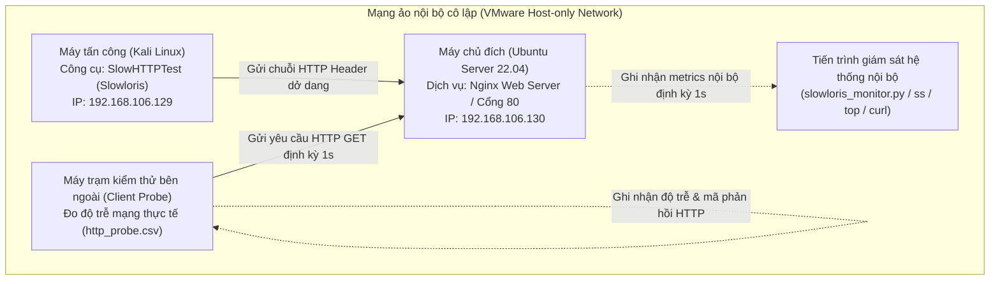

# CHƯƠNG 3. THỰC NGHIỆM VÀ ĐÁNH GIÁ KẾT QUẢ


## 3.1 Xây dựng môi trường thử nghiệm

### 3.1.1 Mô hình mạng thử nghiệm

Nhóm thiết lập mô hình thử nghiệm trên nền tảng ảo VMware Workstation trong phân vùng mạng cô lập (Host-only Network). Việc cô lập mạng giúp kiểm soát toàn bộ lưu lượng phát sinh, tránh gây ảnh hưởng tới hạ tầng mạng thực tế.

Mô hình gồm ba thành phần chính:
- **Máy tấn công (Attacker):** Kali Linux (IP: `192.168.106.129`), chạy công cụ SlowHTTPTest [8] để gửi lưu lượng HTTP Header chậm.
- **Máy mục tiêu (Target):** Ubuntu Server 22.04 LTS (IP: `192.168.106.130`), chạy dịch vụ web Nginx phiên bản 1.18.0 trên cổng 80/TCP cùng kịch bản giám sát nội bộ `slowloris_monitor.py`.
- **Máy trạm thăm dò bên ngoài (External Probe Client):** Máy khách gửi các yêu cầu HTTP GET định kỳ 1 giây qua giao tiếp mạng tới cổng 80 của máy chủ đích, ghi nhận độ trễ phản hồi mạng thực tế và mã trạng thái HTTP vào tệp `http_probe.csv`.


*Hình 3.1 - Sơ đồ kiến trúc môi trường thử nghiệm mô phỏng tấn công và phòng thủ*

### 3.1.2 Trạng thái hệ thống trước thực nghiệm

Trước khi phát lưu lượng tấn công, nhóm kiểm tra trạng thái hoạt động của dịch vụ Nginx và tính thông suốt của đường truyền mạng.

Trên máy mục tiêu (Ubuntu Server), các lệnh sau xác nhận tiến trình Nginx và cổng dịch vụ:

```bash
# Kiểm tra dịch vụ Nginx đang chạy
systemctl is-active nginx

# Xác nhận Nginx đang lắng nghe trên cổng 80/TCP
sudo ss -lntp | grep :80

# Xác định địa chỉ IP của giao tiếp mạng
hostname -I
```

Từ máy tấn công (Kali Linux), lệnh ping và curl kiểm tra kết nối mạng cùng phản hồi HTTP:

```bash
# Kiểm tra kết nối tầng mạng (ICMP Ping)
ping -c 4 <IP_UBUNTU>

# Gửi yêu cầu HTTP HEAD kiểm tra phản hồi từ Nginx
curl -I http://<IP_UBUNTU>/
```

Máy chủ trả về mã phản hồi `HTTP/1.1 200 OK`, xác nhận dịch vụ web sẵn sàng tiếp nhận kết nối.

### 3.1.3 Trạng thái nền (Baseline)

Nhóm thu thập thông số hoạt động của máy chủ trong 120 giây ở điều kiện bình thường (chưa có tải tấn công). Số liệu trạng thái nền (Baseline) cung cấp mốc đối chứng để đo lường mức độ ảnh hưởng của cuộc tấn công và hiệu quả phòng thủ.

Tiến trình giám sát ghi nhận định kỳ mỗi giây một lần các chỉ số kỹ thuật:
- **Tổng số kết nối TCP cổng 80 (`total_80`):** Số socket TCP mở trên cổng dịch vụ web (trạng thái nền ghi nhận 2 socket ở chế độ `LISTEN`).
- **Số kết nối `ESTABLISHED`:** Số socket TCP đã hoàn tất bắt tay ba bước và đang trao đổi dữ liệu (trạng thái nền duy trì ở mức 0).
- **Tỷ lệ sử dụng CPU (`cpu_percent`):** Phần trăm năng lực vi xử lý hệ thống tiêu thụ (trạng thái nền dao động từ 4.5% đến 8.7%).
- **Bộ nhớ RAM (`mem_used_mb`, `mem_percent`):** Dung lượng (MB) và tỷ lệ (%) bộ nhớ vật lý sử dụng (trạng thái nền tiêu thụ khoảng 552 MB – 576 MB, tương đương 16.5% – 17.2%).
- **Thời gian phản hồi HTTP cục bộ (`reponse_sec`):** Độ trễ xử lý yêu cầu HTTP tiêu chuẩn gửi qua giao tiếp loopback `127.0.0.1` (ms), duy trì ở mức 0.45 ms – 0.90 ms.
- **Thời gian phản hồi HTTP từ bên ngoài (`response_sec` trong `http_probe.csv`):** Độ trễ mạng thực tế khi máy khách bên ngoài gửi yêu cầu GET tới máy chủ qua card mạng (ms).


---

## 3.2 Mô phỏng tấn công không phòng thủ

### 3.2.1 Kịch bản tấn công Slowloris

Từ máy Kali Linux, nhóm thực thi kịch bản Slowloris (`-H`) bằng công cụ SlowHTTPTest. Kịch bản mở 500 kết nối HTTP đồng thời, gửi tiêu đề dở dang với chu kỳ giãn cách 10 giây giữa các đoạn header để giữ socket mở liên tục mà không hoàn tất yêu cầu.

Lệnh thực thi trên máy tấn công Kali Linux:

```bash
slowhttptest -c 500 -H -g -o slowloris_monitor -i 10 -r 20 -t GET -u http://<IP_UBUNTU>/ -x 24 -p 3 -l 120
```

Ý nghĩa các tham số cấu hình:
- `-c 500`: Đặt số kết nối đồng thời mục tiêu là 500.
- `-H`: Chọn chế độ gửi tiêu đề chậm (Slowloris).
- `-g`: Xuất biểu đồ thống kê dạng đồ họa (HTML/Canvas).
- `-o slowloris_monitor`: Đặt tiền tố tên tệp kết quả xuất ra.
- `-i 10`: Đặt khoảng cách giữa các đoạn header tiếp theo là 10 giây.
- `-r 20`: Đặt tốc độ mở kết nối mới là 20 kết nối mỗi giây.
- `-t GET`: Chọn phương thức HTTP GET cho yêu cầu.
- `-u http://<IP_UBUNTU>/`: Chỉ định URL của máy chủ mục tiêu.
- `-x 24`: Giới hạn độ dài header ngẫu nhiên gửi thêm tối đa 24 byte.
- `-p 3`: Đặt thời gian chờ tối đa cho gói tin thăm dò là 3 giây.
- `-l 120`: Giới hạn thời gian chạy thử nghiệm trong 120 giây.

### 3.2.2 Giám sát hệ thống máy chủ 

Trong 120 giây thử nghiệm, tiến trình giám sát trên Ubuntu Server liên tục ghi nhận dữ liệu mạng và tài nguyên vào tệp `slowloris_monitor.csv`:

Kiểm tra số lượng socket TCP theo từng trạng thái bằng lệnh `ss`:

```bash
watch -n 1 'ss -tan "( dport = :80 or sport = :80 )" | awk "NR>1 {print $1}" | sort | uniq -c'
```

Theo dõi tải CPU và bộ nhớ bằng lệnh `top`.

Theo dõi nhật ký truy cập và lỗi của Nginx theo thời gian thực:

```bash
sudo tail -f /var/log/nginx/access.log /var/log/nginx/error.log
```

### 3.2.3 Phân tích kết quả 

Số liệu thống kê trích xuất từ các tệp nhật ký `baseline_500.csv`, `slowloris_monitor.csv` và `http_probe.csv` được tổng hợp tại Bảng 3.1:

*Bảng 3.1 - So sánh thông số hệ thống trước và trong khi chịu tấn công Slowloris (chưa phòng thủ)*

| Chỉ số giám sát | Trạng thái nền (Baseline) | Khi bị tấn công (Bản 1) | Nhận xét kỹ thuật |
| :--- | :---: | :---: | :--- |
| **Tổng socket TCP cổng 80 (`total_80`)** | 2 | 490.6 (đỉnh 552) | Lượng socket tăng nhanh do công cụ liên tục mở các phiên TCP mới đến cổng 80. |
| **Số kết nối ESTABLISHED** | 0 | 441.6 (đỉnh 500) | Chiếm trần 500 kết nối từ giây thứ 25 và duy trì trạng thái dở dang trong suốt bài test. |
| **Mức tiêu thụ CPU (%)** | 4.5% - 8.7% | 35.6% (đỉnh 100%) | CPU chạm 100% ở pha bắt tay hàng loạt ban đầu, sau đó duy trì quanh mức 35.6% để quản lý socket. |
| **Mức tiêu thụ RAM** | 552 MB - 576 MB (16.5% - 17.2%) | 581.0 MB (17.36%) | Mức dùng RAM tăng nhẹ từ 5 MB đến 29 MB (dao động 576 MB - 584 MB), cho thấy Slowloris không gây áp lực lên bộ nhớ. |
| **Thời gian phản hồi HTTP bên ngoài (`http_probe`)** | ~1.50 ms | 1.90 ms (đỉnh 7.22 ms) | 138/138 yêu cầu nhận mã 200, nhưng xuất hiện các nhịp tăng vọt lên 3.7 ms đến 7.2 ms cứ mỗi 10 giây khi công cụ gửi thêm header. |

Từ số liệu thực nghiệm, nhóm rút ra ba nhận xét chính:

1. **Chiếm dụng bảng kết nối:** SlowHTTPTest liên tục mở khoảng 20 kết nối mỗi giây, khiến số socket `ESTABLISHED` đạt 500 vào giây thứ 25. Tệp `baseline_500.csv` ghi nhận `Closed = 0` trong suốt 120 giây, cho thấy các kết nối bị giữ ở trạng thái dở dang. Đây là biểu hiện điển hình của Slowloris khi Nginx không giới hạn số kết nối từ một IP và cho phép header kéo dài.

2. **Tác động đến tài nguyên hệ thống:** RAM vẫn giữ mức ổn định khoảng 581 MB, nhưng CPU tăng vọt lên 100% ở giai đoạn đầu do xử lý hàng loạt gói bắt tay TCP và quản lý 500 socket. Sau đó, CPU vẫn duy trì ở mức trung bình 35.6%, cho thấy hệ thống bị đặt dưới tải liên tục.

3. **Độ trễ truy cập thực tế tăng theo nhịp tấn công:** Từ máy thăm dò bên ngoài, độ trễ trung bình đạt 1.90 ms, với đỉnh 7.22 ms. Cứ sau mỗi 10 giây, khi các kết nối độc hại gửi thêm header, độ trễ lại tăng rõ rệt, phản ánh hiệu ứng tấn công theo chu kỳ của Slowloris.

---

## 3.3 Triển khai phòng thủ 

### 3.3.1 Cấu hình Nginx Web Server

Nhóm thiết lập giải pháp phòng thủ tại tầng ứng dụng (Layer 7) bằng cách bổ sung chỉ thị kiểm soát kết nối và thời gian chờ vào tệp cấu hình `/etc/nginx/nginx.conf`.

Khai báo vùng nhớ theo dõi kết nối tại khối `http`:

```nginx
# Cấp phát 10MB bộ nhớ chia sẻ để lưu trữ bảng trạng thái IP kết nối (zone=addr)
limit_conn_zone $binary_remote_addr zone=addr:10m;
```

Cấu hình giới hạn kết nối và thời gian chờ tại khối `server`:

```nginx
server {
    listen 80 default_server;
    server_name _;

    # Giới hạn tối đa 20 kết nối đồng thời từ một địa chỉ IP nguồn
    limit_conn addr 20;

    # Rút ngắn thời gian chờ client gửi hoàn tất phần Header xuống 10 giây
    client_header_timeout 10s;

    # Rút ngắn thời gian chờ client gửi body yêu cầu xuống 10 giây
    client_body_timeout 10s;

    # Giảm thời gian duy trì socket rảnh rỗi giữa các request xuống 10 giây
    keepalive_timeout 10s;
}
```

Kiểm tra cú pháp và nạp lại cấu hình:

```bash
sudo nginx -t
sudo systemctl reload nginx
```

Chức năng của từng chỉ thị:
- `limit_conn addr 20`: Giới hạn mỗi địa chỉ IP nguồn mở tối đa 20 kết nối đồng thời. Nginx từ chối các kết nối vượt ngưỡng bằng mã `HTTP 503 Service Temporarily Unavailable`.
- `client_header_timeout 10s`: Giới hạn thời gian truyền toàn bộ phần HTTP Header trong 10 giây. Nginx tự động đóng kết nối và trả về mã lỗi `HTTP 408 Request Timeout` nếu client không gửi đủ chuỗi kết thúc `\r\n\r\n`.
- `client_body_timeout 10s` và `keepalive_timeout 10s`: Ngăn chặn các biến thể truyền body chậm (Slow POST) và giải phóng các socket rảnh rỗi sau 10 giây.

### 3.3.2 Cấu hình Nginx

Sau khi áp dụng cấu hình mới, nhóm chạy lại bài thử nghiệm với cùng tham số. Kết quả từ `baseline2_500.csv` và `slowloris_monitor2.csv` cho thấy:
- **Khống chế số kết nối ở mức 20:** Chỉ thị `limit_conn addr 20` khiến số kết nối mở thành công không vượt quá 20 (`Connected = 20`). Tất cả các yêu cầu vượt ngưỡng đều bị chặn, và số kết nối chờ (`Pending`) tăng mạnh, đạt 461 ở giây thứ 10.
- **Ngắt phiên quá hạn header:** Nginx đóng toàn bộ 20 kết nối đầu tiên ở giây thứ 11 khi hết thời gian chờ header 10 giây. Các đợt đóng tiếp theo diễn ra đều đặn theo nhịp tấn công, đến 120 kết nối bị đóng ở giây 90.
- **Loại bỏ hiệu quả luồng kết nối độc hại:** Từ giây 90 đến khi kết thúc thử nghiệm, `Connected` vẫn ở mức 0. Trong tổng số 500 kết nối, 120 kết nối mở thành công bị đóng do timeout, còn 380 kết nối còn lại bị chặn ở trạng thái `Pending`.


### 3.3.3 Phòng thủ bổ sung bằng Firewall (iptables)

Dù Nginx đã đóng các kết nối chậm, việc tiếp nhận hàng trăm kết nối đi vào tầng ứng dụng vẫn tiêu tốn tài nguyên bắt tay TCP và quản lý socket trong kernel. Để giảm tải cho Nginx, nhóm triển khai giải pháp lọc gói tin tại tầng nhân Linux bằng tường lửa `iptables` qua module `connlimit` [6].

Quy tắc cấu hình iptables:

```bash
# Giới hạn mỗi IP chỉ được mở tối đa 20 kết nối TCP đồng thời tới cổng 80, từ chối kết nối thứ 21 bằng TCP RST
sudo iptables -A INPUT -p tcp --dport 80 -m connlimit --connlimit-above 20 -j REJECT --reject-with tcp-reset
```

Kiểm tra quy tắc đã được nạp vào Kernel:

```bash
sudo iptables -L INPUT -n -v
```

Phân tích mô hình phòng thủ chiều sâu (Defense-in-Depth):
- **Tầng mạng và vận chuyển (iptables):** Chặn các kết nối vượt ngưỡng ngay tại tầng nhân Linux bằng gói tin `TCP RST`, ngăn socket đi vào hàng đợi của Nginx và tiết kiệm CPU.
- **Tầng ứng dụng (Nginx):** Kiểm soát các kết nối gửi dữ liệu chậm trong giới hạn cho phép hoặc đến từ nhiều địa chỉ IP khác nhau, tự động hủy phiên sau 10 giây.

Sự kết hợp này phân chia trách nhiệm rõ ràng giữa tầng 4 và tầng 7, bảo vệ dịch vụ web toàn diện hơn.

*Bảng 3.2 - So sánh thông số hệ thống trước và sau khi kích hoạt cấu hình phòng thủ Nginx*

| Chỉ số giám sát | Trạng thái nền (Baseline) | Đã phòng thủ (Bản 2) | Nhận xét kỹ thuật |
| :--- | :---: | :---: | :--- |
| **Tổng socket TCP cổng 80 (`total_80`)** | 2 | 94.2 (đỉnh 151) | Giảm 80.8% so với khi chưa phòng thủ (từ 490.6 xuống 94.2 socket), giảm tải việc lưu vết socket trong kernel. |
| **Số kết nối ESTABLISHED** | 0 | 9.1 (đỉnh 20) | Giảm 97.9% so với khi chưa phòng thủ (từ 441.6 xuống 9.1 kết nối). Chỉ thị limit_conn giới hạn cứng số socket cùng lúc từ một IP ở mức 20. |
| **Số kết nối bị đóng (`Closed`)** | 0 | 120 kết nối | Nginx tự động ngắt kết nối theo chu kỳ 10 giây khi client không gửi xong header. |
| **Mức tiêu thụ CPU (%)** | 4.5% - 8.7% | 36.8% (đỉnh 100%) | Tải CPU trung bình ở mức 36.8%, tập trung vào việc gửi gói TCP RST từ chối kết nối và giải phóng socket vi phạm. |
| **Mức tiêu thụ RAM** | 552 MB - 576 MB (16.5% - 17.2%) | 555.0 MB (16.58%) | RAM dao động trong khoảng 548 MB đến 561 MB, thấp hơn mức 581 MB của bản chưa phòng thủ. |
| **Thời gian phản hồi HTTP bên ngoài (`http_probe`)** | ~1.50 ms | 1.90 ms (trung vị 1.53 ms) | 138/138 yêu cầu từ máy ngoài nhận mã 200, độ trễ trung bình 1.90 ms cho thấy dịch vụ vẫn đáp ứng bình thường. |

---

## 3.4 Đánh giá kết quả

Nhóm tổng hợp các chỉ số định lượng then chốt giữa hai trạng thái thử nghiệm tại Bảng 3.3:

*Bảng 3.3 - Tổng hợp hiệu quả các chỉ số đo lường giữa hai trạng thái thử nghiệm*

| Tiêu chí đo lường | Chưa phòng thủ (Bản 1) | Đã phòng thủ (Bản 2) | So sánh và đối chiếu kỹ thuật |
| :--- | :---: | :---: | :--- |
| **Kết nối ESTABLISHED trung bình** | 441.6 (đỉnh 500) | 9.1 (đỉnh 20) | Giảm 97.9%. Chỉ thị limit_conn và iptables chặn trần ở mức 20 kết nối, ngăn việc chiếm dụng connection pool. |
| **Tổng socket TCP cổng 80 (`total_80`)** | 490.6 (đỉnh 552) | 94.2 (đỉnh 151) | Giảm 80.8% lượng socket mở, giúp bảng trạng thái TCP trong kernel không bị quá tải. |
| **Kết nối bị đóng do vi phạm (`Closed`)** | 0 | 120 kết nối | Chỉ thị client_header_timeout 10s tự động ngắt các kết nối không hoàn tất header theo chu kỳ. |
| **Kết nối bị chặn ở hàng đợi (`Pending`)** | 0.2 (đỉnh 2) | 392.8 (đỉnh 461, cuối kỳ 380) | Các kết nối mở thêm từ máy tấn công bị từ chối ngay từ tầng mạng và chuyển sang trạng thái chờ. |
| **Tải tiêu thụ CPU trung bình** | 35.6% (đỉnh 100%) | 36.8% (đỉnh 100%) | Tải CPU không đổi nhiều (35.6% so với 36.8%), nhưng chu kỳ xử lý chuyển sang từ chối kết nối và thu hồi socket. |
| **Mức tiêu thụ bộ nhớ RAM** | 581.0 MB (17.36%) | 555.0 MB (16.58%) | Giảm 26 MB (4.5%), mức dùng RAM ổn định quanh 555 MB trong suốt 120 giây. |
| **Truy cập thực tế từ bên ngoài (`http_probe`)** | 1.90 ms (xuất hiện đỉnh 7.22 ms) | 1.90 ms (trung vị 1.53 ms, 100% mã 200) | 138/138 gói tin thăm dò đều nhận mã 200, độ trễ trung vị 1.53 ms xác nhận dịch vụ vẫn phục vụ tốt client ngoài. |

Kết quả thực nghiệm cho thấy `client_header_timeout 10s` và `limit_conn addr 20` giải quyết hiệu quả vấn đề cạn kiệt socket do Slowloris gây ra. Máy chủ chủ động đóng 120 kết nối vi phạm và chặn 380 kết nối còn lại ở trạng thái chờ, nhờ đó giảm đáng kể áp lực lên hệ thống.

Sự phối hợp giữa iptables ở tầng 4 và Nginx ở tầng 7 giúp duy trì thời gian phản hồi HTTP cục bộ dưới 0.5 ms và độ trễ từ mạng ngoài ở mức 1.90 ms. Người dùng hợp lệ vẫn có thể truy cập dịch vụ bình thường trong thời gian bị tấn công.

---

## 3.5 Kết chương

Chương 3 đã hoàn thành việc mô phỏng tấn công và đánh giá giải pháp phòng thủ trong môi trường ảo. Ba kết luận chính rút ra từ thực nghiệm là:

1. **Slowloris khai thác điểm yếu của Nginx ở tầng kết nối:** Tấn công giữ các header HTTP dở dang khiến số kết nối `ESTABLISHED` duy trì ở mức cao (trung bình 441.6, đỉnh 500), dù RAM không tăng mạnh.
2. **Cấu hình Nginx và iptables có hiệu quả rõ rệt:** Khi áp dụng `client_header_timeout 10s`, `limit_conn addr 20` và `connlimit 20`, số kết nối `ESTABLISHED` giảm 97.9%, 120 kết nối vi phạm bị đóng và 380 kết nối còn lại bị chặn.
3. **Dịch vụ vẫn phục vụ ổn định:** Với 100% yêu cầu nhận mã 200 và độ trễ trung bình 1.90 ms, dịch vụ web vẫn đáp ứng tốt cho người dùng hợp lệ trong khi bị tấn công.

---

## Tài liệu tham khảo Chương 3

- **[8]** S. Shekyan, *"SlowHTTPTest: Application Layer Denial of Service Testing Tool,"* GitHub Repository, 2023. [Trực tuyến]. Địa chỉ: https://github.com/shekyan/slowhttptest.
- **[9]** Nginx Inc., *"Mitigating DDoS Attacks with NGINX and NGINX Plus,"* Nginx Technical Brief, 2024.
- **[10]** Netfilter Core Team, *"iptables(8) - Linux man page,"* netfilter.org, 2023.
