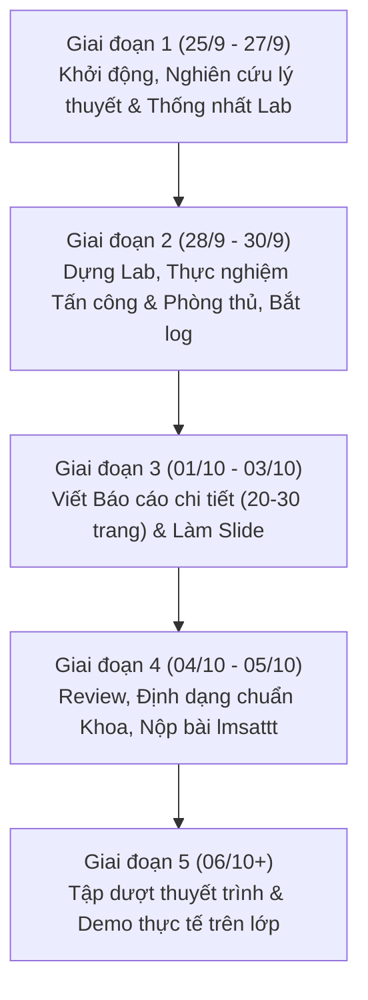

# KẾ HOẠCH CHI TIẾT THỰC HIỆN BÀI TẬP LỚN - NHÓM 1

> **Học phần:** Cơ sở An toàn thông tin  
> **Khoa:** An toàn thông tin – Học viện Công nghệ Bưu chính Viễn thông (PTIT)  
> **Đề tài số 01:** *"Tìm hiểu về các dạng tấn công và cách phòng chống DoS/DDoS. Tìm và demo một công cụ tấn công DoS/DDoS, sau đó đưa ra giải pháp phòng chống phù hợp."*  
> **Tài liệu tham chiếu:**
> - Hướng dẫn BTL: [CSATTT-BTL-2026.pdf](file:///T:/UNI/CSATTT/Project/CSATTT-BTL-2026.pdf)
> - Mẫu báo cáo BTL: [ATTT-Mẫu báo cáo BTL.v1.0.docx](file:///T:/UNI/CSATTT/Project/ATTT-Mẫu%20báo%20cáo%20BTL.v1.0.docx) | [ATTT-Mẫu báo cáo BTL.v1.0.pdf](file:///T:/UNI/CSATTT/Project/ATTT-Mẫu%20báo%20cáo%20BTL.v1.0.pdf)
> - Danh sách nhóm: [DanhSach Chia nhóm - Nhóm 1.pdf](file:///T:/UNI/CSATTT/Project/DanhSach%20Chia%20nhóm%20-%20Nhóm%201.pdf)

---

## I. THÔNG TIN CHUNG VÀ QUY ĐỊNH BÀI TẬP LỚN

### 1. Danh sách thành viên Nhóm 1

| STT | Mã Sinh Viên | Họ và Tên | Vai trò trong nhóm | Phân công nhiệm vụ chính |
| :---: | :---: | :--- | :--- | :--- |
| **1** | **B24DCCE180** | **Lê Anh Minh** | **Nhóm trưởng** | Quản lý tiến độ, phụ trách nghiên cứu & triển khai giải pháp phòng thủ (Chương 3), tổng hợp và chuẩn hóa báo cáo + slide. |
| **2** | **B24DCCE222** | **Nguyễn Đinh Anh Quân** | Thành viên | Phụ trách nghiên cứu tổng quan lý thuyết DoS/DDoS (Chương 1), soạn thảo nội dung phần Mở đầu, Kết luận và xây dựng dàn ý Slide. |
| **3** | **B24DCCE264** | **Nguyễn Đình Tiến** | Thành viên | Phụ trách thiết lập môi trường Lab (máy ảo/mạng), nghiên cứu và triển khai công cụ tấn công DoS/DDoS, thu thập log/bắt gói Wireshark. |
| **4** | **B24DCCE271** | **Ứng Trọng Trình** | Thành viên | Phụ trách phân tích cơ chế kỹ thuật công cụ tấn công & phân tích giải pháp phòng chống (Chương 2), biên tập slide báo cáo và phối hợp demo. |

---

### 2. Các mốc thời gian quan trọng (Milestones)

* **Thời gian bắt đầu:** 25/09/2026
* **Hạn nộp báo cáo & slide (lmsattt):** **23h59 ngày 05/10/2026** *(Tuyệt đối không nộp trễ - nộp muộn sẽ bị 0 điểm báo cáo)*.
* **Thời gian thuyết trình và Demo trực tiếp:** **Từ ngày 06/10/2026** (theo lịch thông báo của giảng viên trên lớp).

---

### 3. Quy cách và Yêu cầu sản phẩm bàn giao

1. **Báo cáo chuyên đề (Word & PDF):**
   * **Độ dài:** Từ **20 đến 30 trang** (không kể bìa và mục lục).
   * **Quy chuẩn soạn thảo:** Font `Times New Roman`, cỡ chữ `13`, dãn dòng `1.2 - 1.3 lines`, Spacing Before `0pt`, After `6pt`.
   * **Căn lề:** Căn đều 2 bên (Justified), căn lề trang chuẩn (Top: 2cm, Bottom: 2cm, Left: 3cm, Right: 2cm).
   * **Đánh số và ghi chú:** Mọi hình ảnh phải có số thứ tự và tên hình nằm ở dưới (ví dụ: *Hình 1.1 - Mô hình tấn công DDoS Botnet*); bảng biểu có tên nằm ở trên (ví dụ: *Bảng 2.1 - So sánh các kỹ thuật phòng thủ DoS*).
   * **Trích dẫn tài liệu tham khảo:** Chuẩn trích dẫn `[1]`, `[2]`,...
   * **Cấu trúc bắt buộc:**
     * Trang bìa chuẩn mẫu Khoa ATTT (Nhóm trưởng ghi số 1).
     * Bảng phân công nhiệm vụ nhóm thực hiện.
     * Bảng nhóm thực hiện tự đánh giá (5 tiêu chí, thang 0-5).
     * Mục lục, Danh mục hình vẽ, Danh mục bảng biểu, Danh mục từ viết tắt.
     * Mở đầu.
     * Nội dung chính (Chương 1, Chương 2, Chương 3).
     * Kết luận & Hướng phát triển.
     * Tài liệu tham khảo.
2. **Slide thuyết trình (PowerPoint / PDF):**
   * **Số lượng slide:** Từ **15 đến 20 slides**.
   * **Thời lượng thuyết trình:** Tối đa **15 phút/nhóm**.
   * **Yêu cầu:** **100% thành viên (cả 4 sinh viên) đều phải tham gia thuyết trình** (Điểm chấm riêng từng cá nhân).
3. **Kịch bản Demo trực tiếp trên lớp:**
   * Thời lượng tối đa: **15 phút/nhóm**.
   * Demo trực quan: Có máy tấn công, máy nạn nhân (Web server), màn hình giám sát lưu lượng/tài nguyên (Wireshark/htop/log) và cơ chế phòng vệ có tác dụng thực tế.
4. **Quy định nộp bài:**
   * Nộp trên hệ thống `lmsattt` qua tài khoản của **Nhóm trưởng**.
   * Tên file nộp: `Nhom1.zip` hoặc nộp riêng các file: `Nhom1_BaoCao.docx`, `Nhom1_BaoCao.pdf`, `Nhom1_Slide.pptx`.

---

## II. ĐỀ CƯƠNG CHI TIẾT BÁO CÁO BTL (THEO MẪU V1.0)

Dựa trên cấu trúc chuẩn của Khoa ATTT, nội dung Báo cáo đề tài 1 được cấu trúc như sau:

```
TRANG BÌA
BẢNG PHÂN CÔNG NHIỆM VỤ NHÓM THỰC HIỆN
BẢNG NHÓM TỰ ĐÁNH GIÁ (5 tiêu chí: Thái độ, Hoàn thành CV, Giao tiếp, Hợp tác, Lãnh đạo)
MỤC LỤC
DANH MỤC CÁC HÌNH VẼ
DANH MỤC CÁC BẢNG BIỂU
DANH MỤC CÁC TỪ VIẾT TẮT
MỞ ĐẦU
  - Tính cấp thiết của đề tài an toàn mạng đối với DoS/DDoS
  - Mục tiêu nghiên cứu và sản phẩm đạt được
  - Đối tượng và phạm vi nghiên cứu
  - Bố cục của báo cáo
CHƯƠNG 1. TỔNG QUAN VỀ TẤN CÔNG VÀ PHÒNG CHỐNG DoS/DDoS
  1.1 Khái niệm cơ bản về DoS và DDoS
      1.1.1 Định nghĩa tấn công từ chối dịch vụ (DoS)
      1.1.2 Tấn công từ chối dịch vụ phân tán (DDoS) và mạng Botnet
      1.1.3 Hậu quả và thiệt hại do DoS/DDoS gây ra
  1.2 Phân loại các dạng tấn công DoS/DDoS theo mô hình OSI
      1.2.1 Tấn công tầng mạng/vận chuyển (Volumetric & Protocol Attacks: SYN Flood, UDP Flood, ICMP Flood)
      1.2.2 Tấn công tầng ứng dụng (Application Layer Attacks - Layer 7: HTTP Flood, Slowloris, Slow POST)
      1.2.3 Tấn công khuếch đại (Amplification/Reflection: DNS Amplification, NTP Amplification)
  1.3 Tổng quan các nguyên lý và kỹ thuật phòng chống DoS/DDoS
      1.3.1 Phòng thủ tại hạ tầng mạng (Firewall, ACL, Blackholing, BGP Anycast)
      1.3.2 Phòng thủ tại máy chủ dịch vụ (Kernel hardening, Rate Limiting, Reverse Proxy)
      1.3.3 Hệ thống phát hiện/ngăn chặn xâm nhập (IDS/IPS Snort, Suricata, WAF)
  1.4 Kết chương
CHƯƠNG 2. PHÂN TÍCH CÔNG CỤ TẤN CÔNG VÀ XÂY DỰNG GIẢI PHÁP PHÒNG CHỐNG
  2.1 Lựa chọn công cụ tấn công demo (Đề xuất: Slowloris hoặc hping3 SYN Flood)
      2.1.1 Giới thiệu công cụ đã chọn (Mục đích, đặc điểm nhận dạng)
      2.1.2 Cơ chế hoạt động chi tiết của công cụ
      2.1.3 Phân tích điểm yếu bị khai thác trên hệ thống nạn nhân
  2.2 Phân tích và lựa chọn giải pháp phòng chống tương ứng
      2.2.1 Mô hình giải pháp đề xuất (Ví dụ: Nginx Reverse Proxy + Rate Limit + Iptables / Fail2ban)
      2.2.2 Cơ chế nhận diện và lọc lưu lượng tấn công
      2.2.3 Cấu hình chi tiết các tham số phòng thủ
  2.3 Kết chương
CHƯƠNG 3. THỬ NGHIỆM KỊCH BẢN TẤN CÔNG VÀ ĐÁNH GIÁ GIẢI PHÁP BẢO VỆ
  3.1 Thiết kế và xây dựng môi trường thử nghiệm (Lab Environment)
      3.1.1 Sơ đồ mạng và thông số cấu hình các máy ảo (Attacker, Victim Web Server, Defense Gateway)
      3.1.2 Các công cụ đo lường và giám sát (Wireshark, htop, netstat, Web benchmark ApacheBench)
  3.2 Kịch bản 1: Thực nghiệm tấn công khi chưa bật giải pháp phòng chống
      3.2.1 Quá trình triển khai tấn công
      3.2.2 Phân tích trạng thái máy chủ (CPU, RAM, số lượng kết nối đang mở)
      3.2.3 Đánh giá khả năng đáp ứng của dịch vụ đối với người dùng hợp lệ
  3.3 Kịch bản 2: Triển khai giải pháp phòng chống và thực nghiệm lại
      3.3.1 Kích hoạt và kiểm tra hoạt động của giải pháp phòng ngự
      3.3.2 Thực hiện lại cuộc tấn công
      3.3.3 Phân tích lưu lượng bị chặn và trạng thái phục vụ người dùng hợp lệ
  3.4 Đánh giá và so sánh kết quả trước/sau khi phòng vệ
  3.5 Kết chương
KẾT LUẬN VÀ HƯỚNG PHÁT TRIỂN
  - Các kết quả chính nhóm đã đạt được
  - Hạn chế của đề tài
  - Hướng phát triển và mở rộng trong thực tế
TÀI LIỆU THAM KHẢO
PHỤ LỤC (Mã nguồn script, cấu hình cấu hình mẫu)
```

---

## III. KẾ HOẠCH TRIỂN KHAI THEO TỪNG GIAI ĐOẠN

Thời gian thực hiện từ **25/09/2026** đến **05/10/2026** (11 ngày làm việc tập trung).



---

### GIAI ĐOẠN 1: KHỞI ĐỘNG & NGHIÊN CỨU LÝ THUYẾT (25/09 – 27/09/2026)

* **Mục tiêu:**
  * Họp nhóm thống nhất mục tiêu, phân công công việc cụ thể.
  * Lựa chọn công nghệ demo tấn công & giải pháp phòng ngự.
  * Hoàn thành đề cương chi tiết và tài liệu lý thuyết cho Chương 1.
* **Các công việc cụ thể:**
  1. **Thống nhất phương án Demo:**
     * *Lựa chọn 1 (Khuyên dùng - Tấn công Layer 7):* Công cụ **Slowloris** (hoặc GoldenEye) tấn công làm cạn kiệt connection pool của máy chủ Apache/Nginx. Giải pháp phòng thủ: Cấu hình Nginx reverse proxy với `limit_conn`, `limit_req`, điều chỉnh timeout và cài đặt `fail2ban`. *(Ưu điểm: Dễ demo trên máy ảo, trực quan, không làm đơ máy thật)*.
     * *Lựa chọn 2 (Tấn công Layer 4):* Công cụ **hping3** (SYN Flood) làm tràn hàng đợi backlog. Giải pháp phòng vệ: Bật `SYN Cookies`, cấu hình giới hạn kết nối bằng `iptables` / `nftables`.
  2. **Nghiên cứu tài liệu:**
     * Tìm kiếm RFC (RFC 4987 về TCP SYN Flood), tài liệu Cloudflare, OWASP DoS/DDoS.
     * Tổng hợp các dạng tấn công: Volumetric, Protocol, Application Layer, Amplification.
* **Sản phẩm đầu ra giai đoạn 1:**
  * Biên bản họp nhóm số 1 (xác nhận kịch bản demo và phân công nhiệm vụ).
  * Bản nháp nội dung lý thuyết Chương 1 (dạng Markdown hoặc Word nháp).

---

### GIAI ĐOẠN 2: THIẾT LẬP LAB & THỰC NGHIỆM TẤN CÔNG / PHÒNG THỦ (28/09 – 30/09/2026)

* **Mục tiêu:**
  * Dựng xong môi trường mạng ảo hóa thử nghiệm hoàn chỉnh.
  * Chạy thử nghiệm thành công 2 kịch bản (Khi chưa phòng thủ & Sau khi phòng thủ).
  * Chụp ảnh toàn bộ quá trình, lưu file pcap Wireshark, file cấu hình và biểu đồ đo lường.
* **Các công việc cụ thể:**
  1. **Xây dựng Lab (Mô hình 3 máy hoặc 3 container):**
     * **Máy tấn công (Attacker):** Kali Linux hoặc Ubuntu (IP: `192.168.100.10`) cài `Slowloris` / `hping3`.
     * **Máy nạn nhân (Victim Server):** Ubuntu Server (IP: `192.168.100.20`) chạy Web Service (Nginx / Apache) hosting 1 website demo.
     * **Máy người dùng hợp lệ (Client):** Windows/Linux (IP: `192.168.100.30`) dùng curl hoặc trình duyệt để kiểm tra tính sẵn sàng của web.
  2. **Thực nghiệm Kịch bản 1 (Tấn công không phòng thủ):**
     * Client truy cập website bình thường -> Đo thời gian phản hồi (RTT/Latency) bằng ApacheBench hoặc script Python.
     * Khởi chạy tấn công từ Attacker.
     * Ghi nhận hiện tượng: Website treo, lỗi `504 Gateway Timeout` hoặc kết nối bị từ chối; CPU/RAM máy chủ tăng cao, netstat cho thấy hàng ngàn kết nối ở trạng thái rơ lửng.
     * Chụp ảnh màn hình terminal, htop, Wireshark bắt gói tin tấn công.
  3. **Thực nghiệm Kịch bản 2 (Kích hoạt phòng thủ):**
     * Thiết lập cơ chế phòng thủ:
       * Cấu hình Nginx `limit_conn_zone` và `limit_req_zone`.
       * Bật `SYN Cookies` (`sysctl -w net.ipv4.tcp_syncookies=1`).
       * Viết rule `iptables` drop các IP gửi gói tin vượt ngưỡng hoặc cấu hình `fail2ban` tự động khóa IP tấn công.
     * Tiến hành tấn công lại với cùng cường độ.
     * Ghi nhận kết quả: Máy chủ từ chối các gói tin tấn công (trả mã lỗi 429/drop), người dùng bình thường vẫn truy cập web trơn tru.
     * Chụp ảnh so sánh trước và sau.
* **Sản phẩm đầu ra giai đoạn 2:**
  * Thư mục chứa đầy đủ ảnh chụp màn hình chất lượng cao (đặt tên rõ ràng: `Hinh_3_1_...png`).
  * File kịch bản lệnh shell / script demo có thể tái lập lại trong 5 phút.

---

### GIAI ĐOẠN 3: SOẠN THẢO BÁO CÁO TOÀN VĂN & LÀM SLIDE (01/10 – 03/10/2026)

* **Mục tiêu:**
  * Hoàn thành bản thảo toàn bộ Báo cáo Word (20-30 trang) đúng mẫu của Khoa.
  * Hoàn thành bộ Slide thuyết trình (15-20 slide).
* **Các công việc cụ thể:**
  1. **Viết báo cáo:**
     * Trưởng nhóm tạo khung file Word từ mẫu `ATTT-Mẫu báo cáo BTL.v1.0.docx`.
     * Ghép nội dung Chương 1 (Lê Anh Minh), Chương 2 (Nguyễn Đình Tiến), Chương 3 (Ứng Trọng Trình & Nguyễn Đinh Anh Quân).
     * Bổ sung hình ảnh demo vào Chương 3, viết lời giải thích chi tiết, bảng số liệu so sánh thời gian phản hồi, số kết nối bị chặn.
     * Viết phần Mở đầu, Kết luận và Hướng phát triển.
     * Lập danh mục tài liệu tham khảo theo đúng chuẩn IEEE/PTIT.
  2. **Làm Slide thuyết trình:**
     * Thiết kế template slide chuyên nghiệp, ngắn gọn, súc tích (15-20 slides).
     * Phân chia phần trình bày trên slide tương ứng cho 4 thành viên:
       * Thành viên 1 (Lê Anh Minh): Đặt vấn đề, Tổng quan DoS/DDoS (Slide 1 - 5).
       * Thành viên 2 (Nguyễn Đình Tiến): Phân loại tấn công & Cơ chế công cụ demo (Slide 6 - 9).
       * Thành viên 3 (Nguyễn Đinh Anh Quân): Mô hình thử nghiệm Lab & Kịch bản tấn công (Slide 10 - 14).
       * Thành viên 4 (Ứng Trọng Trình): Giải pháp phòng chống, Kết quả thử nghiệm & Kết luận (Slide 15 - 19).
* **Sản phẩm đầu ra giai đoạn 3:**
  * Bản dự thảo Báo cáo BTL (file docx).
  * Bản dự thảo Slide thuyết trình (file pptx).

---

### GIAI ĐOẠN 4: SOÁT LỖI, CHUẨN HÓA VÀ NỘP BÀI (04/10 – 05/10/2026)

* **Mục tiêu:**
  * Rà soát toàn bộ quy chuẩn hình thức, số trang, bảng tự đánh giá.
  * Xuất file PDF, nộp bài thành công trên hệ thống `lmsattt` trước hạn 23h59 ngày 05/10/2026.
* **Các công việc cụ thể:**
  1. **Kiểm tra hình thức (Checklist checklist):**
     * Độ dài báo cáo: Kiểm tra đã đạt trong khoảng 20-30 trang chưa.
     * Căn lề hai bên, font Times New Roman cỡ 13.
     * Đánh số thứ tự hình vẽ, bảng biểu đầy đủ; không có hình nào bị thiếu chú thích.
     * Điền đầy đủ thông tin trang bìa, Bảng phân công nhiệm vụ và Bảng tự đánh giá cho 4 thành viên.
     * Tạo Mục lục tự động, Danh mục hình vẽ và Danh mục bảng biểu tự động.
  2. **Đóng gói file nộp bài:**
     * File Word: `Nhom1.docx`
     * File PDF báo cáo: `Nhom1.pdf`
     * File Slide: `Nhom1_Slide.pptx` (và `Nhom1_Slide.pdf`)
  3. **Nộp bài:**
     * Nhóm trưởng (Ứng Trọng Trình) đăng nhập `lmsattt` và nộp đúng quy định.
     * Chụp ảnh màn hình biên lai nộp bài trên hệ thống để lưu trữ.
* **Sản phẩm đầu ra giai đoạn 4:**
  * File báo cáo & slide hoàn chỉnh đã được upload lên `lmsattt`.

---

### GIAI ĐOẠN 5: LUYỆN TẬP THUYẾT TRÌNH & CHUẨN BỊ DEMO TRÊN LỚP (Từ 06/10/2026)

* **Mục tiêu:**
  * 4 thành viên phối hợp nhịp nhàng, thuyết trình trôi chảy trong vòng 15 phút.
  * Demo trực tiếp trơn tru trong 15 phút, sẵn sàng trả lời các câu hỏi phản biện của Giảng viên.
* **Các công việc cụ thể:**
  1. **Luyện tập thuyết trình (Rehearsal):**
     * Họp online/offline chạy thử slide, bấm giờ cho từng thành viên (mỗi người ~3 - 3.5 phút).
     * Chuẩn bị phần chuyển tiếp giữa các phần trình bày mượt mà.
  2. **Chuẩn bị môi trường Demo thực tế:**
     * Đóng gói máy ảo (.ova hoặc snapshot sẵn sàng) trên laptop mang lên lớp.
     * Chuẩn bị sẵn file lệnh cheat-sheet để gõ lệnh nhanh, tránh gõ nhầm khi run trực tiếp.
     * **Kế hoạch dự phòng (Backup plan):** Quay sẵn 1 video demo màn hình chất lượng cao có thuyết minh (đề phòng sự cố mạng WiFi giảng đường hoặc máy tính gặp trục trặc).
  3. **Chuẩn bị bộ câu hỏi phản biện thường gặp:**
     * *Hỏi:* Tại sao DoS tầng ứng dụng (như Slowloris) lại nguy hiểm hơn UDP Flood đối với máy chủ nhỏ?
     * *Hỏi:* Làm thế nào để phân biệt giữa lưu lượng tấn công DDoS và lưu lượng tăng đột biến của người dùng thật (Flash Crowd)?
     * *Hỏi:* Giải pháp của nhóm có chống lại được tấn công phân tán hàng trăm nghìn IP (DDoS thực thụ) không? Cần thêm hạ tầng gì?

---

## IV. BẢNG PHÂN CÔNG NHIỆM VỤ CHI TIẾT CHO 4 THÀNH VIÊN

*(Bảng này được thiết kế tương thích với mẫu trang 2 trong tài liệu `ATTT-Mẫu báo cáo BTL.v1.0.docx`)*

| TT | Thành viên thực hiện | Vai trò | Công việc / Nhiệm vụ cụ thể | Thời hạn hoàn thành | Sản phẩm bàn giao |
| :---: | :--- | :---: | :--- | :---: | :--- |
| **1** | **Ứng Trọng Trình**<br>*(MSV: B24DCCE271)* | Trưởng nhóm | - Lập kế hoạch chung, điều phối tiến độ nhóm.<br>- Nghiên cứu các giải pháp phòng thủ DoS/DDoS (Chương 2, 3).<br>- Cấu hình kịch bản phòng thủ (Nginx rate limit / iptables / Fail2ban).<br>- Soạn thảo Chương 3 (phần phòng thủ & đánh giá so sánh).<br>- Tổng hợp báo cáo, soát lỗi định dạng và nộp bài lên `lmsattt`. | 05/10/2026 | - Báo cáo tổng hợp hoàn thiện.<br>- Script cấu hình phòng thủ.<br>- Bằng chứng nộp bài lmsattt. |
| **2** | **Lê Anh Minh**<br>*(MSV: B24DCCE180)* | Thành viên | - Nghiên cứu cơ sở lý thuyết tổng quan về DoS/DDoS (Chương 1).<br>- Phân loại các dạng tấn công (Layer 4, Layer 7, Amplification).<br>- Viết phần Mở đầu, Kết luận và Hướng phát triển của báo cáo.<br>- Thiết kế cấu trúc dàn ý bộ Slide thuyết trình (Slide 1 - 5). | 03/10/2026 | - Nội dung hoàn chỉnh Chương 1 + Mở đầu + Kết luận.<br>- Slide phần tổng quan lý thuyết. |
| **3** | **Nguyễn Đinh Anh Quân**<br>*(MSV: B24DCCE222)* | Thành viên | - Xây dựng mô hình mạng Lab máy ảo (Attacker, Victim, Client).<br>- Tìm kiếm, cài đặt và cấu hình công cụ tấn công DoS/DDoS.<br>- Thực hiện kịch bản tấn công chưa phòng ngự, đo lường suy giảm dịch vụ.<br>- Bắt gói tin Wireshark, chụp ảnh bằng chứng thực nghiệm.<br>- Soạn thảo nội dung Chương 3 (phần thiết kế lab & thực nghiệm tấn công). | 02/10/2026 | - Môi trường Lab chạy ổn định.<br>- Bộ ảnh chụp kết quả demo kịch bản 1.<br>- File cấu hình lab và file pcap. |
| **4** | **Nguyễn Đình Tiến**<br>*(MSV: B24DCCE264)* | Thành viên | - Nghiên cứu sâu cơ chế kỹ thuật công cụ tấn công đã chọn (Chương 2).<br>- Phân tích các lỗ hổng/điểm yếu hệ thống bị khai thác.<br>- Soạn thảo nội dung toàn bộ Chương 2 của báo cáo.<br>- Thiết kế, đồ họa hóa toàn bộ bộ Slide báo cáo (15-20 slide).<br>- Chuẩn bị kịch bản demo và video backup kịch bản demo. | 04/10/2026 | - Nội dung hoàn chỉnh Chương 2.<br>- Bộ Slide trình chiếu hoàn thiện.<br>- Video demo backup phòng ngừa rủi ro. |

---

## V. MA TRẬN TỰ ĐÁNH GIÁ THÀNH VIÊN (MẪU TRANG 2 BÁO CÁO)

Khi hoàn thành BTL, nhóm sẽ thống nhất cho điểm theo thang từ **0 đến 5** theo các tiêu chí của Khoa:

* **Thái độ tham gia:** `0` (Không tham gia) -> `5` (Chủ động, tích cực).
* **Mức hoàn thành CV:** `0` (Không hoàn thành) -> `5` (Hoàn thành xuất sắc).
* **Kỹ năng giao tiếp:** `0` (Kém/không tương tác) -> `5` (Giao tiếp, báo cáo xuất sắc).
* **Kỹ năng hợp tác:** `0` (Không hợp tác) -> `5` (Hỗ trợ đồng đội, giải quyết xung đột tốt).
* **Kỹ năng lãnh đạo:** `0` (Không có) -> `5` (Tổ chức, phân công và điều phối xuất sắc).

| TT | Sinh viên thực hiện | Mã SV | Thái độ tham gia | Mức hoàn thành CV | Kỹ năng giao tiếp | Kỹ năng hợp tác | Kỹ năng lãnh đạo | Đánh giá chung |
| :---: | :--- | :---: | :---: | :---: | :---: | :---: | :---: | :---: |
| 1 | **Ứng Trọng Trình** *(Trưởng nhóm)* | B24DCCE271 | 5 | 5 | 5 | 5 | 5 | Xuất sắc |
| 2 | **Lê Anh Minh** | B24DCCE180 | 5 | 5 | 4 | 5 | 3 | Hoàn thành tốt |
| 3 | **Nguyễn Đinh Anh Quân** | B24DCCE222 | 5 | 5 | 4 | 5 | 3 | Hoàn thành tốt |
| 4 | **Nguyễn Đình Tiến** | B24DCCE264 | 5 | 5 | 5 | 5 | 4 | Hoàn thành tốt |

---

## VI. HƯỚNG DẪN KỸ THUẬT XÂY DỰNG BÀI LAB DEMO (GỢI Ý THỰC HIỆN)

Để demo trực quan, thuyết phục và không đòi hỏi đường truyền mạng quá lớn, khuyến nghị nhóm triển khai kịch bản: **Tấn công cạn kiệt tài nguyên tầng ứng dụng (Slowloris DoS) và Phòng thủ đa lớp (Nginx Rate Limiting + iptables)**.

### 1. Kiến trúc mô hình mạng thử nghiệm

```
[Attacker - Kali Linux] (192.168.100.10)
        |
        |--- (Mạng nội bộ ảo VMnet/Host-only)
        |
[Victim Server - Web Server] (192.168.100.20)
        |     * Cài đặt Nginx/Apache + PHP/Static Site
        |     * Công cụ giám sát: htop, netstat, Wireshark
        |
[Legitimate Client] (192.168.100.30)
              * Trình duyệt web / lệnh curl kiểm tra độ trễ
```

### 2. Kịch bản chạy Demo 4 bước trước Hội đồng

* **Bước 1: Trạng thái bình thường (Baseline):**
  * Client gửi request truy cập website: Phản hồi nhanh tức thì (dưới 50ms).
  * Máy chủ xem bằng lệnh `netstat -an | grep :80 | wc -l`: Số lượng kết nối rất ít (dưới 5 kết nối).
* **Bước 2: Thực hiện tấn công không phòng thủ:**
  * Máy Attacker chạy lệnh:
    ```bash
    python3 slowloris.py 192.168.100.20 -p 80 -s 500
    ```
  * Client thử refresh trang web -> Trình duyệt xoay vòng liên tục rồi báo lỗi `ERR_CONNECTION_TIMED_OUT` hoặc `504 Gateway Timeout`.
  * Trên máy Server: Kiểm tra lệnh `netstat`, phát hiện hàng trăm kết nối ở trạng thái `ESTABLISHED` hoặc `CLOSE_WAIT` giữ kết nối mở mà không truyền tải dữ liệu.
* **Bước 3: Kích hoạt cơ chế phòng thủ:**
  * Cấu hình Nginx giới hạn số kết nối trên mỗi địa chỉ IP:
    ```nginx
    limit_conn_zone $binary_remote_addr zone=addr:10m;
    limit_conn addr 10;
    client_body_timeout 5s;
    client_header_timeout 5s;
    ```
  * Kèm rule `iptables` giới hạn số kết nối mới:
    ```bash
    sudo iptables -A INPUT -p tcp --dport 80 -m connlimit --connlimit-above 20 -j REJECT
    ```
  * Reload dịch vụ Nginx: `sudo systemctl reload nginx`.
* **Bước 4: Tấn công lại & Kiểm chứng:**
  * Attacker tiếp tục bơm luồng Slowloris.
  * Máy chủ Nginx lập tức từ chối và ngắt các kết nối vượt ngưỡng hoặc treo header quá 5 giây.
  * Máy Client truy cập website: Trang web mở bình thường, mượt mà!
  * **Kết luận demo:** Chứng minh giải pháp phòng vệ ngăn chặn triệt để cuộc tấn công mà không làm gián đoạn dịch vụ của người dùng thực.

---

## VII. CHECKLIST HOÀN TẤT TRƯỚC HẠN CHÓT (DEADLINE: 05/10/2026)

- [ ] Đã hoàn thành dự thảo nội dung 3 chương của Báo cáo (đạt 20-30 trang).
- [ ] Báo cáo đã đúng font chữ Times New Roman 13, căn lề 2 bên, có đầy đủ mục lục và danh mục bảng/hình.
- [ ] Bảng phân công nhiệm vụ và Bảng tự đánh giá đã có đủ 4 thành viên.
- [ ] Tất cả hình ảnh trong báo cáo đều có số hiệu và chú thích bên dưới.
- [ ] Đã chuẩn bị xong Slide báo cáo (15-20 slide) và phân đoạn cho từng thành viên trình bày.
- [ ] Đã kiểm thử chạy demo mượt mà trên laptop cá nhân, quay sẵn video dự phòng.
- [ ] Đã xuất file `Nhom1.docx`, `Nhom1.pdf`, `Nhom1_Slide.pptx`.
- [ ] Nhóm trưởng đã upload bài lên `lmsattt` thành công và thông báo cho cả nhóm trước 23h59 ngày 05/10/2026.
