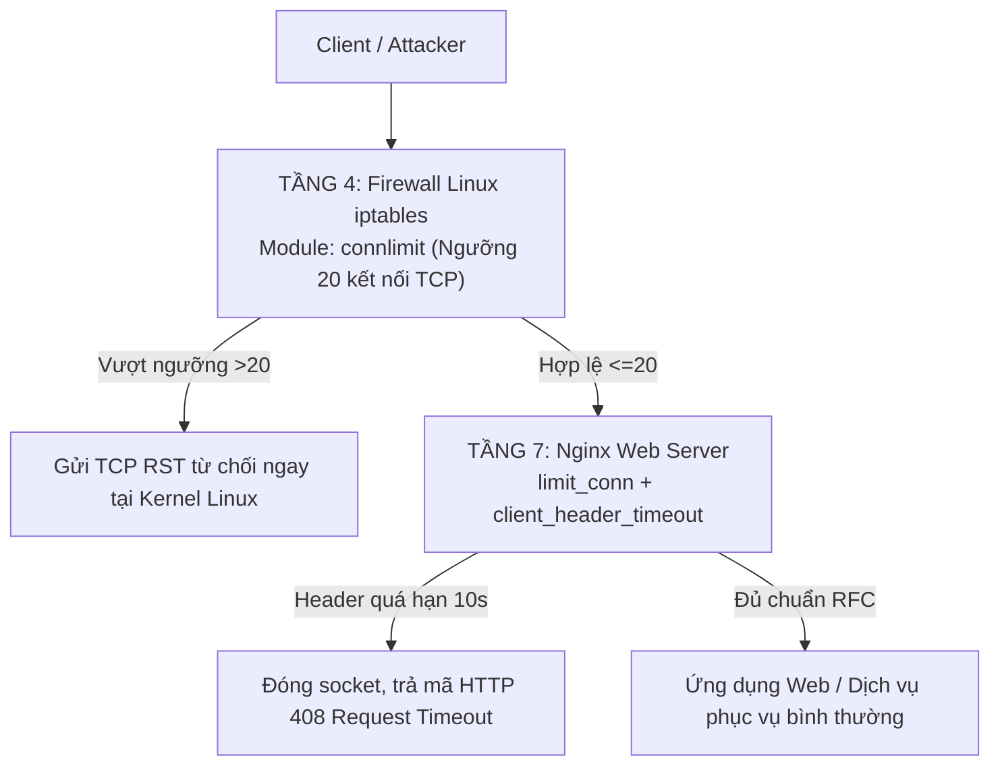

# KỊCH BẢN THUYẾT TRÌNH VÀ NỘI DUNG SLIDE BÁO CÁO BÀI TẬP LỚN

> **HỌC PHẦN:** CƠ SỞ AN TOÀN THÔNG TIN  
> **KHOA:** AN TOÀN THÔNG TIN – HỌC VIỆN CÔNG NGHỆ BƯU CHÍNH VIỄN THÔNG (PTIT)  
> **ĐỀ TÀI SỐ 01:** *"Tìm hiểu về các dạng tấn công và cách phòng chống DoS/DDoS. Tìm và demo một công cụ tấn công DoS/DDoS, sau đó đưa ra giải pháp phòng chống phù hợp."*  
> **NHÓM THỰC HIỆN:** NHÓM 1  
> **TÀI LIỆU CĂN CỨ:** BÁO CÁO BTL NHÓM 1 (BẢN TOÀN VĂN v1.0)  
> **TỔNG THỜI LƯỢNG THUYẾT TRÌNH:** 15 PHÚT (Mỗi thành viên ~3.5 phút) + 15 PHÚT DEMO & HỎI ĐÁP  

---

## BẢNG PHÂN CHIA NHIỆM VỤ THUYẾT TRÌNH

| STT | Thành viên | Mã sinh viên | Vai trò | Phụ trách nội dung slide | Thời lượng dự kiến |
| :---: | :--- | :---: | :---: | :--- | :---: |
| **1** | **Nguyễn Đinh Anh Quân** | B24DCCE222 | Thành viên | **Phần 1: Mở đầu & Tổng quan DoS/DDoS**<br>(Slide 01 - Slide 05) | ~3.5 phút |
| **2** | **Ứng Trọng Trình** | B24DCCE271 | Thành viên | **Phần 2: Phân loại OSI, Cơ chế Slowloris & Kiến trúc phòng thủ**<br>(Slide 06 - Slide 09) | ~3.5 phút |
| **3** | **Nguyễn Đình Tiến** | B24DCCE264 | Thành viên | **Phần 3: Mô hình Lab ảo hóa & Thực nghiệm Kịch bản 1 (Chưa phòng thủ)**<br>(Slide 10 - Slide 13) | ~3.5 phút |
| **4** | **Lê Anh Minh** | B24DCCE180 | Nhóm trưởng | **Phần 4: Thực nghiệm Kịch bản 2 (Đã phòng thủ 2 tầng), Đánh giá & Kết luận**<br>(Slide 14 - Slide 19) | ~4.0 phút |

---

## PHẦN 1: MỞ ĐẦU VÀ TỔNG QUAN TẤN CÔNG DoS/DDoS
*Người trình bày: Nguyễn Đinh Anh Quân (Slide 01 – Slide 05 | Thời lượng: ~3.5 phút)*

---

### SLIDE 01: TRANG TIÊU ĐỀ BÁO CÁO

#### 1. Nội dung hiển thị trên Slide
* **Học viện Công nghệ Bưu chính Viễn thông – Khoa An toàn Thông tin**
* **Báo cáo Bài tập lớn môn: Cơ sở An toàn Thông tin**
* **Đề tài số 01:** Nghiên cứu các dạng tấn công DoS/DDoS, Demo tấn công Slowloris và Triển khai giải pháp phòng thủ hai tầng trên máy chủ Web.
* **Giảng viên hướng dẫn:** Bộ môn An toàn Thông tin
* **Nhóm thực hiện:** Nhóm 1
  * Lê Anh Minh (Nhóm trưởng) – B24DCCE180
  * Nguyễn Đinh Anh Quân – B24DCCE222
  * Nguyễn Đình Tiến – B24DCCE264
  * Ứng Trọng Trình – B24DCCE271
* **Hà Nội, Học kỳ 1 – Năm học 2026 - 2027**

#### 2. Kịch bản thuyết trình (Speaker Notes)
> "Kính chào quý Thầy Cô cùng toàn thể các bạn sinh viên. 
> 
> Hôm nay, đại diện cho Nhóm 1, chúng em xin phép trình bày báo cáo bài tập lớn học phần Cơ sở An toàn Thông tin với Đề tài số 01: *Nghiên cứu các dạng tấn công và giải pháp phòng chống DoS/DDoS; Demo công cụ tấn công tầng ứng dụng Slowloris và xây dựng mô hình phòng thủ hai tầng trên máy chủ Web*.
> 
> Nhóm gồm bốn thành viên: bạn Lê Anh Minh là nhóm trưởng, em là Nguyễn Đinh Anh Quân, cùng hai bạn Nguyễn Đình Tiến và Ứng Trọng Trình. Cả bốn thành viên sẽ lần lượt trình bày từng phần kỹ thuật của đề tài."

---

### SLIDE 02: BỐ CỤC NỘI DUNG VÀ MỤC TIÊU NGHIÊN CỨU

#### 1. Nội dung hiển thị trên Slide
* **Mục tiêu nghiên cứu:**
  * Hệ thống hóa lý thuyết tấn công DoS/DDoS theo mô hình 7 tầng OSI.
  * Làm rõ cơ chế tấn công cạn kiệt tài nguyên dở dang của Slowloris ở tầng ứng dụng (Layer 7).
  * Kiểm chứng mô hình phòng thủ hai tầng kết hợp giữa Nginx và iptables trong môi trường Lab thực tế.
* **Bố cục 4 phần chính:**
  * **Phần 1:** Tổng quan về tấn công và nguyên lý phòng chống DoS/DDoS.
  * **Phần 2:** Cơ chế kỹ thuật công cụ Slowloris và giải pháp phòng thủ hai tầng.
  * **Phần 3:** Thiết lập môi trường Lab và thực nghiệm tấn công khi chưa kích hoạt phòng thủ.
  * **Phần 4:** Triển khai phòng thủ hai tầng, phân tích số liệu đối chứng và kết luận.

#### 2. Kịch bản thuyết trình (Speaker Notes)
> "Mục tiêu trọng tâm của nhóm là làm rõ nguyên lý hoạt động của dạng tấn công DoS tốc độ chậm ở tầng ứng dụng, sau đó kiểm chứng thực nghiệm giải pháp khắc phục ngay trên hệ thống máy chủ Linux.
> 
> Bài thuyết trình hôm nay gồm bốn phần:
> - Đầu tiên là bức tranh tổng quan về DoS/DDoS và mô hình phòng thủ nhiều lớp.
> - Tiếp theo là phân tích sâu cơ chế giữ kết nối dở dang của Slowloris.
> - Phần thứ ba là kịch bản thử nghiệm tấn công làm tê liệt dịch vụ web trên môi trường mạng ảo hóa cô lập.
> - Cuối cùng, nhóm trình bày kết quả thực nghiệm phòng thủ hai tầng, phân tích các chỉ số định lượng đo lường được và rút ra kết luận."

---

### SLIDE 03: KHÁI NIỆM VÀ TÍNH CẤP THIẾT CỦA TÍNH SẴN SÀNG (AVAILABILITY)

#### 1. Nội dung hiển thị trên Slide
* **Vị trí trong tam giác bảo mật CIA:**
  * DoS/DDoS nhắm trực tiếp vào chữ **A - Availability (Tính sẵn sàng)** của dịch vụ.
  * Không làm lộ dữ liệu (Confidentiality) hay thay đổi dữ liệu (Integrity), nhưng ngăn chặn người dùng hợp lệ truy cập hệ thống.
* **Khái niệm cốt lõi:**
  * **DoS (Denial of Service):** Tấn công từ một nguồn duy nhất nhắm vào tài nguyên mục tiêu.
  * **DDoS (Distributed Denial of Service):** Tấn công phân tán từ hàng nghìn đến hàng triệu nút mạng phân tán (Botnet).
* **Hậu quả thực tế:**
  * Gián đoạn các dịch vụ trọng yếu: tài chính ngân hàng, thương mại điện tử, cổng dịch vụ công.
  * Thiệt hại tài chính trực tiếp và vi phạm cam kết chất lượng dịch vụ (SLA).

#### 2. Kịch bản thuyết trình (Speaker Notes)
> "Trong mô hình tam giác an toàn thông tin CIA, nếu Confidentiality bảo vệ bí mật dữ liệu, Integrity đảm bảo tính toàn vẹn, thì DoS và DDoS tấn công thẳng vào Availability, tức tính sẵn sàng của hệ thống.
> 
> Bản chất của tấn công từ chối dịch vụ là làm quá tải tài nguyên phần cứng, băng thông hoặc hàng đợi xử lý. Khi đó, máy chủ không thể phản hồi yêu cầu của người dùng hợp lệ. Sự khác biệt cơ bản giữa DoS và DDoS nằm ở quy mô: DoS xuất phát từ một máy nguồn duy nhất, còn DDoS huy động hàng loạt nguồn tấn công phân tán trên toàn cầu, khiến việc ngăn chặn ở biên mạng phức tạp hơn rất nhiều."

---

### SLIDE 04: MẠNG BOTNET VÀ CƠ CHẾ PHÁT ĐỘNG TẤN CÔNG DDoS

#### 1. Nội dung hiển thị trên Slide
* **Thành phần mạng Botnet:**
  * **Botmaster (Kẻ điều khiển):** Kẻ tấn công phát lệnh từ xa.
  * **Máy chủ C&C (Command & Control):** Hạ tầng chuyển tiếp chỉ thị điều khiển qua giao thức IRC, HTTP/HTTPS hoặc P2P.
  * **Zombie/Bots (Thiết bị ma):** Máy tính, máy chủ hoặc thiết bị IoT bị nhiễm mã độc (ví dụ botnet Mirai khét tiếng).
* **Quy trình tấn công:**
  1. Quét lỗ hổng diện rộng và cài cắm mã độc vào thiết bị nạn nhân.
  2. Các bot duy trì liên lạc ngầm về máy chủ C&C.
  3. Kẻ tấn công phát lệnh đồng loạt dồn lưu lượng tới IP máy chủ mục tiêu.
* **Hình ảnh minh họa:** *Sơ đồ kiến trúc mạng Botnet và cơ chế tấn công DDoS* (Tham chiếu Hình 1.1 trong báo cáo).

#### 2. Kịch bản thuyết trình (Speaker Notes)
> "Để phát động các đợt DDoS quy mô hàng trăm Gigabit mỗi giây, tin tặc dựa vào mạng Botnet, như quý Thầy Cô và các bạn đang thấy trên Hình 1.1.
> 
> Mạng lưới này gồm máy chủ chỉ huy C&C và hàng triệu thiết bị bot. Các thiết bị này thường là router gia đình, camera an ninh hoặc thiết bị IoT sử dụng mật khẩu mặc định bị cài mã độc ngầm. Khi Botmaster gửi lệnh, toàn bộ mạng bot đồng loạt xả lưu lượng vào máy chủ mục tiêu, biến các luồng truy cập phân tán thành cuộc tấn công quy mô lớn làm tê liệt toàn bộ hạ tầng tiếp nhận."

---

### SLIDE 05: MÔ HÌNH PHÒNG THỦ NHIỀU LỚP (DEFENSE-IN-DEPTH)

#### 1. Nội dung hiển thị trên Slide
* **Nguyên lý kiến trúc phòng thủ nhiều lớp:**
  * Không có giải pháp đơn lẻ nào chống lại được mọi dạng DoS/DDoS.
  * Cần phân tầng bảo vệ từ vòng ngoài Internet đến tận lõi ứng dụng.
* **Các tầng bảo vệ chính (Hình 1.4 trong báo cáo):**
  * **Tầng biên ISP / Đám mây (Scrubbing Centers, CDN):** Hấp thụ lưu lượng rác hàng trăm Gbps, định tuyến qua BGP Anycast và lọc gói tin giả mạo (BCP 38/uRPF).
  * **Tầng mạng nội bộ & Tường lửa biên (Perimeter Firewall / IPS):** Lọc giao thức Layer 3/4, giới hạn tần suất gói SYN/UDP/ICMP, chống tràn bảng trạng thái SPI.
  * **Tầng máy chủ dịch vụ & WAF (Host & Application Level):** Tường lửa WAF nhận diện bất thường HTTP, máy chủ web tối ưu hóa tham số kết nối và thời gian chờ phiên.
* *Chuyển tiếp người trình bày:* Bạn Ứng Trọng Trình tiếp nối với nội dung phân loại chi tiết và cơ chế kỹ thuật của công cụ Slowloris.

#### 2. Kịch bản thuyết trình (Speaker Notes)
> "Trước mối đe dọa đa dạng của DoS/DDoS, thực hành an toàn thông tin áp dụng kiến trúc phòng thủ chiều sâu Defense-in-Depth qua ba lớp độc lập:
> - Ở vòng ngoài cùng, các trung tâm làm sạch lưu lượng của ISP hoặc mạng CDN như Cloudflare xử lý các đợt tràn băng thông tầng mạng.
> - Tại cổng vào hệ thống, tường lửa và thiết bị IPS lọc các gói tin sai quy chuẩn hoặc bão hòa giao thức TCP/UDP.
> - Tại lớp trong cùng là chính máy chủ dịch vụ và tường lửa ứng dụng WAF, nơi trực tiếp kiểm soát hành vi kết nối của máy khách.
> 
> Tiếp theo, bạn Ứng Trọng Trình sẽ trình bày chi tiết cách các cuộc tấn công khai thác từng tầng trong mô hình OSI và phân tích sâu cơ chế của công cụ Slowloris."

---

## PHẦN 2: PHÂN LOẠI THEO OSI, CƠ CHẾ SLOWLORIS VÀ GIẢI PHÁP 2 TẦNG
*Người trình bày: Ứng Trọng Trình (Slide 06 – Slide 09 | Thời lượng: ~3.5 phút)*

---

### SLIDE 06: PHÂN LOẠI CÁC HÌNH THỨC TẤN CÔNG DoS/DDoS THEO OSI

#### 1. Nội dung hiển thị trên Slide
* **Bảng phân loại các dạng tấn công chính:**

| Nhóm tấn công | Tầng OSI tác động | Giao thức khai thác | Ví dụ điển hình | Cơ chế làm cạn kiệt |
| :--- | :---: | :---: | :--- | :--- |
| **Bão hòa băng thông (Volumetric)** | Layer 3 & Layer 4 | UDP, ICMP | UDP Flood, DNS/NTP Amplification | Làm nghẽn đường truyền mạng vật lý bằng lưu lượng khổng lồ. |
| **Bão hòa giao thức (Protocol-based)** | Layer 4 (Transport) | TCP | SYN Flood, ACK Flood, RST Flood | Làm tràn bảng hàng đợi kết nối nửa mở (SYN Backlog) của kernel. |
| **Tầng ứng dụng (Application Layer)** | Layer 7 (Application) | HTTP, HTTPS, DNS | HTTP GET Flood, Slowloris, Slow POST | Chiếm dụng tiến trình xử lý và bảng kết nối của máy chủ web. |

* **Đặc tính tấn công tầng 7:** Lưu lượng gói tin rất nhỏ, ngụy trang dưới dạng truy cập HTTP hợp lệ, dễ dàng vượt qua tường lửa tầng mạng truyền thống.

#### 2. Kịch bản thuyết trình (Speaker Notes)
> "Em xin tiếp tục phần trình bày của nhóm với nội dung phân loại tấn công theo mô hình OSI.
> 
> Tùy vào tầng giao thức bị nhắm đến, chúng ta chia DoS/DDoS thành ba nhóm chính:
> - Nhóm thứ nhất là tấn công bão hòa băng thông ở tầng mạng và vận chuyển, như UDP Flood hoặc DNS Amplification, dùng lưu lượng cực lớn để làm nghẽn đường truyền.
> - Nhóm thứ hai nhắm vào cơ chế bắt tay ba bước của TCP, điển hình là SYN Flood làm tràn hàng đợi Backlog của hệ điều hành.
> - Nhóm thứ ba diễn ra ở tầng ứng dụng Layer 7. Nhóm này không cần băng thông lớn. Kẻ tấn công chỉ cần gửi các yêu cầu HTTP rất nhỏ nhưng được thiết kế tinh vi để làm cạn kiệt bảng quản lý kết nối của máy chủ web. Tiêu biểu cho kỹ thuật này chính là công cụ Slowloris."

---

### SLIDE 07: CƠ CHẾ KỸ THUẬT CỦA CÔNG CỤ SLOWLORIS (LOW & SLOW)

#### 1. Nội dung hiển thị trên Slide
* **Quy chuẩn RFC 7230 / RFC 9112 (HTTP/1.1):**
  * Yêu cầu HTTP hợp lệ chỉ kết thúc khi máy chủ nhận được dòng trống chứa hai cặp ký tự liên tiếp: `CRLF CRLF` (`\r\n\r\n`).
  * Khi chưa nhận đủ `\r\n\r\n`, máy chủ coi yêu cầu chưa truyền xong và phải giữ socket mở để chờ.
* **Chiến thuật "chậm và đều" của Slowloris:**
  1. Hoàn tất bắt tay 3 bước TCP bình thường.
  2. Gửi dòng request ban đầu: `GET / HTTP/1.1\r\nHost: target\r\n` (cố tình không gửi `\r\n\r\n`).
  3. Canh chu kỳ 10 - 15 giây (ngay trước khi máy chủ timeout), gửi thêm 1 header rác: `X-a: b\r\n`.
  4. Máy chủ hiểu rằng client vẫn đang truyền tin nên đặt lại bộ đếm timeout về 0 và tiếp tục giữ socket.
* **Hình ảnh minh họa:** *Sơ đồ trình tự bắt tay và duy trì socket dở dang* (Tham chiếu Hình 2.1).

#### 2. Kịch bản thuyết trình (Speaker Notes)
> "Cơ chế của Slowloris được mô tả cụ thể trên Hình 2.1.
> 
> Theo đặc tả RFC 7230 của chuẩn HTTP/1.1, máy chủ chỉ bắt đầu xử lý yêu cầu khi nhận đủ hai cặp ký tự xuống dòng liên tiếp CRLF. Lợi dụng điều này, Slowloris gửi một yêu cầu GET nhưng cố ý giữ lại ký tự kết thúc. 
> 
> Cứ mỗi 10 đến 15 giây, trước khi máy chủ kịp hết thời gian chờ, công cụ này lại gửi thêm một dòng header giả mạo như `X-a: b`. Nhận được dữ liệu mới, máy chủ lập tức khởi động lại bộ đếm thời gian timeout về 0. Bằng cách lặp lại hành động này trên hàng trăm socket song song, Slowloris giữ chân các kết nối này vô thời hạn mà chỉ tiêu tốn vài chục kilobit băng thông."

---

### SLIDE 08: ĐỐI CHIẾU KIẾN TRÚC MÁY CHỦ WEB TRƯỚC SLOWLORIS

#### 1. Nội dung hiển thị trên Slide
* **Mô hình xử lý đa tiến trình / luồng (Apache HTTP Server):**
  * Sử dụng MPM Prefork hoặc MPM Worker: mỗi kết nối chiếm 1 process hoặc thread riêng biệt.
  * Tham số trần `MaxRequestWorkers` thường đặt ở mức 150 - 400 kết nối.
  * Chỉ cần vài trăm kết nối Slowloris là lấp đầy worker pool, khiến người dùng thật bị đẩy vào hàng đợi chờ và bị timeout.
* **Mô hình hướng sự kiện bất đồng bộ (Nginx Event-driven):**
  * Cơ chế `epoll` trên Linux cho phép 1 worker process quản lý hàng nghìn socket mà không tốn nhiều RAM.
  * Điểm yếu: Nếu không cấu hình giới hạn kết nối theo IP và giữ timeout header quá dài, lượng socket dở dang vẫn làm chạm trần `worker_connections`, gây nghẽn kết nối mới.
* **So sánh nhanh:**

| Tiêu chí | Tấn công bão hòa băng thông | Tấn công Slowloris |
| :--- | :--- | :--- |
| **Băng thông cần thiết** | Hàng chục đến hàng trăm Gbps | Chỉ từ 10 - 50 Kbps |
| **Hạ tầng tấn công** | Cần botnet lớn hoặc reflector | Chỉ cần 1 máy tính xách tay thông thường |
| **Dấu hiệu Access Log** | Hàng triệu bản ghi request xuất hiện | Gần như không có log trong lúc kết nối bị treo |

#### 2. Kịch bản thuyết trình (Speaker Notes)
> "Mức độ ảnh hưởng của Slowloris phụ thuộc vào kiến trúc của máy chủ web:
> - Với các máy chủ truyền thống như Apache sử dụng mô hình đa tiến trình Prefork, mỗi kết nối chiếm trọn một tiến trình riêng. Chỉ cần 200 đến 400 kết nối treo là toàn bộ worker pool bị lấp đầy, máy chủ ngừng phục vụ hoàn toàn.
> - Với Nginx, nhờ kiến trúc hướng sự kiện bất đồng bộ epoll, hệ thống không bị tràn bộ nhớ RAM. Tuy nhiên, nếu người quản trị để thời gian chờ mặc định và không giới hạn số socket trên mỗi địa chỉ IP, kẻ tấn công vẫn có thể chiếm trọn ngưỡng kết nối cho phép của Nginx.
> 
> Điểm nguy hiểm nhất của Slowloris là gần như không để lại nhật ký truy cập trong lúc diễn ra tấn công, bởi vì yêu cầu HTTP chưa từng được hoàn tất."

---

### SLIDE 09: ĐỀ XUẤT KIẾN TRÚC PHÒNG THỦ HAI TẦNG (LAYER 4 + LAYER 7)

#### 1. Nội dung hiển thị trên Slide
* **Nguyên lý phối hợp hai tầng (Hình 2.2 trong báo cáo):**



* **Phân định trách nhiệm rõ ràng:**
  * **Tầng 4 (iptables connlimit):** Chặn đứng số lượng kết nối dồn dập ngay từ tầng nhân hệ điều hành Linux, không để socket lọt vào hàng đợi của Nginx, tiết kiệm CPU.
  * **Tầng 7 (Nginx limit_conn & timeout):** Phát hiện và đóng các kết nối truyền dữ liệu chậm chạp không hoàn tất phần Header trong 10 giây.
* *Chuyển tiếp người trình bày:* Bạn Nguyễn Đình Tiến sẽ giới thiệu môi trường Lab ảo hóa và kết quả thực nghiệm tấn công khi chưa có phòng thủ.

#### 2. Kịch bản thuyết trình (Speaker Notes)
> "Để triệt tiêu Slowloris, nhóm thiết kế kiến trúc phòng thủ hai tầng phối hợp giữa tầng 4 và tầng 7, như mô tả trên sơ đồ Hình 2.2.
> 
> Ở tầng 4, tường lửa iptables của Linux sử dụng module connlimit để khống chế tối đa 20 kết nối TCP từ một địa chỉ IP. Mọi kết nối vượt trần đều bị gửi cờ TCP RST từ chối ngay tại nhân hệ điều hành, bảo vệ Nginx khỏi tình trạng quá tải hàng đợi.
> 
> Ở tầng 7, Nginx kiểm soát hành vi ứng dụng. Nếu một kết nối không hoàn thành việc gửi tiêu đề trong 10 giây, Nginx chủ động ngắt socket và trả về mã HTTP 408.
> 
> Sau đây, bạn Nguyễn Đình Tiến sẽ trình bày môi trường thử nghiệm và kết quả thực nghiệm khi máy chủ chưa được phòng thủ."

---

## PHẦN 3: MÔ HÌNH THỰC NGHIỆM VÀ KỊCH BẢN 1 (CHƯA PHÒNG THỦ)
*Người trình bày: Nguyễn Đình Tiến (Slide 10 – Slide 13 | Thời lượng: ~3.5 phút)*

---

### SLIDE 10: XÂY DỰNG MÔ HÌNH MẠNG LAB THỬ NGHIỆM

#### 1. Nội dung hiển thị trên Slide
* **Kiến trúc mạng Lab ảo hóa (VMware Workstation - Chế độ Host-only):**
  * Dải mạng thử nghiệm: `192.168.100.0/24` (Cô lập hoàn toàn, không ảnh hưởng mạng ngoài).
* **Thông số cấu hình ba máy trạm (Hình 3.1 trong báo cáo):**
  * **Máy tấn công (Attacker):** Kali Linux (IP: `192.168.100.10`) – Cài đặt công cụ SlowHTTPTest v1.9.0.
  * **Máy chủ nạn nhân (Victim Server):** Ubuntu Server 22.04 LTS (IP: `192.168.100.20`) – 2 vCPU, 4GB RAM, chạy dịch vụ Nginx 1.18.0.
  * **Máy kiểm thử hợp lệ (Legitimate Client):** Windows / Linux (IP: `192.168.100.30`) – Gửi yêu cầu HTTP GET định kỳ mỗi giây để đo độ trễ và tỷ lệ phản hồi (HTTP Probe).
* **Công cụ đo đạc:** Script Python giám sát socket (`ss`), đo tải tài nguyên (`psutil`), và bắt gói Wireshark.

#### 2. Kịch bản thuyết trình (Speaker Notes)
> "Em xin kính chào Thầy Cô và các bạn. Em là Nguyễn Đình Tiến, phụ trách triển khai môi trường Lab và thực nghiệm kịch bản tấn công.
> 
> Để đảm bảo an toàn và tính chính xác, nhóm thiết lập mô hình thử nghiệm cô lập hoàn toàn trên VMware Workstation ở chế độ Host-only với dải mạng 192.168.100.0/24. 
> 
> Hệ thống gồm ba nút mạng độc lập:
> - Nút thứ nhất là máy Kali Linux đóng vai trò kẻ tấn công, sử dụng công cụ chuẩn SlowHTTPTest.
> - Nút thứ hai là máy chủ Ubuntu Server chạy Nginx phục vụ trang web thử nghiệm.
> - Nút thứ ba là máy khách hợp lệ, liên tục gửi các yêu cầu HTTP thăm dò mỗi giây một lần để kiểm tra xem trang web còn truy cập được hay không và đo độ trễ thực tế."

---

### SLIDE 11: THIẾT LẬP TRẠNG THÁI NỀN HỆ THỐNG (BASELINE)

#### 1. Nội dung hiển thị trên Slide
* **Mục đích:** Đo lường các chỉ số hoạt động bình thường trong 120 giây làm mốc đối chứng khoa học.
* **Số liệu trạng thái nền (Baseline):**
  * **Socket cổng 80 (`total_80`):** 2 socket ở trạng thái `LISTEN`.
  * **Kết nối ESTABLISHED:** 0 kết nối thường trực.
  * **Mức tiêu thụ CPU:** Dao động thấp từ **4.5% đến 8.7%**.
  * **Mức tiêu thụ RAM:** Dao động từ **552 MB đến 576 MB** (khoảng 16.5% đến 17.2%).
  * **Thời gian phản hồi HTTP cục bộ:** 0.45 ms – 0.90 ms.
  * **Thời gian phản hồi từ máy khách ngoài (`http_probe`):** Trung bình **~1.50 ms**, 100% trả mã HTTP 200 OK.
* **Kết luận:** Hệ thống hoạt động trơn tru, sẵn sàng phục vụ người dùng.

#### 2. Kịch bản thuyết trình (Speaker Notes)
> "Trước khi kích hoạt tấn công, nhóm chạy tiến trình ghi nhận trạng thái nền của hệ thống trong 120 giây để lấy mốc đối chứng.
> 
> Kết quả cho thấy khi không có tải bất thường, dịch vụ web duy trì trạng thái rất ổn định:
> - Cổng 80 chỉ mở 2 socket lắng nghe, không có kết nối nào bị treo.
> - Tải vi xử lý CPU chỉ ở mức 4 đến 8%, còn bộ nhớ RAM chiếm khoảng 560 MB.
> - Máy khách bên ngoài gửi yêu cầu thăm dò nhận kết quả phản hồi rất nhanh, trung bình chỉ mất 1.5 mili-giây với 100% mã phản hồi 200 OK."

---

### SLIDE 12: KỊCH BẢN 1 – MÔ PHỎNG TẤN CÔNG KHI CHƯA PHÒNG THỦ

#### 1. Nội dung hiển thị trên Slide
* **Tham số lệnh tấn công bằng SlowHTTPTest trên Kali Linux:**

```bash
slowhttptest -c 500 -H -g -o slowloris_monitor \
  -i 10 -r 20 -t GET -u http://192.168.100.20/ -x 24 -p 3 -l 120
```

* **Giải nghĩa các tham số kỹ thuật then chốt:**
  * `-c 500`: Đặt ngưỡng 500 kết nối đồng thời.
  * `-H`: Chế độ tấn công gửi Header chậm (Slowloris).
  * `-i 10`: Cứ 10 giây gửi thêm một đoạn tiêu đề phụ để gia hạn timeout.
  * `-r 20`: Tốc độ mở 20 kết nối mới mỗi giây.
  * `-x 24`: Độ dài đoạn header gửi thêm tối đa 24 byte.
  * `-l 120`: Thời gian thử nghiệm kéo dài 120 giây.
* **Thời điểm kích hoạt:** Máy chủ giữ nguyên cấu hình Nginx mặc định, chưa thiết lập tường lửa iptables.

#### 2. Kịch bản thuyết trình (Speaker Notes)
> "Tại Kịch bản 1, nhóm mô phỏng trường hợp máy chủ web vận hành với cấu hình mặc định, chưa kích hoạt bất kỳ biện pháp bảo vệ nào.
> 
> Từ máy Kali Linux, nhóm chạy công cụ SlowHTTPTest với lệnh hiển thị trên slide. Công cụ đặt mục tiêu duy trì 500 kết nối đồng thời, tốc độ mở 20 kết nối mỗi giây, và chu kỳ gửi dữ liệu duy trì socket là 10 giây. Toàn bộ bài thử nghiệm diễn ra trong 120 giây để ghi nhận chi tiết biến động của hệ thống."

---

### SLIDE 13: KẾT QUẢ THỰC NGHIỆM KỊCH BẢN 1 (BẢN CHƯA PHÒNG THỦ)

#### 1. Nội dung hiển thị trên Slide
* **Bảng so sánh thông số Baseline và Khi chịu tấn công (Bảng 3.1):**

| Chỉ số kỹ thuật đo lường | Trạng thái nền (Baseline) | Khi bị tấn công (Bản 1) | Biến động kỹ thuật |
| :--- | :---: | :---: | :--- |
| **Tổng socket cổng 80 (`total_80`)** | 2 | **490.6** (đỉnh 552) | Socket tăng đột biến gấp gần 250 lần. |
| **Số kết nối ESTABLISHED** | 0 | **441.6** (đỉnh 500) | Chạm trần 500 socket từ giây thứ 25. |
| **Số kết nối bị đóng (`Closed`)** | 0 | **0** | Suốt 120s không có kết nối nào bị ngắt. |
| **Mức tiêu thụ CPU (%)** | 4.5% - 8.7% | **35.6%** (đỉnh 100%) | Đạt đỉnh 100% trong pha bắt tay ban đầu. |
| **Mức tiêu thụ bộ nhớ RAM** | 552 - 576 MB | **581.0 MB** | Tăng nhẹ ~20 MB, RAM không bị quá tải. |
| **Thời gian phản hồi HTTP ngoài** | ~1.50 ms | **1.90 ms** (đỉnh **7.22 ms**) | Xuất hiện nhịp tăng vọt mỗi 10 giây. |

* **Đặc trưng hệ thống ghi nhận:** Bảng kết nối bị chiếm dụng hoàn toàn; RAM không đổi nhiều; cứ mỗi 10 giây khi kẻ tấn công gửi thêm header, độ trễ lại tăng vọt.
* *Chuyển tiếp người trình bày:* Bạn Lê Anh Minh (Nhóm trưởng) tiếp tục với phần triển khai phòng thủ hai tầng và đánh giá so sánh tổng thể.

#### 2. Kịch bản thuyết trình (Speaker Notes)
> "Số liệu đo lường thực tế tại Bảng 3.1 phản ánh chính xác tác động của Slowloris:
> - Chỉ sau 25 giây phát động, số kết nối ESTABLISHED đã chạm trần tuyệt đối 500 kết nối và duy trì suốt 120 giây thử nghiệm. Chỉ số Closed bằng 0, nghĩa là Nginx không thể tự ngắt bất kỳ kết nối treo nào.
> - Về tài nguyên, vi xử lý CPU chạm ngưỡng 100% trong pha bắt tay ồ ạt ban đầu, sau đó ổn định ở mức 35.6% để duy trì socket. Bộ nhớ RAM chỉ tăng rất nhẹ khoảng 20 MB, khẳng định Slowloris không hề làm cạn kiệt bộ nhớ như các đợt DoS thông thường.
> - Máy khách bên ngoài ghi nhận độ trễ tăng vọt lên đỉnh 7.22 mili-giây theo chu kỳ đúng 10 giây một lần, trùng khớp với thời điểm kẻ tấn công bơm thêm dữ liệu header.
> 
> Tiếp theo, bạn Lê Anh Minh, nhóm trưởng, sẽ trình bày giải pháp cấu hình phòng thủ hai tầng và những kết quả so sánh định lượng thu được."

---

## PHẦN 4: TRIỂN KHAI PHÒNG THỦ, ĐÁNH GIÁ ĐỊNH LƯỢNG VÀ KẾT LUẬN
*Người trình bày: Lê Anh Minh – Nhóm trưởng (Slide 14 – Slide 19 | Thời lượng: ~4.0 phút)*

---

### SLIDE 14: KỊCH BẢN 2 – TRIỂN KHAI PHÒNG THỦ TẦNG 7 (NGINX)

#### 1. Nội dung hiển thị trên Slide
* **Cấu hình chỉ thị bảo vệ trong `/etc/nginx/nginx.conf`:**

```nginx
# 1. Khai báo vùng nhớ chia sẻ 10MB lưu vết bảng IP (khối http)
limit_conn_zone $binary_remote_addr zone=addr:10m;

# 2. Cấu hình kiểm soát kết nối và thời gian chờ (khối server)
server {
    listen 80 default_server;
    limit_conn addr 20;            # Tối đa 20 kết nối đồng thời trên 1 IP
    client_header_timeout 10s;     # Giới hạn truyền header trong 10 giây
    client_body_timeout 10s;       # Giới hạn truyền body trong 10 giây
    keepalive_timeout 10s;         # Hủy kết nối rảnh rỗi sau 10 giây
}
```

* **Cơ chế tác động:**
  * `limit_conn addr 20`: Chặn đứng các kết nối vượt ngưỡng, trả mã `HTTP 503`.
  * `client_header_timeout 10s`: Đóng socket và trả mã `HTTP 408 Request Timeout` nếu không nhận đủ `\r\n\r\n` sau 10 giây.
* **Kết quả bước 1:** Số kết nối mở tối đa khống chế ở mức 20; đúng giây thứ 11, Nginx tự động đóng hàng loạt kết nối vi phạm quá hạn.

#### 2. Kịch bản thuyết trình (Speaker Notes)
> "Kính thưa Thầy Cô và các bạn, em là Lê Anh Minh. Em xin trình bày giải pháp khắc phục sự cố đã được nhóm triển khai và kiểm chứng.
> 
> Tại tầng ứng dụng, nhóm đưa vào tệp cấu hình Nginx hai nhóm chỉ thị quan trọng:
> - Thứ nhất, sử dụng `limit_conn_zone` cấp phát 10 Megabyte bộ nhớ chia sẻ và đặt chỉ thị `limit_conn addr 20` để khống chế mỗi địa chỉ IP chỉ được phép mở tối đa 20 kết nối đồng thời.
> - Thứ hai, nhóm rút ngắn tham số `client_header_timeout` xuống còn 10 giây.
> 
> Khi áp dụng cấu hình này, Nginx lập tức chặn đứng việc chiếm dụng kết nối: số phiên mở thành công bị chặn ở mức 20, và đúng vào giây thứ 11, Nginx tự động đóng hàng loạt kết nối không gửi đủ dữ liệu header, trả lại tài nguyên cho hệ thống."

---

### SLIDE 15: KỊCH BẢN 2 – PHÒNG THỦ BỔ SUNG TẦNG 4 VỚI FIREWALL (IPTABLES)

#### 1. Nội dung hiển thị trên Slide
* **Vấn đề đặt ra:** Nginx đóng kết nối ở tầng 7 nhưng gói tin TCP vẫn đi vào tầng nhân Linux, tiêu tốn tài nguyên bắt tay và hàng đợi kernel.
* **Quy tắc tường lửa iptables với module connlimit:**

```bash
# Từ chối kết nối thứ 21 trở đi từ cùng 1 IP tới cổng 80 bằng gói TCP RST
sudo iptables -A INPUT -p tcp --dport 80 \
  -m connlimit --connlimit-above 20 \
  -j REJECT --reject-with tcp-reset
```

* **Hiệu quả kỹ thuật phối hợp Defense-in-Depth:**
  * Gói tin vượt trần 20 kết nối bị chặn ngay tại nhân Linux bằng gói `TCP RST`.
  * Hoàn toàn giải phóng Nginx khỏi việc tiếp nhận socket thừa, giảm thiểu tối đa áp lực xử lý.
  * Phân định vai trò: iptables chặn số lượng lớn ở tầng 4; Nginx xử lý hành vi truyền chậm ở tầng 7.

#### 2. Kịch bản thuyết trình (Speaker Notes)
> "Tuy nhiên, nếu chỉ xử lý ở Nginx, các gói tin TCP vẫn đi qua nhân hệ điều hành, làm tốn tài nguyên bắt tay và lưu vết socket.
> 
> Vì vậy, nhóm thiết lập thêm một lớp lá chắn tại tầng 4 bằng tường lửa iptables. Nhóm sử dụng module `connlimit` với câu lệnh hiển thị trên màn hình: nếu một địa chỉ IP mở vượt quá 20 kết nối đến cổng 80, nhân Linux lập tức phản hồi bằng gói tin TCP RST để hủy kết nối ngay tại tầng mạng.
> 
> Nhờ đó, 380 kết nối độc hại dư thừa bị chặn đứng ngay trước cửa ngõ, không còn cơ hội lọt vào hàng đợi của Nginx. Đây chính là sức mạnh của mô hình phòng thủ theo chiều sâu."

---

### SLIDE 16: SO SÁNH ĐỐI CHỨNG ĐỊNH LƯỢNG HIỆU QUẢ PHÒNG THỦ

#### 1. Nội dung hiển thị trên Slide
* **Bảng tổng hợp chỉ số kỹ thuật trước và sau phòng thủ (Bảng 3.3 trong báo cáo):**

| Tiêu chí đo lường định lượng | Khi chưa phòng thủ (Bản 1) | Sau khi phòng thủ (Bản 2) | Hiệu quả cải thiện |
| :--- | :---: | :---: | :---: |
| **Kết nối ESTABLISHED trung bình** | 441.6 (đỉnh 500) | **9.1** (đỉnh 20) | **Giảm 97.9% kết nối độc hại** |
| **Tổng socket TCP cổng 80 (`total_80`)** | 490.6 (đỉnh 552) | **94.2** (đỉnh 151) | **Giảm 80.8% tải socket kernel** |
| **Kết nối bị hủy do vi phạm (`Closed`)** | 0 kết nối | **120 kết nối** | **Ngắt phiên tự động chuẩn xác** |
| **Kết nối bị chặn ở hàng đợi (`Pending`)** | 0.2 (đỉnh 2) | **392.8** (cuối kỳ 380) | **Chặn đứng 380 kết nối rác** |
| **Tải bộ nhớ RAM tiêu thụ** | 581.0 MB | **555.0 MB** | **Duy trì ổn định mức nền** |
| **Độ trễ truy cập người dùng thật** | 1.90 ms (đỉnh **7.22 ms**) | **1.90 ms** (trung vị **1.53 ms**) | **100% mã 200, triệt tiêu giật lag** |

* **Đánh giá tổng quát:** Giải pháp hai tầng giải quyết triệt để bài toán cạn kiệt socket của Slowloris, duy trì độ trễ phản hồi cực thấp cho người dùng hợp lệ.

#### 2. Kịch bản thuyết trình (Speaker Notes)
> "Bảng 3.3 tổng hợp toàn bộ các kết quả định lượng thu được từ thực nghiệm so sánh:
> - Chỉ số quan trọng nhất là số kết nối ESTABLISHED bị chiếm dụng giảm tới 97.9%, từ mức trung bình 441 kết nối xuống chỉ còn 9 kết nối, với mức trần tuyệt đối là 20.
> - Tổng lượng socket trên cổng 80 giảm 80.8%, giúp bảng trạng thái TCP của nhân Linux hoàn toàn thông thoáng.
> - Hệ thống đã chủ động ngắt 120 kết nối vi phạm thời gian chờ và chặn đứng 380 kết nối vượt trần tại tầng mạng.
> - Quan trọng nhất, máy khách hợp lệ bên ngoài duy trì tỷ lệ truy cập thành công tuyệt đối 100%, độ trễ phản hồi trung vị đạt 1.53 mili-giây và hoàn toàn triệt tiêu các nhịp gián đoạn."

---

### SLIDE 17: KẾT LUẬN CỦA ĐỀ TÀI

#### 1. Nội dung hiển thị trên Slide
* **Những kết quả cụ thể đạt được:**
  * **Về lý thuyết:** Hệ thống hóa toàn diện các hình thức tấn công DoS/DDoS theo mô hình OSI và các nguyên tắc thiết kế phòng thủ nhiều lớp.
  * **Về phân tích kỹ thuật:** Làm sáng tỏ bản chất tấn công tốc độ chậm của Slowloris thông qua việc khai thác chuẩn HTTP/1.1 (RFC 7230).
  * **Về thực nghiệm:** Tái hiện thành công hiện tượng nghẽn bảng kết nối trên môi trường mạng ảo hóa cô lập an toàn.
  * **Về giải pháp:** Chứng minh bằng số liệu thực nghiệm tính hiệu quả của mô hình phòng thủ hai tầng phối hợp giữa Nginx (`limit_conn`, `timeout`) và iptables (`connlimit`).

#### 2. Kịch bản thuyết trình (Speaker Notes)
> "Tóm lại, bài tập lớn của nhóm đã hoàn thành toàn diện các mục tiêu đề ra:
> - Thứ nhất, nhóm đã hệ thống hóa kiến thức lý thuyết về DoS/DDoS và phân tích rõ cơ chế khai thác quy chuẩn HTTP của Slowloris.
> - Thứ hai, nhóm đã thiết lập thành công môi trường Lab ảo hóa cô lập, tái hiện chính xác hiện tượng cạn kiệt kết nối khi chưa có biện pháp bảo vệ.
> - Thứ ba, nhóm đã kiểm chứng thực tế hiệu quả của mô hình phòng thủ hai tầng, mang lại kết quả giảm thiểu 97.9% kết nối độc hại và duy trì dịch vụ liên tục cho người dùng hợp lệ."

---

### SLIDE 18: HƯỚNG PHÁT TRIỂN MỞ RỘNG

#### 1. Nội dung hiển thị trên Slide
* **Tự động hóa phòng thủ với Fail2ban:**
  * Thiết lập bộ lọc (filter) quét tệp nhật ký `error.log` của Nginx để bắt các mã lỗi `408 Request Timeout`.
  * Tự động đẩy địa chỉ IP có hành vi tái phạm vào danh sách cấm (Drop/Reject) của iptables trong khoảng thời gian xác định.
* **Mở rộng kịch bản tấn công phân tán (Distributed Slowloris):**
  * Kiểm thử mô hình tấn công xuất phát từ nhiều dải IP nguồn khác nhau nhằm đánh giá giới hạn của luật `connlimit` đơn lẻ.
  * Nghiên cứu triển khai thêm các module kiểm soát tần suất nâng cao (`limit_req_zone`) và tường lửa ứng dụng WAF (ModSecurity / OWASP CRS).
* **Kiểm thử các biến thể DoS tầng 7 khác:** Thử nghiệm Slow POST (chậm thân gói tin) và Slow Read (chậm nhận dữ liệu).

#### 2. Kịch bản thuyết trình (Speaker Notes)
> "Từ những kết quả đã đạt được, nhóm đề xuất ba hướng phát triển tiếp theo cho đề tài:
> - Một là tự động hóa quy trình phản ứng bằng Fail2ban. Hệ thống sẽ tự động quét nhật ký lỗi của Nginx và khóa ngay các IP liên tục bị ngắt kết nối do quá hạn header.
> - Hai là mở rộng kịch bản thử nghiệm sang hình thức Slowloris phân tán từ nhiều dải IP khác nhau, qua đó tích hợp thêm tường lửa ứng dụng ModSecurity với bộ quy tắc OWASP Core Rule Set.
> - Ba là tiếp tục kiểm thử các biến thể tấn công cạn kiệt tầng ứng dụng khác như Slow POST hoặc Slow Read."

---

### SLIDE 19: LỜI CẢM ƠN VÀ PHIÊN HỎI ĐÁP (Q&A)

#### 1. Nội dung hiển thị trên Slide
* **CẢM ƠN QUÝ THẦY CÔ VÀ CÁC BẠN ĐÃ LẮNG NGHE!**
* **Nhóm 1 sẵn sàng tiếp nhận các câu hỏi phản biện và tiến hành phần Demo trực tiếp.**
* **Bảng chuẩn bị câu hỏi phản biện định hướng:**
  * *Câu 1:* Tại sao DoS tầng ứng dụng (như Slowloris) lại nguy hiểm hơn tấn công UDP Flood đối với các máy chủ nhỏ?
  * *Câu 2:* Làm thế nào để phân biệt giữa lưu lượng tấn công Slowloris và máy khách kết nối mạng di động chập chờn?
  * *Câu 3:* Nếu kẻ tấn công dùng Botnet phân tán mỗi IP chỉ mở 2 kết nối, luật iptables connlimit có còn hiệu quả không? Cần giải pháp gì thay thế?

#### 2. Kịch bản thuyết trình (Speaker Notes)
> "Bài thuyết trình của Nhóm 1 đến đây là kết thúc. Chúng em xin chân thành cảm ơn quý Thầy Cô và các bạn đã chú ý lắng nghe. 
> 
> Sau đây, nhóm xin kính mời quý Thầy Cô đặt câu hỏi phản biện và đóng góp ý kiến để đề tài được hoàn thiện hơn, đồng thời nhóm đã sẵn sàng hệ thống máy ảo để tiến hành phần demo trực tiếp trên lớp. Em xin trân trọng cảm ơn!"

---

## GỢI Ý TRẢ LỜI CÁC CÂU HỎI PHẢN BIỆN TRỌNG TÂM

Để giúp các thành viên nhóm tự tin bảo vệ bài tập lớn trước Hội đồng, dưới đây là các câu trả lời ngắn gọn, chuẩn xác về mặt kỹ thuật cho 3 câu hỏi thường gặp nhất:

### Câu 1: Tại sao DoS tầng ứng dụng (như Slowloris) lại nguy hiểm hơn UDP Flood đối với máy chủ vừa và nhỏ?
* **Trả lời:**
  * UDP Flood cần băng thông lớn (hàng trăm Mbps đến Gbps) và thường bị phát hiện ngay lập tức bởi nhà mạng ISP hoặc tường lửa biên.
  * Ngược lại, Slowloris chỉ cần băng thông vài chục Kbps từ một máy tính cá nhân. Do gói tin hoàn toàn tuân thủ bắt tay TCP và gửi tiêu đề HTTP hợp lệ, nó dễ dàng lọt qua mọi tường lửa tầng mạng truyền thống. Tấn công này không cần làm nghẽn đường truyền mà nhắm thẳng vào điểm nghẽn giới hạn số lượng kết nối đồng thời của phần mềm máy chủ web.

### Câu 2: Làm sao phân biệt người dùng mạng yếu (mạng chập chờn) với kẻ tấn công Slowloris?
* **Trả lời:**
  * Người dùng mạng yếu có thể truyền gói tin chậm, nhưng họ luôn gửi gói tin theo đúng luồng tự nhiên và kết thúc yêu cầu bằng chuỗi `\r\n\r\n` sau một khoảng thời gian ngắn. Họ cũng không bao giờ chủ động mở hàng chục socket song song từ cùng một trình duyệt để gửi các header vô nghĩa như `X-a: b`.
  * Slowloris có hành vi đặc trưng: mở số lượng lớn kết nối song song và chủ động gửi các trường header tùy biến theo chu kỳ cố định ngay trước khi timeout hết hạn nhằm duy trì kết nối treo. Việc áp dụng thời gian chờ 10 giây (`client_header_timeout 10s`) là hoàn toàn đủ rộng cho mạng di động thông thường truyền tải phần header (chỉ vài trăm byte), trong khi triệt tiêu được hành vi duy trì socket treo của Slowloris.

### Câu 3: Nếu kẻ tấn công dùng mạng Botnet phân tán, mỗi IP chỉ mở 2 kết nối thì giải pháp của nhóm có còn hiệu quả không?
* **Trả lời:**
  * Nếu mỗi bot chỉ mở 2 kết nối, quy tắc `connlimit 20` trên một IP của iptables sẽ không kích hoạt. Tuy nhiên, lớp phòng thủ tầng 7 Nginx với chỉ thị `client_header_timeout 10s` vẫn phát huy tác dụng triệt để: toàn bộ các bot này đều bị ngắt kết nối và giải phóng socket sau 10 giây do không gửi hoàn tất header.
  * Để đối phó toàn diện với kịch bản Botnet phân tán lớn, nhóm sẽ mở rộng thêm:
    1. Cấu hình Nginx `limit_req` để giới hạn tần suất request trên toàn server.
    2. Đặt tường lửa ứng dụng WAF (như ModSecurity) kiểm tra tính hợp lệ của Header HTTP.
    3. Đẩy dịch vụ ra sau mạng phân phối nội dung CDN (như Cloudflare) để phân tán và làm sạch lưu lượng trước khi chạm tới máy chủ gốc.
