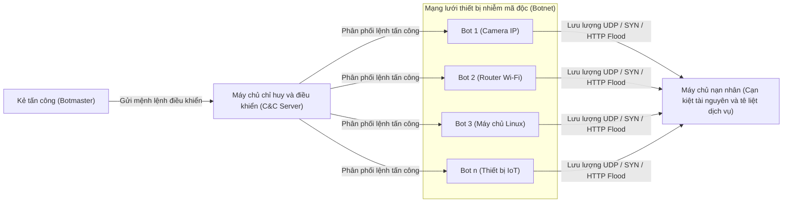
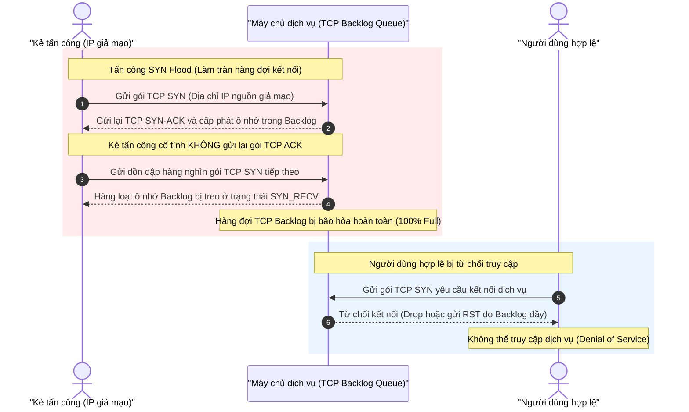
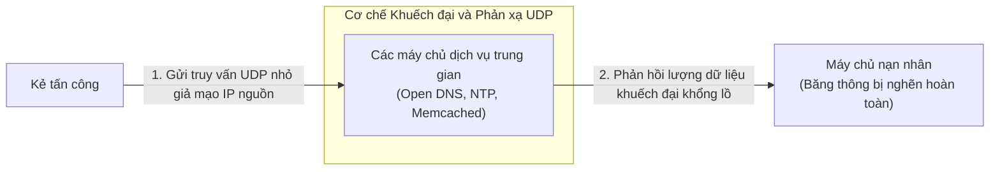
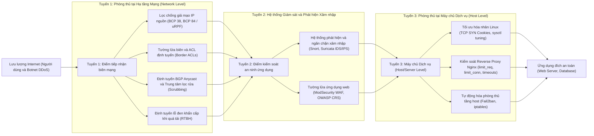
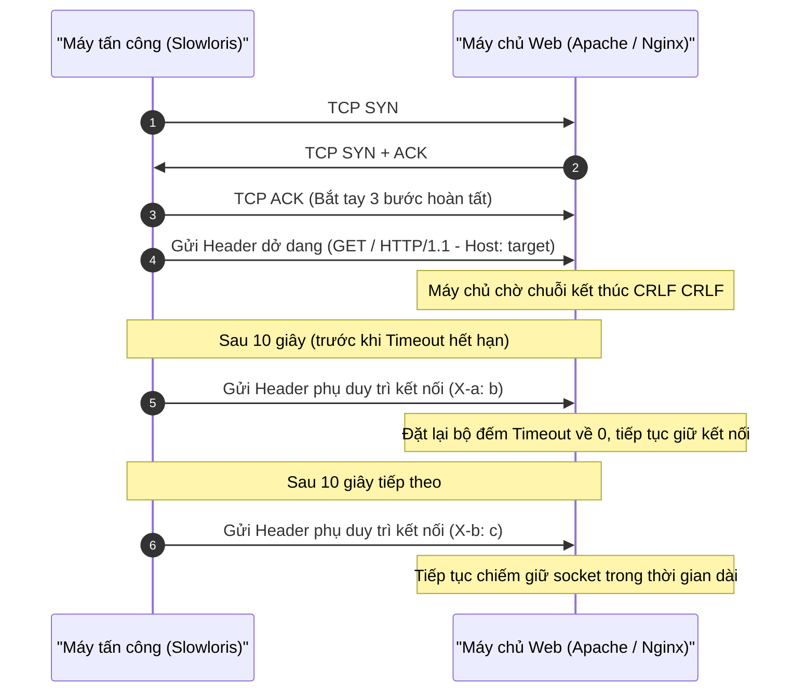
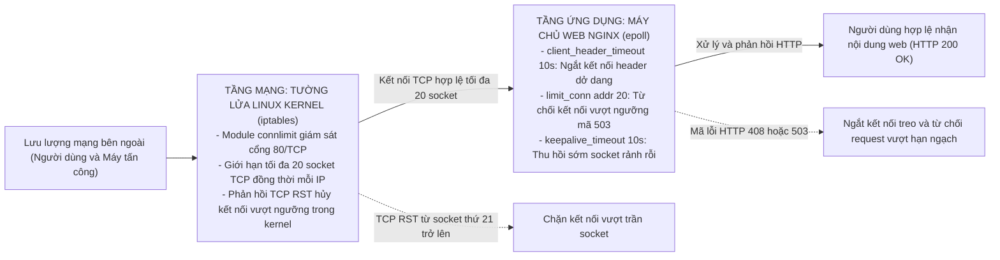
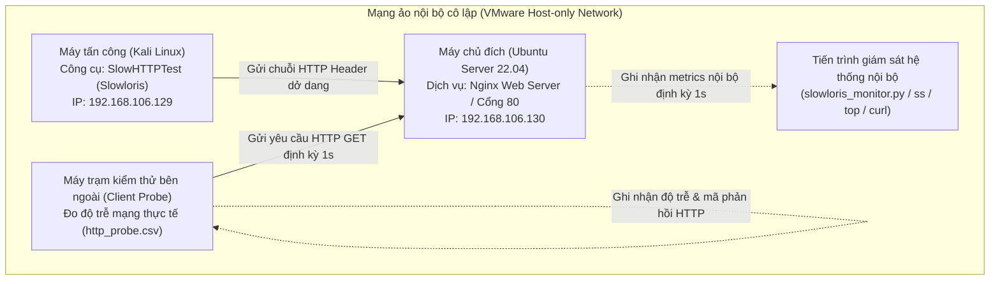

# BÁO CÁO BÀI TẬP LỚN

> **HỌC PHẦN:** CƠ SỞ AN TOÀN THÔNG TIN  
> **KHOA:** AN TOÀN THÔNG TIN – HỌC VIỆN CÔNG NGHỆ BƯU CHÍNH VIỄN THÔNG  
> **ĐỀ TÀI SỐ 01:** *"Tìm hiểu về các dạng tấn công và cách phòng chống DoS/DDoS. Tìm và demo một công cụ tấn công DoS/DDoS, sau đó đưa ra giải pháp phòng chống phù hợp."*  
> **TÊN NHÓM:** NHÓM 1  
> **HỌC KỲ / NĂM HỌC:** HỌC KỲ 1 – NĂM HỌC 2026 - 2027  
> **HÀ NỘI – 2026**

---

### DANH SÁCH SINH VIÊN THỰC HIỆN (TRƯỞNG NHÓM XẾP SỐ 1)

| STT | Mã Sinh Viên | Họ và Tên | Vai trò trong nhóm | Phân công nhiệm vụ chính |
| :---: | :---: | :--- | :---: | :--- |
| **1** | **B24DCCE180** | **Lê Anh Minh** | **Nhóm trưởng** | Quản lý tiến độ chung; Nghiên cứu và triển khai giải pháp phòng thủ (Mục 3.3, 3.4); Cấu hình Nginx và iptables; Tổng hợp toàn văn báo cáo chuẩn mẫu Khoa ATTT; Hoàn thiện slide báo cáo. |
| **2** | **B24DCCE222** | **Nguyễn Đinh Anh Quân** | Thành viên | Phụ trách nghiên cứu cơ sở lý thuyết tổng quan về DoS/DDoS (Chương 1); Phân loại các hình thức tấn công; Soạn thảo phần Mở đầu, Kết luận và Hướng phát triển; Xây dựng dàn ý Slide. |
| **3** | **B24DCCE264** | **Nguyễn Đình Tiến** | Thành viên | Thiết lập mô hình Lab ảo hóa VMware Workstation; Cài đặt và cấu hình công cụ tấn công SlowHTTPTest (Slowloris); Thực thi kịch bản tấn công chưa phòng thủ; Thu thập log hệ thống và số liệu thực nghiệm (Mục 3.1, 3.2). |
| **4** | **B24DCCE271** | **Ứng Trọng Trình** | Thành viên | Phụ trách nghiên cứu sâu cơ chế kỹ thuật công cụ Slowloris và xây dựng mô hình phòng thủ hai tầng trên máy chủ web (Chương 2); Thiết kế đồ họa toàn bộ Slide thuyết trình; Chuẩn bị video demo dự phòng. |

---

## PHÂN CÔNG NHIỆM VỤ NHÓM THỰC HIỆN

*Bảng 0.1 - Bảng phân công chi tiết nhiệm vụ và tiến độ các thành viên Nhóm 1*

| TT | Công việc / Nhiệm vụ | SV thực hiện | Thời hạn hoàn thành | Kết quả đầu ra |
| :---: | :--- | :--- | :---: | :--- |
| **1** | Họp khởi động, thống nhất kịch bản demo Slowloris và phân chia công việc | Lê Anh Minh (Chủ trì)<br>Cả 4 thành viên | 27/09/2026 | Biên bản họp nhóm số 1, đề cương chi tiết BTL |
| **2** | Nghiên cứu tổng quan lý thuyết DoS/DDoS, botnet và phân loại theo mô hình OSI | Nguyễn Đinh Anh Quân | 30/09/2026 | Bản thảo hoàn chỉnh Chương 1 |
| **3** | Phân tích cơ chế kỹ thuật công cụ Slowloris, socket HTTP và giải pháp phòng thủ 2 tầng | Ứng Trọng Trình | 01/10/2026 | Bản thảo hoàn chỉnh Chương 2 |
| **4** | Thiết lập mạng ảo hóa VMware (Host-only), cấu hình Ubuntu Server, Nginx, Kali Linux | Nguyễn Đình Tiến | 29/09/2026 | Hệ thống Lab vận hành ổn định, sẵn sàng đo lường |
| **5** | Chạy thực nghiệm kịch bản 1 (chưa phòng thủ), thu thập file log, csv và số liệu baseline | Nguyễn Đình Tiến | 30/09/2026 | Tệp log csv, pcap Wireshark, số liệu bảng 3.1 |
| **6** | Cấu hình phòng thủ Nginx (limit_conn, timeout) và iptables (connlimit), chạy thực nghiệm kịch bản 2 | Lê Anh Minh | 01/10/2026 | Cấu hình thực tế, số liệu bảng 3.2, 3.3 |
| **7** | Soạn thảo nội dung Chương 3, phân tích so sánh đối chiếu hiệu năng hệ thống | Nguyễn Đình Tiến<br>Lê Anh Minh | 02/10/2026 | Bản thảo hoàn chỉnh Chương 3 |
| **8** | Soạn thảo phần Mở đầu, Kết luận và Hướng phát triển của báo cáo | Nguyễn Đinh Anh Quân | 03/10/2026 | Nội dung Mở đầu, Kết luận & Hướng phát triển |
| **9** | Thiết kế bộ Slide thuyết trình (PowerPoint, 15-20 slide) và kịch bản thuyết trình | Ứng Trọng Trình | 04/10/2026 | Slide thuyết trình hoàn thiện, phân chia lượt nói |
| **10** | Rà soát toàn văn, chuẩn hóa định dạng theo mẫu v1.0 Khoa ATTT, gộp tài liệu tham khảo | Lê Anh Minh | 05/10/2026 | Báo cáo hoàn chỉnh (Word & PDF), nộp bài lmsattt |

---

## NHÓM THỰC HIỆN TỰ ĐÁNH GIÁ

*Bảng 0.2 - Đánh giá mức độ đóng góp và kỹ năng của các thành viên Nhóm 1*

| TT | SV thực hiện | Thái độ tham gia | Mức hoàn thành CV | Kỹ năng giao tiếp | Kỹ năng hợp tác | Kỹ năng lãnh đạo | Điểm TB |
| :---: | :--- | :---: | :---: | :---: | :---: | :---: | :---: |
| **1** | **Lê Anh Minh** | 5 | 5 | 5 | 5 | 5 | **5.0** |
| **2** | **Nguyễn Đinh Anh Quân** | 5 | 5 | 4 | 5 | 4 | **4.6** |
| **3** | **Nguyễn Đình Tiến** | 5 | 5 | 4 | 5 | 4 | **4.6** |
| **4** | **Ứng Trọng Trình** | 5 | 5 | 5 | 5 | 4 | **4.8** |

*Ghi chú tiêu chí đánh giá (Thang điểm 0 - 5 theo quy chuẩn Khoa ATTT):*
- **Thái độ tham gia:** Đánh giá điểm thái độ tham gia công việc chung của nhóm (từ 0: không tham gia, đến 5: chủ động, tích cực).
- **Mức hoàn thành CV:** Đánh giá điểm mức độ hoàn thành công việc được giao (từ 0: không hoàn thành, đến 5: hoàn thành xuất sắc).
- **Kỹ năng giao tiếp:** Đánh giá điểm khả năng tương tác, giao tiếp trong nhóm (từ 0: không hoặc giao tiếp rất yếu, đến 5: giao tiếp xuất sắc).
- **Kỹ năng hợp tác:** Đánh giá điểm khả năng hợp tác, hỗ trợ lẫn nhau, giải quyết mâu thuẫn, xung đột (từ 0: kém, đến 5: xuất sắc).
- **Kỹ năng lãnh đạo:** Đánh giá điểm khả năng lãnh đạo (từ 0: không có khả năng, đến 5: tổ chức và điều phối công việc trong nhóm hiệu quả).

---

## MỤC LỤC

- **DANH MỤC CÁC HÌNH VẼ**
- **DANH MỤC CÁC BẢNG BIỂU**
- **DANH MỤC CÁC TỪ VIẾT TẮT**
- **MỞ ĐẦU**
- **CHƯƠNG 1. TỔNG QUAN VỀ TẤN CÔNG VÀ PHÒNG CHỐNG DoS/DDoS**
  - 1.1 Khái niệm cơ bản về DoS và DDoS
    - 1.1.1 Định nghĩa tấn công từ chối dịch vụ (DoS)
    - 1.1.2 Tấn công từ chối dịch vụ phân tán (DDoS) và mạng Botnet
    - 1.1.3 Hậu quả và thiệt hại
  - 1.2 Phân loại các hình thức tấn công DoS/DDoS theo mô hình OSI
    - 1.2.1 Tấn công tầng mạng và tầng vận chuyển (Volumetric và Protocol)
    - 1.2.2 Tấn công tầng ứng dụng (Application Layer - Layer 7)
    - 1.2.3 Tấn công khuếch đại và phản xạ (Amplification/Reflection Attacks)
  - 1.3 Tổng quan các nguyên lý và kỹ thuật phòng chống DoS/DDoS
    - 1.3.1 Phòng thủ tại hạ tầng mạng (Network Infrastructure Level)
    - 1.3.2 Phòng thủ tại máy chủ dịch vụ (Host/Server Level)
    - 1.3.3 Hệ thống phát hiện, ngăn chặn xâm nhập và tường lửa ứng dụng (IDS/IPS, WAF)
  - 1.4 Kết chương
- **CHƯƠNG 2. PHÂN TÍCH CÔNG CỤ TẤN CÔNG SLOWLORIS VÀ GIẢI PHÁP PHÒNG THỦ**
  - 2.1 Khái quát
  - 2.2 Phân tích công cụ tấn công Slowloris
    - 2.2.1 Cơ chế hoạt động và cách thức làm cạn kiệt tài nguyên
    - 2.2.2 Dấu hiệu nhận diện trên hệ thống nạn nhân
  - 2.3 Giải pháp phòng chống trên máy chủ web
    - 2.3.1 Cơ chế kiểm soát lưu lượng và giới hạn kết nối bằng Nginx
    - 2.3.2 Cấu hình tường lửa tầng mạng với iptables
    - 2.3.3 Các giải pháp tự động hóa và tối ưu hóa mở rộng
    - 2.3.4 Đánh giá phạm vi hiệu quả và giới hạn của giải pháp
  - 2.4 Kết chương
- **CHƯƠNG 3. THỰC NGHIỆM VÀ ĐÁNH GIÁ KẾT QUẢ**
  - 3.1 Xây dựng môi trường thử nghiệm
    - 3.1.1 Mô hình mạng thử nghiệm
    - 3.1.2 Trạng thái hệ thống trước thực nghiệm
    - 3.1.3 Trạng thái nền (Baseline)
  - 3.2 Mô phỏng tấn công không phòng thủ
    - 3.2.1 Kịch bản tấn công Slowloris
    - 3.2.2 Giám sát hệ thống máy chủ
    - 3.2.3 Phân tích kết quả
  - 3.3 Triển khai phòng thủ
    - 3.3.1 Cấu hình Nginx Web Server
    - 3.3.2 Kết quả thực nghiệm sau khi áp dụng cấu hình Nginx
    - 3.3.3 Phòng thủ bổ sung bằng Firewall (iptables)
  - 3.4 Đánh giá kết quả
  - 3.5 Kết chương
- **KẾT LUẬN**
  - Kết quả đạt được
  - Hướng phát triển
- **TÀI LIỆU THAM KHẢO**

---

## DANH MỤC CÁC HÌNH VẼ

| Ký hiệu hình | Tên gọi chi tiết của hình vẽ | Vị trí |
| :---: | :--- | :---: |
| **Hình 1.1** | Sơ đồ kiến trúc mạng Botnet và cơ chế phát động tấn công DDoS phân tán | Chương 1 (Mục 1.1.2) |
| **Hình 1.2** | Sơ đồ quy trình bắt tay ba bước TCP và hiện tượng nghẽn hàng đợi trong tấn công SYN Flood | Chương 1 (Mục 1.2.1) |
| **Hình 1.3** | Sơ đồ luồng lưu lượng trong tấn công DoS/DDoS phản xạ và khuếch đại | Chương 1 (Mục 1.2.3) |
| **Hình 1.4** | Mô hình kiến trúc phòng thủ nhiều lớp (Defense-in-Depth) chống DoS/DDoS | Chương 1 (Mục 1.3) |
| **Hình 2.1** | Trình tự bắt tay TCP và duy trì kết nối dở dang của Slowloris | Chương 2 (Mục 2.2.1) |
| **Hình 2.2** | Sơ đồ kiến trúc phòng thủ hai tầng bảo vệ máy chủ web | Chương 2 (Mục 2.3) |
| **Hình 3.1** | Sơ đồ kiến trúc môi trường thử nghiệm mô phỏng tấn công và phòng thủ | Chương 3 (Mục 3.1.1) |

---

## DANH MỤC CÁC BẢNG BIỂU

| Ký hiệu bảng | Tên gọi chi tiết của bảng biểu | Vị trí |
| :---: | :--- | :---: |
| **Bảng 0.1** | Bảng phân công chi tiết nhiệm vụ và tiến độ các thành viên Nhóm 1 | Phần đầu báo cáo |
| **Bảng 0.2** | Đánh giá mức độ đóng góp và kỹ năng của các thành viên Nhóm 1 | Phần đầu báo cáo |
| **Bảng 1.1** | So sánh đặc điểm kỹ thuật giữa tấn công DoS và DDoS | Chương 1 (Mục 1.1.2) |
| **Bảng 1.2** | Phân loại các hình thức tấn công DoS/DDoS theo mô hình OSI | Chương 1 (Mục 1.2) |
| **Bảng 1.3** | Các kỹ thuật tấn công khuếch đại UDP phổ biến và hệ số BAF | Chương 1 (Mục 1.2.3) |
| **Bảng 1.4** | So sánh tổng hợp các giải pháp phòng chống DoS/DDoS | Chương 1 (Mục 1.3.3) |
| **Bảng 2.1** | So sánh đặc điểm kỹ thuật giữa tấn công DoS truyền thống và Slowloris | Chương 2 (Mục 2.2) |
| **Bảng 2.2** | Các tham số cấu hình phòng thủ Slowloris trên Nginx | Chương 2 (Mục 2.3.1) |
| **Bảng 3.1** | So sánh thông số hệ thống trước và trong khi chịu tấn công Slowloris (chưa phòng thủ) | Chương 3 (Mục 3.2.3) |
| **Bảng 3.2** | So sánh thông số hệ thống trước và sau khi kích hoạt giải pháp phòng thủ Nginx kết hợp iptables | Chương 3 (Mục 3.3.3) |
| **Bảng 3.3** | Tổng hợp hiệu quả các chỉ số đo lường giữa hai trạng thái thử nghiệm | Chương 3 (Mục 3.4) |

---

## DANH MỤC CÁC TỪ VIẾT TẮT

| Từ viết tắt | Thuật ngữ tiếng Anh / Giải thích | Thuật ngữ tiếng Việt / Ý nghĩa |
| :--- | :--- | :--- |
| **ACL** | Access Control List | Danh sách kiểm soát truy cập |
| **API** | Application Programming Interface | Giao diện lập trình ứng dụng |
| **BAF** | Bandwidth Amplification Factor | Hệ số khuếch đại băng thông |
| **BCP** | Best Current Practice | Tài liệu thực hành tốt nhất (IETF) |
| **BGP** | Border Gateway Protocol | Giao thức định tuyến biên ngoài |
| **C&C** | Command and Control | Hệ thống máy chủ chỉ huy và điều khiển |
| **CDN** | Content Delivery Network | Mạng phân phối nội dung |
| **CIA** | Confidentiality - Integrity - Availability | Tam giác bảo mật: Tính bảo mật - Toàn vẹn - Sẵn sàng |
| **CPU** | Central Processing Unit | Bộ vi xử lý trung tâm |
| **CRLF** | Carriage Return Line Feed (`\r\n`) | Ký tự xuống dòng và về đầu dòng |
| **DDoS** | Distributed Denial of Service | Tấn công từ chối dịch vụ phân tán |
| **DNS** | Domain Name System | Hệ thống phân giải tên miền |
| **DoS** | Denial of Service | Tấn công từ chối dịch vụ |
| **EDNS0** | Extension Mechanisms for DNS 0 | Tiện ích mở rộng cơ chế cho giao thức DNS |
| **ICMP** | Internet Control Message Protocol | Giao thức thông điệp điều khiển Internet |
| **IDS** | Intrusion Detection System | Hệ thống phát hiện xâm nhập |
| **IETF** | Internet Engineering Task Force | Nhóm kỹ thuật đặc trách mạng Internet |
| **IoT** | Internet of Things | Mạng lưới thiết bị Internet vạn vật |
| **IP** | Internet Protocol | Giao thức mạng Internet |
| **IPS** | Intrusion Prevention System | Hệ thống ngăn chặn xâm nhập |
| **ISN** | Initial Sequence Number | Số thứ tự khởi tạo ban đầu (TCP) |
| **ISP** | Internet Service Provider | Nhà cung cấp dịch vụ mạng Internet |
| **MPM** | Multi-Processing Module | Module đa xử lý (trên Apache HTTP Server) |
| **MSS** | Maximum Segment Size | Kích thước phân đoạn truyền tải tối đa |
| **NTP** | Network Time Protocol | Giao thức đồng bộ thời gian mạng |
| **OSI** | Open Systems Interconnection | Mô hình tham chiếu kết nối các hệ thống mở |
| **OWASP** | Open Web Application Security Project | Dự án an toàn ứng dụng web mở |
| **OWASP CRS** | OWASP Core Rule Set | Bộ quy tắc phòng thủ ứng dụng web cốt lõi |
| **P2P** | Peer-to-Peer | Kiến trúc mạng phân tán ngang hàng |
| **RAM** | Random Access Memory | Bộ nhớ truy cập ngẫu nhiên |
| **RFC** | Request for Comments | Chuỗi văn bản tiêu chuẩn kỹ thuật Internet |
| **RTBH** | Remotely Triggered Black Hole | Kỹ thuật định tuyến lỗ đen kích hoạt từ xa |
| **RTT** | Round Trip Time | Thời gian truyền vòng lặp của gói tin mạng |
| **SLA** | Service Level Agreement | Cam kết thỏa thuận chất lượng dịch vụ |
| **SOC** | Security Operations Center | Trung tâm điều hành giám sát an ninh mạng |
| **SYN** | Synchronize | Cờ đồng bộ khởi tạo phiên trong TCP |
| **TCB** | Transmission Control Block | Khối điều khiển đường truyền TCP |
| **TCP** | Transmission Control Protocol | Giao thức điều khiển truyền vận |
| **UDP** | User Datagram Protocol | Giao thức truyền dữ liệu phi kết nối |
| **uRPF** | Unicast Reverse Path Forwarding | Kiểm tra đường dẫn ngược đơn hướng |
| **WAF** | Web Application Firewall | Tường lửa ứng dụng web |

---

# MỞ ĐẦU

Đảm bảo tính sẵn sàng (Availability) cho máy chủ và ứng dụng web là mục tiêu cốt lõi của an toàn thông tin. Các cuộc tấn công từ chối dịch vụ (Denial of Service, DoS) và từ chối dịch vụ phân tán (Distributed Denial of Service, DDoS) trực tiếp làm tê liệt hoạt động của dịch vụ trực tuyến. Khác với các đợt tấn công bão hòa băng thông tầng mạng (Volumetric DoS), hình thức tấn công cạn kiệt tài nguyên tầng ứng dụng (Layer 7) như tấn công tốc độ chậm (Slow HTTP Attack) nhắm vào cơ chế quản lý phiên của máy chủ. Cụ thể, công cụ Slowloris duy trì các kết nối HTTP dở dang với lưu lượng rất thấp để chiếm dụng toàn bộ bảng kết nối đồng thời, khiến máy chủ không thể tiếp nhận người dùng hợp lệ.

Báo cáo bài tập lớn tập trung nghiên cứu cơ chế phát động của Slowloris, xây dựng mô hình thử nghiệm cô lập và triển khai giải pháp phòng thủ hai tầng phối hợp giữa máy chủ web Nginx và tường lửa Linux iptables.

Nội dung báo cáo gồm ba chương:

* **Chương 1. Tổng quan về tấn công và phòng chống DoS/DDoS:** Trình bày khái niệm, cơ chế mạng botnet, phân loại kỹ thuật tấn công theo mô hình OSI và các nguyên lý phòng thủ theo chiều sâu.
* **Chương 2. Phân tích công cụ tấn công Slowloris và giải pháp phòng thủ:** Làm rõ cơ chế giữ kết nối dở dang của Slowloris, đặc điểm nhận diện trên hệ thống và thiết kế mô hình phòng thủ kết hợp Nginx với iptables.
* **Chương 3. Thực nghiệm và đánh giá kết quả:** Triển khai mô hình thử nghiệm cô lập, thực nghiệm tấn công bằng SlowHTTPTest, kích hoạt cấu hình phòng thủ hai tầng và đối chiếu định lượng hiệu năng hệ thống.

---


# CHƯƠNG 1. TỔNG QUAN VỀ TẤN CÔNG VÀ PHÒNG CHỐNG DoS/DDoS

Chương 1 trình bày cơ sở lý thuyết về tấn công từ chối dịch vụ (DoS/DDoS) và mô hình phòng thủ theo chiều sâu (Defense-in-Depth). Nội dung tập trung vào ba trọng tâm: bản chất và tác động của DoS/DDoS qua mạng botnet; phân loại kỹ thuật tấn công theo mô hình OSI; các lớp phòng thủ từ biên mạng, máy chủ dịch vụ đến hệ thống giám sát an ninh.

---

## 1.1 Khái niệm cơ bản về DoS và DDoS

### 1.1.1 Định nghĩa tấn công từ chối dịch vụ (DoS)

Tấn công từ chối dịch vụ (Denial of Service, DoS) làm tê liệt khả năng cung cấp tài nguyên hoặc dịch vụ đối với người dùng hợp lệ, đe dọa trực tiếp tính sẵn sàng (Availability) trong tam giác bảo mật CIA. Kẻ tấn công nhắm vào ba nhóm tài nguyên: băng thông mạng, bảng trạng thái giao thức (hàng đợi socket) và tài nguyên tính toán của máy chủ (CPU, RAM, luồng thực thi).

Kỹ thuật DoS gồm hai cơ chế chính:
- **Khai thác lỗ hổng phần mềm (Vulnerability-based Attacks):** Kẻ tấn công gửi gói tin dị thường (malformed packets) vi phạm đặc tả giao thức nhằm kích hoạt lỗi xử lý của hệ điều hành hoặc phần mềm máy chủ. Điển hình gồm Ping of Death (gói ICMP vượt giới hạn 65.535 byte gây tràn bộ đệm khi tái lắp ghép) [1], Teardrop (lỗi tính toán độ lệch phân mảnh offset làm sập nhân hệ thống) và Land Attack (gói TCP SYN có địa chỉ IP và cổng nguồn trùng với đích, khiến máy chủ tự phản hồi dẫn đến treo hệ thống).
- **Làm tràn ngập tài nguyên (Resource Exhaustion Attacks):** Kẻ tấn công gửi dồn dập yêu cầu vượt quá công suất tính toán, năng lực I/O hoặc dung lượng đường truyền của máy chủ. Phương thức này không phụ thuộc vào lỗ hổng phần mềm cụ thể nên đe dọa hầu hết dịch vụ mạng công cộng.

### 1.1.2 Tấn công từ chối dịch vụ phân tán (DDoS) và mạng Botnet

Tấn công từ chối dịch vụ phân tán (Distributed Denial of Service, DDoS) phát động lưu lượng từ nhiều nguồn cùng lúc, thường xuất phát từ mạng botnet gồm hàng trăm nghìn đến hàng triệu thiết bị, nhằm áp đảo hạ tầng của máy chủ mục tiêu.

*Bảng 1.1 - So sánh đặc điểm kỹ thuật giữa tấn công DoS và DDoS*

| Tiêu chí so sánh | Tấn công DoS (Đơn nguồn) | Tấn công DDoS (Phân tán) |
|---|---|---|
| **Số lượng nguồn tấn công** | Một hoặc vài máy trạm cục bộ | Hàng nghìn đến hàng triệu máy trạm phân tán toàn cầu (mạng botnet) |
| **Quy mô lưu lượng** | Bị giới hạn bởi băng thông phần cứng của máy tấn công (thường dưới 1 Gbps) | Lưu lượng khổng lồ; Cloudflare ghi nhận 935 đợt tấn công tầng mạng vượt ngưỡng 1 Tbps trong nửa đầu năm 2026 [2] |
| **Khả năng ngăn chặn** | Tương đối đơn giản; thiết lập quy tắc tường lửa chặn IP nguồn phát | Phức tạp; nguồn tấn công phân tán rộng và thường xuyên giả mạo địa chỉ IP nguồn (IP Spoofing) |
| **Khả năng truy vết nguồn gốc** | Dễ dàng xác định địa chỉ IP nguồn thật của kẻ tấn công | Khó khăn; lưu lượng đi qua nhiều lớp máy chủ trung gian và mạng botnet che giấu danh tính kẻ chủ mưu |

Mạng botnet gồm ba thành phần: kẻ điều hành (Botmaster), máy chủ chỉ huy (Command and Control, C&C Server) và các thiết bị nhiễm mã độc (Bots). Vòng đời botnet trải qua ba giai đoạn: lây nhiễm (Infection) qua quét cổng hoặc khai thác lỗ hổng; báo danh và duy trì kết nối với máy chủ C&C (C&C Rendezvous); nhận lệnh và phát động tấn công đồng loạt vào mục tiêu (Execution).


*Hình 1.1 - Sơ đồ kiến trúc mạng Botnet và cơ chế phát động tấn công DDoS phân tán*

Kiến trúc điều khiển botnet vận hành theo hai mô hình:
- **Mô hình tập trung (Client-Server):** Bot nhận lệnh từ máy chủ trung tâm qua giao thức IRC hoặc HTTP/HTTPS. Mô hình này dễ quản trị nhưng tồn tại điểm lỗi đơn (Single Point of Failure); mạng lưới tê liệt khi máy chủ C&C bị cô lập hoặc chặn tên miền.
- **Mô hình ngang hàng (Peer-to-Peer, P2P):** Các bot trao đổi lệnh trực tiếp với nhau, loại bỏ nút điều khiển trung tâm và gây khó khăn cho việc triệt phá toàn bộ hạ tầng.

Mã độc Mirai (tháng 8/2016) quét cổng Telnet 23 và 2323, sử dụng 62 cặp thông tin đăng nhập mặc định để kiểm soát hơn 600.000 camera an ninh và router [3]. Ngày 21/10/2016, Mirai huy động khoảng 100.000 bot gửi lưu lượng TCP/UDP tới cổng 53 của Dyn, làm tê liệt các dịch vụ lớn như Twitter, GitHub, Spotify và Netflix trong nhiều giờ [4]. Mô hình dịch vụ hóa (DDoS-as-a-Service, dịch vụ booter và stresser) cho phép thuê hạ tầng tấn công theo giờ với chi phí thấp, gia tăng tần suất đe dọa an toàn thông tin toàn cầu.

### 1.1.3 Hậu quả và thiệt hại

Tấn công DoS/DDoS gây tổn thất nghiêm trọng trên bốn phương diện:
- **Gián đoạn vận hành và tổn thất tài chính:** Dịch vụ ngừng hoạt động làm giảm doanh thu trực tiếp, phát sinh chi phí ứng cứu sự cố và nguy cơ bồi thường vi phạm cam kết mức chất lượng dịch vụ (SLA).
- **Suy giảm uy tín thương hiệu:** Gián đoạn kéo dài làm xói mòn lòng tin của đối tác và khách hàng, ảnh hưởng tiêu cực tới vị thế thị trường của tổ chức.
- **Nghi binh che giấu xâm nhập (Smokescreen Attack):** Kẻ tấn công tạo lưu lượng DDoS đột biến nhằm phân tán nguồn lực của Trung tâm Giám sát Điều hành An ninh mạng (SOC), che giấu hành vi đánh cắp dữ liệu hoặc cài cắm mã độc. Khảo sát của Kaspersky Lab và B2B International ghi nhận 56% doanh nghiệp từng chứng kiến DDoS bị lợi dụng cho mục đích này [5].
- **Tác động lan truyền diện rộng (Collateral Damage):** Tấn công nhắm vào nhà cung cấp hạ tầng dùng chung (DNS, điện toán đám mây, ISP) khiến toàn bộ dịch vụ phụ thuộc trên cùng hệ thống bị cô lập, tương tự sự cố Dyn năm 2016.

---

## 1.2 Phân loại các hình thức tấn công DoS/DDoS theo mô hình OSI

Phân loại DoS/DDoS theo mô hình OSI giúp xác định tài nguyên mục tiêu và thiết lập giải pháp phòng thủ tương ứng. Cơ quan An ninh mạng và Cơ sở hạ tầng Hoa Kỳ (CISA) chia DoS/DDoS thành ba nhóm: làm cạn kiệt băng thông (Volumetric), khai thác giao thức tầng mạng/vận chuyển (Protocol) và tấn công tầng ứng dụng (Application Layer). Nhóm tấn công khuếch đại/phản xạ (Amplification/Reflection) nhân lưu lượng qua trung gian nên được phân tích thành một phân nhóm độc lập.

*Bảng 1.2 - Phân loại các hình thức tấn công DoS/DDoS theo mô hình OSI*

| Nhóm tấn công | Tầng tác động (OSI) | Tài nguyên mục tiêu bị khai thác | Kỹ thuật tấn công tiêu biểu |
|---|---|---|---|
| **Làm cạn băng thông (Volumetric)** | Tầng mạng & vận chuyển (Layer 3 & 4) | Băng thông đường truyền vật lý, năng lực chuyển mạch router | UDP Flood, ICMP Flood |
| **Khai thác giao thức (Protocol)** | Tầng mạng & vận chuyển (Layer 3 & 4) | Bảng trạng thái kết nối tường lửa, hàng đợi kết nối (backlog) của socket | TCP SYN Flood, Ping of Death, Smurf Attack |
| **Tầng ứng dụng (Application Layer)** | Tầng ứng dụng (Layer 7) | Luồng xử lý máy chủ web, CPU, RAM, giới hạn kết nối cơ sở dữ liệu | HTTP GET/POST Flood, Slowloris, Slow POST (R.U.D.Y.) |
| **Khuếch đại / Phản xạ (Amplification / Reflection)** | Tầng vận chuyển & ứng dụng (Layer 4 & 7) | Băng thông đường truyền nạn nhân (nhờ hệ số khuếch đại UDP) | DNS Amplification, NTP Amplification, Memcached Amplification |

### 1.2.1 Tấn công tầng mạng và tầng vận chuyển (Volumetric và Protocol)

**Nhóm tấn công làm cạn băng thông (Volumetric Attacks):** Kẻ tấn công làm nghẽn đường truyền mạng đi vào máy chủ đích bằng khối lượng dữ liệu khổng lồ.
- **UDP Flood:** Giao thức UDP hoạt động phi kết nối và không yêu cầu bắt tay. Kẻ tấn công gửi dồn dập các gói UDP tốc độ cao tới các cổng ngẫu nhiên. Khi không có tiến trình lắng nghe, hệ điều hành liên tục tạo và gửi gói ICMP Destination Unreachable (Type 3, Code 3) để phản hồi, làm cạn kiệt CPU máy chủ và lấp đầy băng thông hai chiều.
- **ICMP Flood (Ping Flood):** Kẻ tấn công gửi liên tục các gói ICMP Echo Request (Type 8), buộc máy chủ đích đáp trả bằng các gói ICMP Echo Reply (Type 0) có kích thước tương đương. Lưu lượng đối xứng quy mô lớn trực tiếp làm nghẽn băng thông hệ thống.

**Nhóm tấn công khai thác giao thức (Protocol Attacks):** Kẻ tấn công khai thác cơ chế quản lý trạng thái của giao thức tầng 3 và 4 để làm cạn kiệt bộ nhớ hệ điều hành hoặc thiết bị mạng trung gian.
- **TCP SYN Flood:** Giao thức TCP yêu cầu máy chủ cấp phát ô nhớ trong hàng đợi backlog sau khi gửi gói SYN-ACK. Kẻ tấn công phát dồn dập các gói SYN với địa chỉ IP giả mạo hoặc cố tình không gửi gói ACK phản hồi. Kết nối bán mở giữ chỗ trong hàng đợi cho đến khi hết thời gian chờ (timeout). Khi backlog đầy, máy chủ từ chối mọi yêu cầu kết nối hợp lệ mới, làm tê liệt dịch vụ ở tầng nhân hệ điều hành mà không cần làm nghẽn băng thông.


*Hình 1.2 - Sơ đồ quy trình bắt tay ba bước TCP và hiện tượng nghẽn hàng đợi trong tấn công SYN Flood*

### 1.2.2 Tấn công tầng ứng dụng (Application Layer - Layer 7)

Tấn công tầng ứng dụng nhắm trực tiếp vào phần mềm dịch vụ web, cơ sở dữ liệu hoặc giao diện lập trình ứng dụng (API). Lưu lượng tấn công tuân thủ cú pháp HTTP/HTTPS hợp lệ nên các bộ lọc tường lửa tầng mạng khó phân biệt với người dùng thông thường. Kẻ tấn công chỉ cần lượng băng thông rất nhỏ nhưng có thể làm cạn kiệt luồng xử lý đồng thời (worker threads) hoặc bộ nhớ máy chủ.

- **HTTP Flood:** Kẻ tấn công gửi dồn dập các yêu cầu HTTP GET hoặc HTTP POST hợp lệ. Yêu cầu GET nhắm vào tài nguyên động đòi hỏi máy chủ tính toán; yêu cầu POST nhắm vào biểu mẫu xác thực hoặc tìm kiếm dữ liệu để buộc cơ sở dữ liệu phải xử lý liên tục.
- **Slowloris:** Robert Hansen công bố công cụ Slowloris năm 2009, khai thác định dạng kết thúc tiêu đề HTTP theo RFC 7230 [6]. Kẻ tấn công mở hàng loạt kết nối TCP và gửi tiêu đề chưa hoàn chỉnh (thiếu chuỗi kết thúc `\r\n\r\n`). Trước khi hết hạn chờ (timeout), công cụ gửi thêm dòng tiêu đề phụ (`X-a: b\r\n`) để duy trì socket. Bằng cách giữ hàng nghìn kết nối mở với băng thông tối thiểu, Slowloris chiếm dụng toàn bộ bảng kết nối của máy chủ web, từ chối mọi truy cập hợp lệ (chi tiết tại Chương 2 và Chương 3).
- **Slow POST (R.U.D.Y.):** Công cụ khai thác phần thân HTTP POST bằng cách gửi tiêu đề `Content-Length` lớn, sau đó truyền từng byte dữ liệu chậm rãi cách nhau từ 10 đến 120 giây. Máy chủ phải duy trì socket và cấp phát bộ nhớ chờ đủ dữ liệu, dẫn đến cạn kiệt tài nguyên kết nối.

### 1.2.3 Tấn công khuếch đại và phản xạ (Amplification/Reflection Attacks)

Tấn công khuếch đại kết hợp hai kỹ thuật mạng:
- **Kỹ thuật Phản xạ (Reflection):** Kẻ tấn công gửi truy vấn tới các máy chủ trung gian công khai (Reflectors) với địa chỉ IP nguồn giả mạo thành địa chỉ IP của nạn nhân (IP Spoofing). Toàn bộ dữ liệu phản hồi đổ dồn về máy chủ nạn nhân.
- **Kỹ thuật Khuếch đại (Amplification):** Kẻ tấn công khai thác các giao thức UDP không kiểm tra phiên, trong đó kích thước gói tin phản hồi lớn gấp nhiều lần gói tin truy vấn ban đầu.

Hệ số khuếch đại băng thông (Bandwidth Amplification Factor, BAF) là tỷ số giữa kích thước tải dữ liệu UDP phản hồi và tải dữ liệu truy vấn [7]:

$$\text{BAF} = \frac{\text{Kích thước Payload phản hồi (Bytes)}}{\text{Kích thước Payload yêu cầu (Bytes)}}$$


*Hình 1.3 - Sơ đồ luồng lưu lượng trong tấn công DoS/DDoS phản xạ và khuếch đại*

*Bảng 1.3 - Các kỹ thuật tấn công khuếch đại UDP phổ biến và hệ số BAF*

| Kỹ thuật tấn công | Giao thức / Cổng | Cơ chế tạo phản hồi khuếch đại | Hệ số khuếch đại băng thông (BAF) |
|---|---|---|---|
| **DNS Amplification** | UDP / Cổng 53 | Gửi truy vấn bản ghi dung lượng lớn (loại ANY hoặc TXT) tới các máy chủ Open DNS Resolver hỗ trợ tiện ích EDNS0 (RFC 2671) | Từ 28 đến 54 lần |
| **NTP Amplification** | UDP / Cổng 123 | Lạm dụng lệnh giám sát hệ thống `monlist` trên các máy chủ NTP phiên bản cũ để lấy danh sách 600 địa chỉ IP kết nối gần nhất | Khoảng 556,9 lần |
| **Memcached Amplification** | UDP / Cổng 11211 | Gửi các yêu cầu đọc dữ liệu dung lượng nhỏ để truy xuất các tệp dữ liệu lưu trong bộ nhớ đệm mở công khai không xác thực | Lên tới 51.200 lần |

Ngày 28/02/2018, GitHub hứng chịu đợt tấn công Memcached Amplification đạt đỉnh 1,35 Tbps với 126,9 triệu gói tin mỗi giây [8]. Cuộc tấn công xuất phát từ việc hàng loạt máy chủ Memcached mở cổng UDP 11211 ra Internet không kèm xác thực, kết hợp kỹ thuật giả mạo IP nguồn. Để ngăn chặn hình thức này, các mạng biên triển khai lọc IP giả mạo theo chuẩn BCP 38 / RFC 2827 [9], đồng thời vô hiệu hóa cổng UDP trên các dịch vụ nội bộ hoặc tắt tính năng phân giải đệ quy mở (Open Resolver).

---

## 1.3 Tổng quan các nguyên lý và kỹ thuật phòng chống DoS/DDoS

Do tấn công DoS/DDoS hiện nay thường phối hợp nhiều vectơ (vừa làm nghẽn băng thông vừa làm tê liệt ứng dụng), một biện pháp đơn lẻ không đủ bảo vệ toàn diện hệ thống. Cơ quan An ninh mạng và Cơ sở hạ tầng Hoa Kỳ (CISA) khuyến nghị áp dụng mô hình phòng thủ theo chiều sâu (Defense-in-Depth), chia các giải pháp thành ba tuyến: hạ tầng mạng, máy chủ dịch vụ và hệ thống giám sát an ninh chuyên dụng [10].


*Hình 1.4 - Mô hình kiến trúc phòng thủ nhiều lớp (Defense-in-Depth) chống DoS/DDoS*

### 1.3.1 Phòng thủ tại hạ tầng mạng (Network Infrastructure Level)

- **Tường lửa và ACL:** Lọc gói tin tại router biên theo IP, cổng, giao thức, cờ TCP và áp dụng chính sách giới hạn tốc độ (Rate Limiting) cho ICMP/UDP. Quy tắc IP tĩnh không hiệu quả trước lưu lượng phân tán từ các mạng botnet lớn.
- **Lọc chống giả mạo IP (BCP 38 & uRPF):** Khuyến nghị BCP 38 (RFC 2827) yêu cầu ISP loại bỏ gói tin có IP nguồn ngoài dải cấp phát [9]. Khuyến nghị BCP 84 (RFC 3704) bổ sung kiểm tra đường dẫn ngược Unicast (uRPF) [11]; router hủy gói tin nếu giao diện nhận không phải là đường về tối ưu của IP nguồn, triệt tiêu tiền đề của tấn công phản xạ và khuếch đại.
- **Định tuyến lỗ đen (RTBH):** Khi lưu lượng vượt ngưỡng chịu tải, nhà vận hành mạng quảng bá tuyến BGP trỏ IP bị tấn công vào giao diện Null0. Lưu lượng tới địa chỉ này bị loại bỏ ngay tại biên ISP nhằm bảo vệ phần còn lại của hạ tầng.
- **BGP Anycast và Trung tâm lọc rửa (Scrubbing Centers):** Cùng một IP công cộng được quảng bá từ nhiều nút mạng phân tán địa lý, dùng BGP chia nhỏ lưu lượng về trạm gần nhất để phân tán áp lực. Các trung tâm lọc rửa chuyên dụng bóc tách gói tin độc hại và chỉ chuyển lưu lượng hợp lệ về máy chủ gốc qua đường hầm an toàn.

### 1.3.2 Phòng thủ tại máy chủ dịch vụ (Host/Server Level)

- **Tối ưu hóa nhân Linux:** Khắc phục nguy cơ cạn kiệt backlog do TCP SYN Flood qua ba thiết lập:
  - `net.ipv4.tcp_syncookies = 1`: Kích hoạt SYN Cookies theo RFC 4987 [12]. Khi backlog đầy, máy chủ mã hóa trạng thái vào giá trị ISN của gói SYN-ACK thay vì lưu bảng kết nối bán mở. Khi nhận gói ACK hợp lệ tiếp theo, nhân giải mã ISN để khôi phục phiên mà không cạn kiệt bộ nhớ.
  - `net.ipv4.tcp_max_syn_backlog`: Mở rộng kích thước hàng đợi trạng thái `SYN_RECV` lên 2048 - 4096.
  - `net.ipv4.tcp_synack_retries`: Giảm số lần phát lại gói SYN-ACK từ 5 xuống 2 hoặc 3 lần nhằm thu hồi sớm các ô nhớ dở dang.
- **Cấu hình giới hạn trên Web Server Nginx:** Module `ngx_http_limit_req_module` sử dụng thuật toán thùng rò rỉ (leaky bucket) để khống chế tần suất yêu cầu trên từng IP; module `ngx_http_limit_conn_module` ấn định trần kết nối đồng thời. Hai chỉ thị `client_header_timeout` và `client_body_timeout` (thiết lập 5 đến 10 giây) ngắt kết nối và trả mã lỗi `HTTP 408 Request Timeout` nếu máy khách truyền dữ liệu quá chậm, vô hiệu hóa kỹ thuật giữ socket của Slowloris và Slow POST.
- **Kiến trúc Reverse Proxy:** Nginx làm reverse proxy đệm toàn bộ phần đầu và phần thân HTTP trước khi chuyển tiếp vào dịch vụ nội bộ, bảo vệ máy chủ ứng dụng khỏi nguy cơ bị chiếm dụng socket bởi các cuộc tấn công tốc độ chậm.
- **Cơ chế phòng vệ tự động với Fail2ban:** Fail2ban giám sát nhật ký máy chủ (access log, error log). Khi một IP phát sinh lỗi bất thường vượt ngưỡng (nhiều mã lỗi HTTP 408 liên tiếp), công cụ tự động kích hoạt quy tắc tường lửa (`iptables`) để cô lập IP vi phạm tại tầng mạng.

### 1.3.3 Hệ thống phát hiện, ngăn chặn xâm nhập và tường lửa ứng dụng (IDS/IPS, WAF)

- **Hệ thống IDS/IPS:** IDS phân tích gói tin thụ động để phát cảnh báo; IPS đặt trực tiếp trên luồng truyền dữ liệu (inline) để chủ động ngăn chặn lưu lượng bất thường. Suricata và Snort là hai giải pháp mã nguồn mở tiêu biểu, kết hợp nhận diện theo mẫu chữ ký (Signature-based) và phát hiện dị thường thống kê (Anomaly-based).
- **Tường lửa ứng dụng web (WAF):** WAF kiểm soát sâu lưu lượng HTTP/HTTPS ở tầng 7, phân tích tiêu đề, tham số và cookie để chặn đứng tấn công khai thác ứng dụng. ModSecurity tích hợp OWASP Core Rule Set (OWASP CRS) [13] là giải pháp phổ biến. WAF bảo vệ tầng ứng dụng nhưng không thay thế được năng lực hấp thụ băng thông lớn tại biên mạng.

*Bảng 1.4 - So sánh tổng hợp các giải pháp phòng chống DoS/DDoS*

| Giải pháp kỹ thuật | Tầng tác động | Mục tiêu bảo vệ phù hợp nhất | Hạn chế kỹ thuật chính |
|---|---|---|---|
| **Tường lửa biên & ACL** | Layer 3 & 4 | Lọc gói tin tĩnh theo IP, cổng và giao thức; giới hạn tốc độ lưu lượng ICMP/UDP | Kém hiệu quả trước lưu lượng phân tán rộng từ mạng botnet lớn |
| **Lọc chống giả mạo IP (BCP 38, uRPF)** | Layer 3 | Triệt tiêu tấn công phản xạ và khuếch đại UDP bằng cách ngăn chặn IP Spoofing | Đòi hỏi sự hợp tác triển khai đồng bộ từ phía nhà cung cấp dịch vụ mạng (ISP) |
| **Định tuyến lỗ đen (RTBH)** | Layer 3 | Giảm tải khẩn cấp khi lưu lượng tấn công vượt ngưỡng chịu đựng của hạ tầng | Địa chỉ IP mục tiêu bị cô lập hoàn toàn, dịch vụ không thể truy cập từ bên ngoài |
| **BGP Anycast & Trung tâm lọc rửa** | Layer 3 & 4 | Hấp thụ và bóc tách lưu lượng tấn công phân tán quy mô lớn (hàng trăm Gbps đến Tbps) | Chi phí triển khai và duy trì dịch vụ cao; phụ thuộc năng lực nhà cung cấp |
| **TCP SYN Cookies** | Layer 4 | Bảo vệ hàng đợi kết nối socket của hệ điều hành trước tấn công TCP SYN Flood | Không lưu tùy chọn TCP mở rộng trong gói SYN; làm tăng nhẹ tải tính toán mã băm của CPU |
| **Giới hạn tốc độ & thời gian chờ (Nginx)** | Layer 7 | Ngăn chặn tấn công cạn kiệt socket kết nối HTTP chậm (Slowloris, Slow POST) | Yêu cầu vượt ngưỡng quy định bị từ chối; cần tinh chỉnh tham số phù hợp với người dùng mạng yếu |
| **Hệ thống IDS/IPS (Suricata, Snort)** | Layer 3, 4, 7 | Nhận diện dấu hiệu tấn công đã biết và phát hiện lưu lượng biến động bất thường | Phương pháp chữ ký khó phát hiện các cuộc tấn công phân tán lưu lượng nhỏ lẻ |
| **Tường lửa ứng dụng web (WAF)** | Layer 7 | Phân tích sâu nội dung thông điệp HTTP/HTTPS, ngăn chặn tấn công logic ứng dụng | Không có khả năng hấp thụ các đợt tấn công làm tràn băng thông ở tầng mạng |

---

## 1.4 Kết chương

Chương 1 đã hệ thống hóa các nguyên lý cơ bản về tấn công và phòng thủ DoS/DDoS. Phân tích theo mô hình OSI cho thấy sự đa dạng của các vectơ tấn công: từ làm tràn ngập băng thông và khai thác giao thức ở tầng 3 và 4 đến chiếm dụng tài nguyên ứng dụng ở tầng 7.

Để bảo vệ hệ thống trước các mối đe dọa đa vectơ, tổ chức cần thiết lập chiến lược phòng thủ theo chiều sâu (Defense-in-Depth), phối hợp chặt chẽ giữa hạ tầng mạng, máy chủ dịch vụ và hệ thống giám sát chuyên dụng. Trên nền tảng lý thuyết này, Chương 2 đi sâu phân tích công cụ tấn công Slowloris nhằm làm rõ cơ chế chiếm dụng socket tầng ứng dụng và thiết kế mô hình phòng thủ hai tầng Nginx kết hợp iptables.

---
# CHƯƠNG 2. PHÂN TÍCH CÔNG CỤ TẤN CÔNG SLOWLORIS VÀ GIẢI PHÁP PHÒNG THỦ

## 2.1 Khái quát

Chương 2 tập trung vào hai nội dung kỹ thuật trọng tâm: phân tích cơ chế tấn công Slowloris và thiết kế giải pháp phòng thủ trên máy chủ web. Nội dung cụ thể gồm hai phần:
- Phân tích công cụ tấn công Slowloris: làm rõ cơ chế khai thác quy chuẩn đóng gói HTTP/1.1 theo RFC 7230, sự khác biệt giữa kiến trúc đa tiến trình và hướng sự kiện, cùng các dấu hiệu nhận diện trên hệ thống.
- Xây dựng giải pháp phòng chống: thiết lập kiến trúc phòng thủ hai tầng phối hợp giữa máy chủ web Nginx tại tầng ứng dụng (thời gian chờ 10 giây, giới hạn 20 socket/IP) và tường lửa iptables tại tầng mạng (chặn trần 20 kết nối TCP bằng connlimit). Chương cũng đề xuất các giải pháp mở rộng gồm tự động hóa với Fail2ban, kiểm soát tần suất với module limit_req và tối ưu hóa nhân Linux.

---

## 2.2 Phân tích công cụ tấn công Slowloris

Slowloris do chuyên gia bảo mật Robert Hansen công bố năm 2009 [6], nhắm vào tầng ứng dụng (Layer 7). Công cụ này thuộc nhóm tấn công tốc độ chậm (low and slow). Kẻ tấn công chỉ cần một máy trạm gửi lưu lượng nhỏ nhưng kéo dài liên tục. Lưu lượng này chiếm dụng toàn bộ bảng kết nối đồng thời của máy chủ web, khai thác cách triển khai giao thức HTTP trên các kiến trúc hướng tiến trình và cơ chế quản lý socket của máy chủ.

*Bảng 2.1 - So sánh đặc điểm kỹ thuật giữa tấn công DoS truyền thống và Slowloris*

| Tiêu chí so sánh | Tấn công DoS băng thông lớn (Volumetric DoS) | Tấn công Slowloris (Low and Slow DoS) |
| :--- | :--- | :--- |
| **Tầng tác động (Mô hình OSI)** | Tầng mạng / Tầng vận chuyển (Layer 3 & 4) | Tầng ứng dụng (Layer 7 - HTTP/HTTPS) |
| **Mục tiêu làm cạn kiệt** | Băng thông đường truyền, bảng trạng thái router/firewall | Giới hạn kết nối đồng thời của máy chủ web (`MaxRequestWorkers` trên Apache hoặc `worker_connections` trên Nginx) |
| **Lưu lượng yêu cầu** | Rất lớn (hàng trăm Mbps đến Gbps) | Rất nhỏ (khoảng vài chục Kbps) |
| **Yêu cầu hạ tầng tấn công** | Cần botnet hoặc máy chủ khuếch đại (NTP, DNS) | Chỉ cần một máy trạm cấu hình thông thường |
| **Dấu hiệu trên Access Log** | Ghi nhận đột biến hàng triệu bản ghi request | Hầu như không có bản ghi trong lúc treo kết nối; chỉ ghi nhận mã HTTP 408 trên Nginx khi chạm trần thời gian chờ |
| **Mức độ tiêu thụ CPU/RAM** | CPU máy chủ và router xử lý gói tin tăng vọt | Bộ nhớ RAM ổn định; CPU tăng vọt trong pha bắt tay TCP hàng loạt, sau đó duy trì ở mức trung bình để quản lý socket |

### 2.2.1 Cơ chế hoạt động và cách thức làm cạn kiệt tài nguyên

**Quy chuẩn kết thúc yêu cầu theo RFC 7230:**  
Theo đặc tả HTTP/1.1 trong RFC 7230 (được cập nhật tại RFC 9112) [14], một thông điệp yêu cầu kết thúc phần tiêu đề (headers) bằng một dòng trống chứa hai cặp ký tự xuống dòng liên tiếp CRLF (`\r\n\r\n`).

```http
GET / HTTP/1.1\r\n
Host: example.com\r\n
User-Agent: Mozilla/5.0...\r\n
Accept: text/html\r\n
\r\n                            <-- Chuỗi CRLF đánh dấu kết thúc phần Header
```

Khi chưa nhận đủ chuỗi `\r\n\r\n`, máy chủ coi yêu cầu chưa hoàn tất. Socket mạng được giữ ở trạng thái mở để chờ các dòng tiêu đề tiếp theo.

**Kỹ thuật duy trì kết nối nửa mở:**  
Sau khi hoàn tất bắt tay ba bước TCP, Slowloris gửi dòng yêu cầu cùng một vài trường tiêu đề ban đầu, nhưng không gửi chuỗi `\r\n\r\n` kết thúc:

```http
GET / HTTP/1.1\r\n
Host: example.com\r\n
User-Agent: Mozilla/5.0 (Windows NT 10.0; Win64; x64)...\r\n
```

Định kỳ từ 10 đến 15 giây, trước khi bộ đếm thời gian của máy chủ (như giá trị `Timeout 60` mặc định của Apache) hết hạn, công cụ gửi tiếp một dòng tiêu đề phụ không có ý nghĩa nghiệp vụ:

```http
X-a: b\r\n
```

Mỗi khi nhận thêm dữ liệu, máy chủ đặt lại bộ đếm timeout về 0. Bằng cách lặp lại thao tác này, kẻ tấn công duy trì hàng loạt socket mở liên tục mà không bao giờ gửi xong yêu cầu [15].


*Hình 2.1 - Trình tự bắt tay TCP và duy trì kết nối dở dang của Slowloris*

**Cơ chế làm cạn kiệt tài nguyên xử lý trên các kiến trúc máy chủ:**  
Slowloris khai thác trực tiếp mô hình xử lý đa tiến trình và đa luồng trên các máy chủ web truyền thống như Apache HTTP Server thông qua module đa xử lý MPM (Multi-Processing Module) [16]:
* Mô hình MPM Prefork gán mỗi tiến trình con cho một kết nối client duy nhất.
* Mô hình MPM Worker gán mỗi luồng xử lý cho một kết nối.

Cả hai mô hình đều giới hạn tổng số kết nối đồng thời qua tham số `MaxRequestWorkers` (thường từ 150 đến 400 kết nối để tránh tràn bộ nhớ RAM). Khi kẻ tấn công mở đồng thời vài trăm socket ở trạng thái treo, số socket này lấp đầy toàn bộ worker pool của máy chủ. Lúc này, mọi yêu cầu kết nối từ người dùng hợp lệ đều bị đẩy vào hàng đợi chờ (`ListenBacklog`). Khi hàng đợi đầy, máy chủ từ chối kết nối mới hoặc làm yêu cầu của người dùng bị quá hạn (timed out).

Đối với các máy chủ web sử dụng kiến trúc hướng sự kiện bất đồng bộ như Nginx, dù cơ chế `epoll` giúp một tiến trình worker xử lý hàng nghìn kết nối mà không tốn nhiều bộ nhớ RAM, Slowloris vẫn có thể gây cạn kiệt tài nguyên nếu máy chủ không có chính sách giới hạn kết nối theo IP và giữ thời gian chờ header quá dài. Khi kẻ tấn công mở đồng loạt hàng trăm socket dở dang, các kết nối này chiếm trọn giới hạn `worker_connections` của Nginx, đẩy các yêu cầu kết nối từ người dùng hợp lệ vào hàng đợi chờ hoặc bị từ chối dịch vụ.

### 2.2.2 Dấu hiệu nhận diện trên hệ thống nạn nhân

Hệ thống bị tấn công Slowloris xuất hiện các biểu hiện đặc trưng sau:

1. **Tài nguyên phần cứng và mạng:** Băng thông mạng gần như không tăng so với bình thường, chỉ tiêu tốn vài chục kilobit/giây cho các gói tin giữ kết nối. Tải CPU tăng mạnh trong pha bắt tay TCP dồn dập ban đầu, sau đó duy trì ở mức trung bình để quản lý bảng trạng thái socket. Bộ nhớ RAM duy trì ổn định, không bị tràn bộ nhớ.
2. **Bảng kết nối mạng:** Lệnh kiểm tra socket (`ss` hoặc `netstat`) ghi nhận số lượng lớn kết nối ở trạng thái `ESTABLISHED` trỏ về cổng 80 hoặc 443 từ cùng một địa chỉ IP nguồn, với kích thước hàng đợi truyền nhận (`Recv-Q` / `Send-Q`) gần như bằng 0.

```bash
# Kiểm tra số lượng kết nối tới cổng dịch vụ web
ss -tan '( sport = :80 or sport = :443 )' | awk '{print $1}' | sort | uniq -c
```

3. **Phía người dùng:** Các yêu cầu tải trang bị treo lâu, độ trễ phản hồi mạng tăng vọt và xuất hiện lỗi quá thời gian chờ (`504 Gateway Timeout` khi đi qua proxy, hoặc `ERR_CONNECTION_TIMED_OUT`).
4. **Nhật ký máy chủ:** Trên các máy chủ đa tiến trình như Apache, file `access.log` không có bản ghi mới trong suốt thời gian tấn công do tiến trình chỉ ghi log sau khi hoàn tất phiên phản hồi HTTP [16]. Thông tin lỗi chỉ xuất hiện trong `error.log` khi hệ thống cạn kiệt worker pool (`server reached MaxRequestWorkers setting`). Ngược lại, trên máy chủ web Nginx, khi các socket dở dang bị ngắt do chạm trần thời gian chờ (`client_header_timeout`), máy chủ sẽ ghi nhận bản ghi với mã trạng thái `HTTP 408 Request Timeout` vào `access.log`. Dấu hiệu này giúp người quản trị phát hiện và theo dõi hành vi tấn công ngay trên nhật ký truy cập.

---

## 2.3 Giải pháp phòng chống trên máy chủ web

Cuộc tấn công Slowloris thành công nhờ hai điều kiện: máy chủ cho phép duy trì kết nối chậm kéo dài, và không khống chế số lượng socket đồng thời từ mỗi IP nguồn. Do đó, giải pháp phòng thủ cần đối ứng trực tiếp vào hai yếu tố này.

Nhóm thiết kế mô hình phòng thủ hai tầng theo nguyên lý phòng thủ chiều sâu (Defense-in-Depth). Tầng mạng (iptables) đóng vai trò lá chắn phía trước tại nhân Linux, khống chế số lượng socket vật lý. Tầng ứng dụng (Nginx) đóng vai trò phòng ngự nghiệp vụ trực tiếp, kiểm soát thời gian truyền nhận giao thức HTTP. Các giải pháp mở rộng gồm Fail2ban, module limit_req và tham số sysctl bổ trợ khả năng tự động hóa và nâng cao năng lực chịu tải cho môi trường thực tế.


*Hình 2.2 - Sơ đồ kiến trúc phòng thủ hai tầng bảo vệ máy chủ web*

### 2.3.1 Cơ chế kiểm soát lưu lượng và giới hạn kết nối bằng Nginx

Nginx sử dụng kiến trúc hướng sự kiện bất đồng bộ với cơ chế `epoll`, cho phép một tiến trình worker xử lý hàng nghìn kết nối đồng thời mà không tốn nhiều bộ nhớ [17]. Khi cấu hình các chỉ thị kiểm soát thời gian chờ và số kết nối đồng thời, Nginx chủ động bảo vệ tài nguyên socket và loại bỏ các luồng truyền dữ liệu bất thường.

*Bảng 2.2 - Các tham số cấu hình phòng thủ Slowloris trên Nginx*

| Tên tham số cấu hình | Giá trị thiết lập | Mục đích kỹ thuật |
| :--- | :--- | :--- |
| `client_header_timeout` | `10s` | Giới hạn thời gian tối đa để client truyền xong toàn bộ phần HTTP Header |
| `client_body_timeout` | `10s` | Giới hạn thời gian tối đa giữa hai thao tác đọc liên tiếp của request body |
| `keepalive_timeout` | `10s` | Giảm thời gian duy trì socket rảnh rỗi giữa các request của client |
| `limit_conn_zone` | `$binary_remote_addr zone=addr:10m` | Khởi tạo vùng nhớ chia sẻ 10MB lưu bảng theo dõi kết nối theo IP |
| `limit_conn` | `addr 20` | Giới hạn tối đa 20 kết nối đồng thời từ mỗi địa chỉ IP nguồn |

Cấu hình hoàn chỉnh trong file `/etc/nginx/nginx.conf`:

```nginx
http {
    # Cấp phát 10MB bộ nhớ chia sẻ lưu trữ bảng trạng thái kết nối theo IP (zone=addr)
    limit_conn_zone $binary_remote_addr zone=addr:10m;

    server {
        listen 80 default_server;
        server_name _;

        # Giới hạn tối đa 20 kết nối đồng thời từ một địa chỉ IP nguồn
        limit_conn addr 20;

        # Rút ngắn thời gian chờ client gửi hoàn tất phần Header xuống 10 giây
        client_header_timeout 10s;

        # Rút ngắn thời gian chờ client gửi body yêu cầu xuống 10 giây
        client_body_timeout 10s;

        # Giảm thời gian duy trì socket rảnh rỗi giữa các request xuống 10 giây
        keepalive_timeout 10s;

        location / {
            root /var/www/html;
            index index.html index.htm;
        }
    }
}
```

Các chỉ thị cấu hình trên chia thành hai nhóm cơ chế chính:

1. **Nhóm tham số kiểm soát thời gian truyền nhận dữ liệu (Timeouts):**  
Mặc định, máy chủ thường duy trì thời gian chờ header lên tới 60 giây. Việc rút ngắn `client_header_timeout` xuống 10 giây buộc client phải hoàn tất toàn bộ phần header trong khung thời gian này. Khi Slowloris gửi header rác định kỳ để duy trì socket dở dang, nếu quá 10 giây không có chuỗi kết thúc `\r\n\r\n`, Nginx chủ động ngắt socket và phản hồi mã lỗi `HTTP 408 Request Timeout`. Chỉ thị `client_body_timeout 10s` và `keepalive_timeout 10s` hỗ trợ thu hồi sớm socket rảnh rỗi và ngăn chặn biến thể truyền nội dung chậm (Slow POST).

2. **Nhóm tham số khống chế định mức kết nối theo địa chỉ IP (limit_conn):**  
Module `ngx_http_limit_conn_module` sử dụng vùng nhớ chia sẻ `addr:10m` để theo dõi số lượng socket từ từng địa chỉ IP [17]. Khai báo `limit_conn addr 20` giới hạn mỗi client chỉ duy trì tối đa 20 kết nối đồng thời. Khi Slowloris cố tình mở hàng loạt kết nối, từ kết nối thứ 21 trở đi, Nginx từ chối tiếp nhận và trả về mã lỗi `HTTP 503 Service Temporarily Unavailable`. Cơ chế này ngăn chặn việc chiếm dụng cạn kiệt tài nguyên `worker_connections`, bảo toàn năng lực xử lý cho người dùng hợp lệ.

### 2.3.2 Cấu hình tường lửa tầng mạng với iptables

Dù Nginx xử lý tốt kết nối đồng thời, việc để lượng lớn socket đi vào tầng ứng dụng vẫn làm tốn tài nguyên quản lý file descriptor của hệ điều hành. Chặn bớt lưu lượng ngay tại tầng nhân Linux qua iptables giúp giảm tải trực tiếp cho dịch vụ web.

**Cấu hình module connlimit của iptables:**  
Module `connlimit` cho phép kiểm tra số lượng kết nối TCP đồng thời ở trạng thái mở từ một địa chỉ IP trước khi gói tin chuyển tiếp lên tầng ứng dụng [18]:

```bash
# Từ chối kết nối mới nếu một IP mở quá 20 socket TCP đồng thời tới cổng 80
sudo iptables -A INPUT -p tcp --dport 80 -m connlimit --connlimit-above 20 -j REJECT --reject-with tcp-reset
```

Khi áp dụng quy tắc trên, từ socket thứ 21 trở đi, hạt nhân Linux phản hồi gói tin `TCP RST` (Reset) để đóng kết nối ngay lập tức. Cơ chế này phân chia ranh giới xử lý giữa hai tầng:
- Tầng mạng (iptables): Kiểm soát lưu lượng ngay tại nhân Linux. Nếu một IP gửi gói tin SYN vượt quá 20 socket đồng thời, iptables phản hồi `TCP RST` lập tức, ngăn gói tin đi vào hàng đợi của Nginx và tiết kiệm chu kỳ xử lý của CPU.
- Tầng ứng dụng (Nginx): Tiếp nhận các kết nối hợp lệ nằm trong ngưỡng 20 socket đi qua tường lửa. Nếu client giữ kết nối chậm quá 10 giây, Nginx chủ động ngắt phiên và trả về mã lỗi `HTTP 408`.

Sự kết hợp giữa iptables tại Layer 4 và Nginx tại Layer 7 tạo thành mô hình phòng thủ hai tầng cốt lõi. Đây là cấu hình phòng ngự chính được triển khai, kiểm thử và đo lường định lượng trong bài thực nghiệm ở Chương 3.

### 2.3.3 Các giải pháp tự động hóa và tối ưu hóa mở rộng

Phần này đề xuất ba giải pháp mở rộng gồm tự động hóa cô lập IP bằng Fail2ban, kiểm soát tần suất yêu cầu bằng module limit_req và tinh chỉnh tham số hạt nhân Linux (`sysctl.conf`). Đây là các khuyến nghị kỹ thuật bổ trợ cho môi trường vận hành thực tế.

Trong bài thực nghiệm ở Chương 3, nhóm chủ đích không kích hoạt Fail2ban khi thu thập số liệu 120 giây. Nếu kích hoạt Fail2ban, tường lửa sẽ chặn toàn bộ địa chỉ IP của máy tấn công sau 5 yêu cầu phát sinh mã lỗi 408 hoặc 503 (khoảng giây thứ 11). Việc ngắt nguồn phát quá sớm sẽ triệt tiêu áp lực tải lên hệ thống. Nhóm cần duy trì tải tấn công liên tục trong 120 giây để quan sát toàn diện động thái của máy chủ. Trạng thái chịu tải kéo dài giúp kiểm chứng mức CPU 36.8%, RAM 555 MB, nhịp đóng 120 socket và độ trễ probe 1.90 ms.

1. **Cơ chế tự động cô lập IP tấn công với Fail2ban:**  
Fail2ban theo dõi file nhật ký truy cập của Nginx theo thời gian thực. Khi một địa chỉ IP nhận nhiều mã lỗi 408 hoặc 503 trong thời gian ngắn, Fail2ban tự động tạo quy tắc iptables để chặn gói tin từ IP đó trong một khoảng thời gian xác định [19].

Cấu hình bộ lọc Fail2ban cho Nginx (`/etc/fail2ban/filter.d/nginx-slowloris.conf`):

```ini
[Definition]
failregex = ^<HOST> -.* "(GET|POST).*" (408|503)
ignoreregex =
```

Khai báo Jail trong `/etc/fail2ban/jail.local`:

```ini
[nginx-slowloris]
enabled  = true
port     = http,https
filter   = nginx-slowloris
logpath  = /var/log/nginx/access.log
maxretry = 5
findtime = 60
bantime  = 600
```

Khi một IP phát sinh 5 lần mã lỗi 408 hoặc 503 trong vòng 60 giây, Fail2ban đưa địa chỉ đó vào danh sách chặn của iptables trong 10 phút (600 giây).

2. **Kiểm soát tần suất gửi yêu cầu với module limit_req:**  
Kẻ tấn công có thể thay đổi chiến thuật từ duy trì kết nối chậm sang mở và đóng phiên dồn dập nhằm lách qua các bộ đếm timeout. Module `ngx_http_limit_req_module` của Nginx áp dụng thuật toán thùng rò rỉ (Leaky Bucket) để khống chế tốc độ tiếp nhận request:

```nginx
http {
    # Giới hạn tốc độ tiếp nhận: tối đa 5 yêu cầu/giây trên mỗi IP
    limit_req_zone $binary_remote_addr zone=req_limit:10m rate=5r/s;

    server {
        location / {
            # Cho phép xử lý đột biến tối đa 10 yêu cầu
            limit_req zone=req_limit burst=10 nodelay;
        }
    }
}
```

Cấu hình trên cho phép client gửi tối đa 5 yêu cầu/giây, đồng thời chấp nhận mức tăng đột biến không quá 10 yêu cầu với tùy chọn `nodelay`. Các yêu cầu vượt quá hạn ngạch này lập tức bị Nginx từ chối bằng mã `HTTP 503`.

3. **Tinh chỉnh tham số hạt nhân Linux trên máy chủ sản xuất:**  
Các tham số mạng trong file `/etc/sysctl.conf` giúp hệ điều hành dọn dẹp socket rác nhanh hơn và mở rộng hàng đợi tiếp nhận:

```ini
# Bật TCP SYN Cookies bảo vệ hàng đợi kết nối
net.ipv4.tcp_syncookies = 1

# Giảm thời gian giữ trạng thái FIN-WAIT-2 khi đóng socket
net.ipv4.tcp_fin_timeout = 15

# Tăng kích thước hàng đợi tiếp nhận kết nối
net.core.somaxconn = 4096
net.ipv4.tcp_max_syn_backlog = 4096

# Giảm chu kỳ kiểm tra TCP Keepalive để giải phóng socket rảnh rỗi sớm hơn
net.ipv4.tcp_keepalive_time = 300
net.ipv4.tcp_keepalive_intvl = 15
net.ipv4.tcp_keepalive_probes = 5
```

Quản trị viên áp dụng cấu hình mới bằng lệnh `sudo sysctl -p`.

### 2.3.4 Đánh giá phạm vi hiệu quả và giới hạn của giải pháp

Mô hình phòng thủ phối hợp giữa Nginx và iptables giải quyết tốt bài toán tấn công Slowloris từ một nguồn phát hoặc một dải địa chỉ IP tập trung (tấn công DoS đơn lẻ). Tuy nhiên, đối với biến thể tấn công phân tán quy mô lớn (Distributed Slowloris / DDoS), giải pháp này bộc lộ những giới hạn kỹ thuật cần lưu ý:
1. **Trường hợp mạng Botnet phân tán rộng:** Nếu kẻ tấn công sử dụng hàng nghìn địa chỉ IP khác nhau và mỗi IP chỉ mở từ 1 đến 2 kết nối, lưu lượng từ mỗi IP hoàn toàn nằm dưới ngưỡng kích hoạt của `limit_conn` (20 kết nối) và `connlimit` (20 kết nối). Khi đó, các quy tắc dựa trên ngưỡng IP đơn lẻ không thể phát hiện cuộc tấn công.
2. **Hướng xử lý bổ trợ nâng cao:** Để khắc phục kịch bản tấn công phân tán nói trên, hệ thống cần bổ sung các cơ chế phòng thủ chuyên sâu hơn:
   - Triển khai tường lửa ứng dụng web (WAF như ModSecurity hoặc Coraza) có khả năng phân tích hành vi và áp dụng điểm danh tiếng (reputation score) cho phiên kết nối.
   - Sử dụng các mạng phân phối nội dung (CDN) hoặc dịch vụ trung gian bảo vệ (như Cloudflare, AWS Shield) để hấp thụ và lọc các kết nối chậm phân tán trước khi lưu lượng chạm tới máy chủ gốc.

---

## 2.4 Kết chương

Chương 2 đã phân tích cơ chế tấn công Slowloris, cách thức làm cạn kiệt tài nguyên kết nối và các dấu hiệu nhận diện trên hệ thống. Chương cũng xây dựng mô hình phòng thủ hai tầng phối hợp giữa cấu hình Nginx (10s timeout, 20 socket) và quy tắc connlimit của iptables. Các giải pháp mở rộng gồm Fail2ban, module limit_req và tinh chỉnh sysctl cũng được đề xuất cho môi trường vận hành thực tế. Đây là cơ sở kỹ thuật trực tiếp để nhóm triển khai và đánh giá thực nghiệm trong bài Lab ở Chương 3.

---

---

# CHƯƠNG 3. THỰC NGHIỆM VÀ ĐÁNH GIÁ KẾT QUẢ


## 3.1 Xây dựng môi trường thử nghiệm

### 3.1.1 Mô hình mạng thử nghiệm

Nhóm thiết lập mô hình thử nghiệm trên nền tảng ảo VMware Workstation trong phân vùng mạng cô lập (Host-only Network). Mạng cô lập giúp kiểm soát toàn bộ lưu lượng phát sinh và không ảnh hưởng tới hạ tầng mạng bên ngoài.

Mô hình gồm ba thành phần chính:
- **Máy tấn công (Attacker):** Kali Linux (IP: `192.168.106.129`), chạy công cụ SlowHTTPTest [20] để gửi lưu lượng HTTP Header chậm.
- **Máy mục tiêu (Target):** Ubuntu Server 22.04 LTS (IP: `192.168.106.130`), chạy dịch vụ web Nginx phiên bản 1.18.0 trên cổng 80/TCP cùng kịch bản giám sát nội bộ `slowloris_monitor.py`.
- **Máy trạm thăm dò bên ngoài (External Probe Client):** Máy khách gửi các yêu cầu HTTP GET định kỳ 1 giây qua giao tiếp mạng tới cổng 80 của máy chủ đích, ghi nhận độ trễ phản hồi mạng thực tế và mã trạng thái HTTP vào tệp `http_probe.csv`.


*Hình 3.1 - Sơ đồ kiến trúc môi trường thử nghiệm mô phỏng tấn công và phòng thủ*

### 3.1.2 Trạng thái hệ thống trước thực nghiệm

Trước khi phát lưu lượng tấn công, nhóm kiểm tra trạng thái hoạt động của dịch vụ Nginx và tính thông suốt của đường truyền mạng.

Trên máy mục tiêu (Ubuntu Server), các lệnh sau xác nhận tiến trình Nginx và cổng dịch vụ:

```bash
# Kiểm tra dịch vụ Nginx đang chạy
systemctl is-active nginx

# Xác nhận Nginx đang lắng nghe trên cổng 80/TCP
sudo ss -lntp | grep :80

# Xác định địa chỉ IP của giao tiếp mạng
hostname -I
```

Từ máy tấn công (Kali Linux), lệnh ping và curl kiểm tra kết nối mạng cùng phản hồi HTTP:

```bash
# Kiểm tra kết nối tầng mạng (ICMP Ping)
ping -c 4 <IP_UBUNTU>

# Gửi yêu cầu HTTP HEAD kiểm tra phản hồi từ Nginx
curl -I http://<IP_UBUNTU>/
```

Máy chủ trả về mã phản hồi `HTTP/1.1 200 OK`, xác nhận dịch vụ web sẵn sàng tiếp nhận kết nối.

### 3.1.3 Trạng thái nền (Baseline)

Nhóm thu thập thông số hoạt động của máy chủ trong 120 giây ở điều kiện bình thường (chưa có tải tấn công). Số liệu trạng thái nền (Baseline) cung cấp mốc đối chứng để đo lường mức độ ảnh hưởng của cuộc tấn công và hiệu quả phòng thủ.

Tiến trình giám sát ghi nhận định kỳ mỗi giây một lần các chỉ số kỹ thuật:
- **Tổng số kết nối TCP cổng 80 (`total_80`):** Số socket TCP mở trên cổng dịch vụ web (trạng thái nền ghi nhận 2 socket ở chế độ `LISTEN`).
- **Số kết nối `ESTABLISHED`:** Số socket TCP đã hoàn tất bắt tay ba bước và đang trao đổi dữ liệu (trạng thái nền duy trì ở mức 0).
- **Tỷ lệ sử dụng CPU (`cpu_percent`):** Phần trăm năng lực vi xử lý hệ thống tiêu thụ (trạng thái nền dao động từ 4.5% đến 8.7%).
- **Bộ nhớ RAM (`mem_used_mb`, `mem_percent`):** Dung lượng (MB) và tỷ lệ (%) bộ nhớ vật lý sử dụng (trạng thái nền tiêu thụ khoảng 552 MB đến 576 MB, tương đương 16.5% đến 17.2%).
- **Thời gian phản hồi HTTP cục bộ (`response_sec`):** Độ trễ xử lý yêu cầu HTTP tiêu chuẩn gửi qua giao tiếp loopback `127.0.0.1` (ms), duy trì ở mức 0.45 ms đến 0.90 ms.
- **Thời gian phản hồi HTTP từ bên ngoài (`response_sec` trong `http_probe.csv`):** Độ trễ mạng thực tế khi máy khách bên ngoài gửi yêu cầu GET tới máy chủ qua card mạng (ms).


---

## 3.2 Mô phỏng tấn công không phòng thủ

### 3.2.1 Kịch bản tấn công Slowloris

Từ máy Kali Linux, nhóm thực thi kịch bản Slowloris (`-H`) bằng công cụ SlowHTTPTest. Kịch bản mở 500 kết nối HTTP đồng thời, gửi tiêu đề dở dang với chu kỳ giãn cách 10 giây giữa các đoạn header để giữ socket mở liên tục mà không hoàn tất yêu cầu.

Lệnh thực thi trên máy tấn công Kali Linux:

```bash
slowhttptest -c 500 -H -g -o slowloris_monitor -i 10 -r 20 -t GET -u http://<IP_UBUNTU>/ -x 24 -p 3 -l 120
```

Ý nghĩa các tham số cấu hình:
- `-c 500`: Đặt số kết nối đồng thời mục tiêu là 500.
- `-H`: Chọn chế độ gửi tiêu đề chậm (Slowloris).
- `-g`: Xuất biểu đồ thống kê dạng đồ họa (HTML/Canvas).
- `-o slowloris_monitor`: Đặt tiền tố tên tệp kết quả xuất ra.
- `-i 10`: Đặt khoảng cách giữa các đoạn header tiếp theo là 10 giây.
- `-r 20`: Đặt tốc độ mở kết nối mới là 20 kết nối mỗi giây.
- `-t GET`: Chọn phương thức HTTP GET cho yêu cầu.
- `-u http://<IP_UBUNTU>/`: Chỉ định URL của máy chủ mục tiêu.
- `-x 24`: Giới hạn độ dài header ngẫu nhiên gửi thêm tối đa 24 byte.
- `-p 3`: Đặt thời gian chờ tối đa cho gói tin thăm dò là 3 giây.
- `-l 120`: Giới hạn thời gian chạy thử nghiệm trong 120 giây.

### 3.2.2 Giám sát hệ thống máy chủ 

Trong 120 giây thử nghiệm, tiến trình giám sát trên Ubuntu Server liên tục ghi nhận dữ liệu mạng và tài nguyên vào tệp `slowloris_monitor.csv`:

Kiểm tra số lượng socket TCP theo từng trạng thái bằng lệnh `ss`:

```bash
watch -n 1 'ss -tan "( dport = :80 or sport = :80 )" | awk "NR>1 {print $1}" | sort | uniq -c'
```

Theo dõi tải CPU và bộ nhớ bằng lệnh `top`.

Theo dõi nhật ký truy cập và lỗi của Nginx theo thời gian thực:

```bash
sudo tail -f /var/log/nginx/access.log /var/log/nginx/error.log
```

### 3.2.3 Phân tích kết quả 

Bảng 3.1 tổng hợp số liệu trích xuất từ các tệp nhật ký `baseline_500.csv`, `slowloris_monitor.csv` và `http_probe.csv`:

*Bảng 3.1 - So sánh thông số hệ thống trước và trong khi chịu tấn công Slowloris (chưa phòng thủ)*

| Chỉ số giám sát | Trạng thái nền (Baseline) | Khi bị tấn công (Bản 1) | Nhận xét kỹ thuật |
| :--- | :---: | :---: | :--- |
| **Tổng socket TCP cổng 80 (`total_80`)** | 2 | 490.6 (đỉnh 552) | Lượng socket tăng nhanh do công cụ liên tục mở các phiên TCP mới đến cổng 80. |
| **Số kết nối ESTABLISHED** | 0 | 441.6 (đỉnh 500) | Chiếm trần 500 kết nối từ giây thứ 25 và duy trì trạng thái dở dang trong suốt bài test. |
| **Mức tiêu thụ CPU (%)** | 4.5% - 8.7% | 35.6% (đỉnh 100%) | CPU chạm 100% ở pha bắt tay hàng loạt ban đầu, sau đó duy trì quanh mức 35.6% để quản lý socket. |
| **Mức tiêu thụ RAM** | 552 MB đến 576 MB (16.5% đến 17.2%) | 581.0 MB (17.36%) | Mức dùng RAM tăng nhẹ từ 5 MB đến 29 MB (dao động 576 MB đến 584 MB), cho thấy Slowloris không gây áp lực lên bộ nhớ. |
| **Thời gian phản hồi HTTP bên ngoài (`http_probe`)** | ~1.50 ms | 1.90 ms (đỉnh 7.22 ms) | 138/138 yêu cầu nhận mã 200, nhưng xuất hiện các nhịp tăng vọt lên 3.7 ms đến 7.2 ms cứ mỗi 10 giây khi công cụ gửi thêm header. |

Số liệu thực nghiệm cho thấy các đặc trưng vận hành của hệ thống khi chưa được phòng thủ:
- **Chiếm dụng bảng kết nối:** SlowHTTPTest liên tục mở khoảng 20 kết nối mỗi giây, khiến số socket `ESTABLISHED` chạm trần 500 vào giây thứ 25. Tệp nhật ký ghi nhận `Closed = 0` trong suốt 120 giây. Toàn bộ socket bị giữ ở trạng thái dở dang do Nginx chưa giới hạn kết nối theo IP và chưa thiết lập thời hạn truyền header.
- **Tác động đến tài nguyên hệ thống:** Mức chiếm dụng RAM duy trì ổn định quanh 581 MB. Tải CPU tăng lên 100% ở pha bắt tay TCP ban đầu, sau đó duy trì ở mức trung bình 35.6% để quản lý bảng socket.
- **Biến động độ trễ mạng:** Máy thăm dò bên ngoài ghi nhận độ trễ trung bình 1.90 ms với đỉnh 7.22 ms. Cứ sau mỗi chu kỳ 10 giây, khi công cụ gửi thêm các đoạn header phụ, độ trễ lại tăng vọt, phản ánh hiệu ứng tải theo chu kỳ của Slowloris.

---

## 3.3 Triển khai phòng thủ 

### 3.3.1 Cấu hình Nginx Web Server

Nhóm thiết lập giải pháp phòng thủ tại tầng ứng dụng (Layer 7) theo khuyến nghị từ Nginx [21] bằng cách bổ sung chỉ thị kiểm soát kết nối và thời gian chờ vào tệp cấu hình `/etc/nginx/nginx.conf`.

Khai báo vùng nhớ theo dõi kết nối tại khối `http`:

```nginx
# Cấp phát 10MB bộ nhớ chia sẻ để lưu trữ bảng trạng thái IP kết nối (zone=addr)
limit_conn_zone $binary_remote_addr zone=addr:10m;
```

Cấu hình giới hạn kết nối và thời gian chờ tại khối `server`:

```nginx
server {
    listen 80 default_server;
    server_name _;

    # Giới hạn tối đa 20 kết nối đồng thời từ một địa chỉ IP nguồn
    limit_conn addr 20;

    # Rút ngắn thời gian chờ client gửi hoàn tất phần Header xuống 10 giây
    client_header_timeout 10s;

    # Rút ngắn thời gian chờ client gửi body yêu cầu xuống 10 giây
    client_body_timeout 10s;

    # Giảm thời gian duy trì socket rảnh rỗi giữa các request xuống 10 giây
    keepalive_timeout 10s;
}
```

Kiểm tra cú pháp và nạp lại cấu hình:

```bash
sudo nginx -t
sudo systemctl reload nginx
```

Chức năng của từng chỉ thị:
- `limit_conn addr 20`: Giới hạn mỗi địa chỉ IP nguồn mở tối đa 20 kết nối đồng thời. Nginx từ chối các kết nối vượt ngưỡng bằng mã `HTTP 503 Service Temporarily Unavailable`.
- `client_header_timeout 10s`: Giới hạn thời gian truyền toàn bộ phần HTTP Header trong 10 giây. Nginx tự động đóng kết nối và trả về mã lỗi `HTTP 408 Request Timeout` nếu client không gửi đủ chuỗi kết thúc `\r\n\r\n`.
- `client_body_timeout 10s` và `keepalive_timeout 10s`: Ngăn chặn các biến thể truyền body chậm (Slow POST) và giải phóng các socket rảnh rỗi sau 10 giây.

### 3.3.2 Kết quả thực nghiệm sau khi áp dụng cấu hình Nginx

Sau khi áp dụng cấu hình mới, nhóm chạy lại bài thử nghiệm với cùng tham số. Kết quả từ `baseline2_500.csv` và `slowloris_monitor2.csv` cho thấy:
- **Khống chế số kết nối ở mức 20:** Chỉ thị `limit_conn addr 20` khiến số kết nối mở thành công không vượt quá 20 (`Connected = 20`). Tất cả các yêu cầu vượt ngưỡng đều bị chặn, và số kết nối chờ (`Pending`) tăng mạnh, đạt 461 ở giây thứ 10.
- **Ngắt phiên quá hạn header:** Nginx đóng toàn bộ 20 kết nối đầu tiên ở giây thứ 11 khi hết thời gian chờ header 10 giây. Các đợt đóng tiếp theo diễn ra đều đặn theo nhịp tấn công; Nginx đã đóng tổng cộng 120 kết nối vi phạm ở giây 90.
- **Loại bỏ hiệu quả luồng kết nối độc hại:** Từ giây 90 đến khi kết thúc thử nghiệm, `Connected` vẫn ở mức 0. Trong tổng số 500 kết nối, 120 kết nối mở thành công bị đóng do timeout, còn 380 kết nối còn lại bị chặn ở trạng thái `Pending`.


### 3.3.3 Phòng thủ bổ sung bằng Firewall (iptables)

Dù Nginx đã đóng các kết nối chậm, việc tiếp nhận hàng trăm kết nối đi vào tầng ứng dụng vẫn tiêu tốn tài nguyên bắt tay TCP và quản lý socket trong kernel. Để giảm tải cho Nginx, nhóm triển khai giải pháp lọc gói tin tại tầng nhân Linux bằng tường lửa `iptables` qua module `connlimit` [22].

Quy tắc cấu hình iptables:

```bash
# Giới hạn mỗi IP chỉ được mở tối đa 20 kết nối TCP đồng thời tới cổng 80, từ chối kết nối thứ 21 bằng TCP RST
sudo iptables -A INPUT -p tcp --dport 80 -m connlimit --connlimit-above 20 -j REJECT --reject-with tcp-reset
```

Xác nhận quy tắc đã nạp vào nhân Linux:

```bash
sudo iptables -L INPUT -n -v
```

Phân tích mô hình phòng thủ chiều sâu (Defense-in-Depth):
- **Tầng mạng và vận chuyển (iptables):** Chặn các kết nối vượt ngưỡng ngay tại tầng nhân Linux bằng gói tin `TCP RST`, ngăn socket đi vào hàng đợi của Nginx và tiết kiệm CPU.
- **Tầng ứng dụng (Nginx):** Kiểm soát các kết nối gửi dữ liệu chậm trong giới hạn cho phép hoặc đến từ nhiều địa chỉ IP khác nhau, tự động hủy phiên sau 10 giây.

Sự kết hợp này phân chia trách nhiệm rõ ràng giữa tầng 4 và tầng 7, bảo vệ dịch vụ web toàn diện hơn.

*Bảng 3.2 - So sánh thông số hệ thống trước và sau khi kích hoạt giải pháp phòng thủ Nginx kết hợp iptables*

| Chỉ số giám sát | Trạng thái nền (Baseline) | Đã phòng thủ (Bản 2) | Nhận xét kỹ thuật |
| :--- | :---: | :---: | :--- |
| **Tổng socket TCP cổng 80 (`total_80`)** | 2 | 94.2 (đỉnh 151) | Giảm 80.8% so với khi chưa phòng thủ (từ 490.6 xuống 94.2 socket), giảm tải lưu vết socket trong kernel. |
| **Số kết nối ESTABLISHED** | 0 | 9.1 (đỉnh 20) | Giảm 97.9% so với khi chưa phòng thủ (từ 441.6 xuống 9.1 kết nối). Chỉ thị limit_conn giới hạn cứng số socket cùng lúc từ một IP ở mức 20. |
| **Số kết nối bị đóng (`Closed`)** | 0 | 120 kết nối | Nginx tự động ngắt kết nối theo chu kỳ 10 giây khi client không gửi xong header. |
| **Mức tiêu thụ CPU (%)** | 4.5% - 8.7% | 36.8% (đỉnh 100%) | Tải CPU trung bình ở mức 36.8%, chủ yếu xử lý gói TCP RST từ chối kết nối và giải phóng socket vi phạm. |
| **Mức tiêu thụ RAM** | 552 MB đến 576 MB (16.5% đến 17.2%) | 555.0 MB (16.58%) | RAM dao động trong khoảng 548 MB đến 561 MB, thấp hơn mức 581 MB của bản chưa phòng thủ. |
| **Thời gian phản hồi HTTP bên ngoài (`http_probe`)** | ~1.50 ms | 1.90 ms (trung vị 1.53 ms) | 138/138 yêu cầu từ máy ngoài nhận mã 200, độ trễ trung bình 1.90 ms cho thấy dịch vụ vẫn đáp ứng bình thường. |

---

## 3.4 Đánh giá kết quả

Bảng 3.3 tổng hợp các chỉ số định lượng then chốt giữa hai trạng thái thử nghiệm:

*Bảng 3.3 - Tổng hợp hiệu quả các chỉ số đo lường giữa hai trạng thái thử nghiệm*

| Tiêu chí đo lường | Chưa phòng thủ (Bản 1) | Đã phòng thủ (Bản 2) | So sánh và đối chiếu kỹ thuật |
| :--- | :---: | :---: | :--- |
| **Kết nối ESTABLISHED trung bình** | 441.6 (đỉnh 500) | 9.1 (đỉnh 20) | Giảm 97.9%. Chỉ thị limit_conn và iptables chặn trần ở mức 20 kết nối, ngăn chiếm dụng bảng kết nối. |
| **Tổng socket TCP cổng 80 (`total_80`)** | 490.6 (đỉnh 552) | 94.2 (đỉnh 151) | Giảm 80.8% lượng socket mở, giúp bảng trạng thái TCP trong kernel không bị quá tải. |
| **Kết nối bị đóng do vi phạm (`Closed`)** | 0 | 120 kết nối | Chỉ thị client_header_timeout 10s tự động ngắt các kết nối không hoàn tất header theo chu kỳ. |
| **Kết nối bị chặn ở hàng đợi (`Pending`)** | 0.2 (đỉnh 2) | 392.8 (đỉnh 461, cuối kỳ 380) | Các kết nối mở thêm từ máy tấn công bị từ chối ngay từ tầng mạng và chuyển sang trạng thái chờ. |
| **Tải tiêu thụ CPU trung bình** | 35.6% (đỉnh 100%) | 36.8% (đỉnh 100%) | Tải CPU không đổi nhiều (35.6% so với 36.8%), nhưng chu kỳ xử lý chuyển sang từ chối kết nối và thu hồi socket. |
| **Mức tiêu thụ bộ nhớ RAM** | 581.0 MB (17.36%) | 555.0 MB (16.58%) | Giảm 26 MB (4.5%), mức dùng RAM ổn định quanh 555 MB trong suốt 120 giây. |
| **Truy cập thực tế từ bên ngoài (`http_probe`)** | 1.90 ms (xuất hiện đỉnh 7.22 ms) | 1.90 ms (trung vị 1.53 ms, 100% mã 200) | 138/138 gói tin thăm dò đều nhận mã 200, độ trễ trung vị 1.53 ms xác nhận dịch vụ vẫn phục vụ tốt client ngoài. |

Kết quả thực nghiệm cho thấy `client_header_timeout 10s` và `limit_conn addr 20` giải quyết hiệu quả vấn đề cạn kiệt socket do Slowloris gây ra. Máy chủ chủ động đóng 120 kết nối vi phạm và chặn 380 kết nối còn lại ở trạng thái chờ, nhờ đó giảm đáng kể áp lực lên hệ thống.

Sự phối hợp giữa iptables ở tầng 4 và Nginx ở tầng 7 giúp duy trì thời gian phản hồi HTTP cục bộ dưới 0.5 ms và độ trễ từ mạng ngoài ở mức 1.90 ms. Người dùng hợp lệ vẫn có thể truy cập dịch vụ bình thường trong thời gian bị tấn công.

---

## 3.5 Kết chương

Chương 3 đã hoàn thành mô phỏng tấn công và đánh giá giải pháp phòng thủ trong môi trường mạng cô lập. Kết quả thực nghiệm xác nhận Slowloris làm tê liệt máy chủ bằng cách bão hòa bảng kết nối (đạt trần 500 socket `ESTABLISHED`) mà không làm cạn kiệt bộ nhớ RAM.

Giải pháp phòng thủ kết hợp giữa Nginx tại tầng ứng dụng (`client_header_timeout 10s`, `limit_conn addr 20`) và `iptables` tại tầng mạng (`connlimit 20`) đã giảm 97.9% số kết nối độc hại đồng thời, chủ động đóng 120 kết nối vi phạm và chặn 380 kết nối vượt ngưỡng. Nhờ cơ chế phân tách trách nhiệm giữa tầng 4 và tầng 7, máy chủ duy trì tỷ lệ phục vụ 100% đối với các yêu cầu hợp lệ với độ trễ phản hồi ổn định 1.90 ms trong suốt thời gian chịu tải tấn công.

---

# KẾT LUẬN

## Kết quả đạt được

Đề tài đã hoàn thành việc nghiên cứu lý thuyết, thực nghiệm tấn công và đánh giá phương án phòng thủ với các kết quả cụ thể:

* Hệ thống hóa kiến thức nền tảng về tấn công DoS/DDoS theo mô hình OSI và nguyên lý phòng thủ theo chiều sâu từ tầng mạng đến tầng ứng dụng.
* Làm rõ cơ chế hoạt động của Slowloris trong việc khai thác chuẩn HTTP/1.1 (RFC 7230): duy trì kết nối bằng tiêu đề dở dang để làm cạn kiệt bảng trạng thái kết nối máy chủ mà không tiêu tốn nhiều tài nguyên CPU hay băng thông mạng.
* Thiết lập môi trường thử nghiệm cô lập (Host-only), tái hiện hiện tượng máy chủ Nginx bị tê liệt hoàn toàn khi đạt trần 500 kết nối `ESTABLISHED` từ công cụ SlowHTTPTest.
* Triển khai và kiểm chứng giải pháp phòng thủ hai tầng kết hợp giữa Nginx (`client_header_timeout 10s`, `limit_conn addr 20`) và iptables (`connlimit 20`):
  * Giảm 97.9% số kết nối chiếm dụng đồng thời (từ trung bình 441.6 xuống 9.1 kết nối).
  * Giảm 80.8% tổng số socket mở trên cổng 80, giải phóng áp lực lưu vết phiên trên nhân Linux.
  * Tự động đóng 120 kết nối vi phạm thời gian chờ và chặn 380 kết nối vượt trần tại tầng mạng.
  * Duy trì tỷ lệ phục vụ 100% đối với các yêu cầu hợp lệ từ bên ngoài với độ trễ phản hồi ổn định (trung vị 1.53 ms).

## Hướng phát triển

Từ các kết quả đạt được, đề tài có thể tiếp tục mở rộng theo các hướng sau:

* Tự động hóa phòng thủ bằng Fail2ban: phân tích nhật ký truy cập Nginx để phát hiện các địa chỉ IP có hành vi treo phiên và tự động bổ sung luật chặn vào iptables.
* Đánh giá kịch bản tấn công phân tán (Distributed Slowloris): kiểm thử trường hợp nhiều máy tấn công phát động đồng thời nhằm xác định ngưỡng chịu tải khi luật giới hạn kết nối theo IP đơn lẻ (`connlimit`) bị phân tán.
* Mở rộng phạm vi thử nghiệm đối với các biến thể tấn công cạn kiệt tầng ứng dụng khác như Slow POST (chậm thân gói tin) và Slow Read (chậm nhận phản hồi).

---

## TÀI LIỆU THAM KHẢO

- **[1]** CERT Coordination Center, *"CA-1996-26: Denial-of-Service Attack via ping,"* Carnegie Mellon University, Software Engineering Institute, 1996.
- **[2]** Cloudflare Inc., *"DDoS Threat Report for 2026 H1,"* Cloudflare Research & Intelligence, 2026. [Trực tuyến]. Địa chỉ: https://www.cloudflare.com/resources/reports/ddos-threat-report/.
- **[3]** M. Antonakakis et al., *"Understanding the Mirai Botnet,"* in *26th USENIX Security Symposium (USENIX Security 17)*, Vancouver, BC, 2017, pp. 1093–1110.
- **[4]** S. Hilton, *"Dyn Analysis Summary of Thursday October 21-2016 Attack,"* Dyn Dyn Status Blog, Oct. 2016.
- **[5]** Kaspersky Lab and B2B International, *"Corporate IT Security Risks: Special Report on DDoS Attacks,"* Kaspersky Lab, Tech. Rep., 2016.
- **[6]** R. Hansen, *"Slowloris HTTP DoS,"* ha.ckers.org, 2009.
- **[7]** C. Rossow, *"Amplification Hell: Revisiting Network Protocols for DDoS Abuse,"* in *2014 IEEE Symposium on Security and Privacy*, San Jose, CA, USA, 2014, pp. 46–60.
- **[8]** S. Kottler, *"February 28th DDoS Incident Report,"* The GitHub Blog, Mar. 2018. [Trực tuyến]. Địa chỉ: https://github.blog/2018-03-01-ddos-incident-report/.
- **[9]** P. Ferguson and D. Senie, *"Network Ingress Filtering: Defeating Denial of Service Attacks which employ IP Source Address Spoofing,"* BCP 38, RFC 2827, Internet Engineering Task Force (IETF), May 2000.
- **[10]** Cybersecurity and Infrastructure Security Agency (CISA), *"Understanding and Mitigating Russian State-Sponsored Cyber Threats to U.S. Critical Infrastructure - DDoS Defense Quick Guide,"* CISA Technical Alert, 2022.
- **[11]** F. Baker and P. Savola, *"Ingress Filtering for Multihomed Networks,"* BCP 84, RFC 3704, Internet Engineering Task Force (IETF), Mar. 2004.
- **[12]** W. Eddy, *"TCP SYN Flooding Attacks and Common Mitigations,"* RFC 4987, Internet Engineering Task Force (IETF), Aug. 2007.
- **[13]** OWASP Foundation, *"OWASP ModSecurity Core Rule Set (CRS) Project,"* OWASP, 2023. [Trực tuyến]. Địa chỉ: https://coreruleset.org.
- **[14]** R. Fielding and J. Reschke, *"Hypertext Transfer Protocol (HTTP/1.1): Message Syntax and Routing,"* RFC 7230, Internet Engineering Task Force (IETF), 2014.
- **[15]** OWASP Foundation, *"Slow HTTP Attack,"* OWASP Automated Threat Handbook, 2021.
- **[16]** The Apache Software Foundation, *"Apache MPM worker & mod_reqtimeout Documentation,"* Apache HTTP Server Version 2.4 Documentation, 2024.
- **[17]** Nginx Inc., *"Module ngx_http_core_module & ngx_http_limit_conn_module,"* Nginx Documentation, 2024.
- **[18]** Netfilter Core Team, *"iptables extensions man page (connlimit, recent),"* Netfilter.org, 2023.
- **[19]** C. Hombrouck et al., *"Fail2ban Architecture and Configuration Guide,"* Fail2ban Project, 2023.
- **[20]** S. Shekyan, *"SlowHTTPTest: Application Layer Denial of Service Testing Tool,"* GitHub Repository, 2023. [Trực tuyến]. Địa chỉ: https://github.com/shekyan/slowhttptest.
- **[21]** Nginx Inc., *"Mitigating DDoS Attacks with NGINX and NGINX Plus,"* Nginx Technical Brief, 2024.
- **[22]** Netfilter Core Team, *"iptables(8) - Linux man page,"* netfilter.org, 2023.
